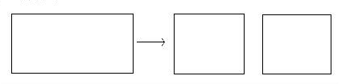
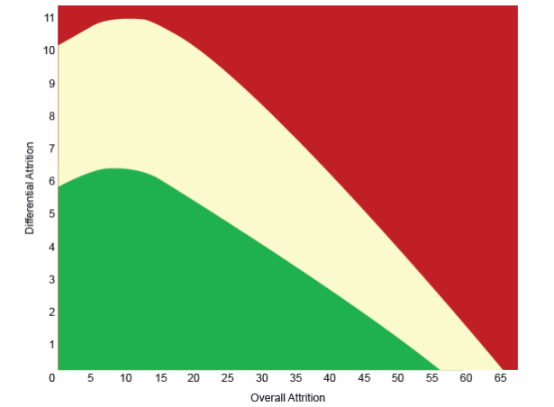

# Evaluating Pedagogical Efficacy with Randomized Control Trials {#efficacy}

```{r, echo=FALSE,message=FALSE,warning=FALSE}
library(dplyr)
library(ggplot2)
library(stargazer)
rm(list=ls())

proj_dir = getwd()
input_file_path = paste0(proj_dir,'/_data/02/production_data.RData')
load(input_file_path)
```

## Motivation

The past decade has witnessed  the rise of recommendation service based on machine learning algorithm. Success stories are abundant in online service sectors: from online shopping, such as Amazon, to entertainment, such as Netflix, or even dating, such as OKcupid. Naturally, it inspires people to revive the old ideal of adaptive(personalized) learning with the modern information technology. Although there are many types of adaptive learning, they share one common feature: There is little evidence that any of the adaptive learning engines has produced significant more learning gain than the non-personalized pedagogy.

At K-12 level, there is three major digital-only personalized learning service provider. Khan Academy, ALEKS, and Knewton. Although all institutions claim learning gain in observational studies, none has been evaluated by an RCT. Funded by the Gates Foundation and fielded by SRI, an implementation report on Khan Academy [@murphy2014research] found a positive correlation between Khan Academy usage and student math outcome. Evaluation studies on ALEKS found that it does not outperform teacher lecture in K-12[@craig2013impact] and in college[@taylor2008effects]. In a college setting, a positive relation is also found between ALEKS exposure and outcome gain[@angus2009does]. There has been no peer reviewed publication that evaluates Knewton's efficacy, although Knewton's own [whitepaper](http://learn.knewton.com/improvement-index-white-paper) claims to find a positive correlation between usage and outcome improvement (**website citation needed**). The common positive finding, a positive correlation between usage and performance, has the critical weakness of founding learner agency and pedagogical efficacy. It may be gritty or smart students who made large progress during the intervention also well utilized the technology. Thus a positive correlation can be found where true treatment effect is Null. Smaller education technology providers do not fare well either. What works Clearinghouse reviews 10 evaluation of education technologies as of August 2016. 5 are disqualified because they are not random or quasi-random experiment. Out of the remaining 5 valid studies, only 2 found statistical significant improvement[@barrow2009technology;@roschelle2007can] in small sample, 1 reported negative impact[@carter2016impact] and 2 reported mixed results[@berkowitz2015math;@campuzano2009effectiveness]. Taken into consideration the publication bias for significant results, the case for the learning technology is quite weak.


There are digital learning service providers that stand up to the random control trials in a large-scale field test. RAND corp[@pane2013effectiveness] reported statistically significant improvement in high school algebra in the second year of implementation, but not in the first year and not for the middle school. The exceptional case is Reasoning mind, a Houston-based math education provider.In summary of a decade of evaluations, [SRI](https://www.reasoningmind.org/rmwp/wp-content/uploads/2015/12/SRI-Report-Strength-of-Research-for-Reasoning-Mind.pdf) (**web citation needed **) concludes that there is strong evidence to prove the efficacy of reasoning mind in both engagement[@mulqueeny2015improving] and standardized test outcome[@khachatryan2014reasoning]. However, both Carnegie Learning and Reasoning Mind uses blended learning model that combines new curriculum with new technology. Thus it is not clear whether the curriculum design or the adaptive learning technology shall take the credit.

It is a stark contrast between the success of recommendation algorithm in consumer service sector and the failure in the education sector. This chapter does not attempt to explain this contrast with empirical evidence but will nonetheless offer an educated speculation. The current recommendation algorithm, be it collaborative filtering or supervised classification, focuses on discovering or describe the latent preference and provides little insight into its changes. The consumer service can provide superior service if the consumer preference is revealed, while the education service can only deliver learning gain if the latent knowledge mastery is changed because the K12 curriculum aims to raise student's latent ability to a certain standard.

To illustrate the point, consider the following mental experiment on literature "recommendation". Say there is a teenage girl who enjoys the twilight saga and a curriculum requires students to master "Romeo and Juliet". Amazon will be content to with a recommendation algorithm that recommends similar teenage romance novels, such as the hunger games. However, for the learning recommendation engine, it has to provide a series of books leading the student to appreciate the deep link between the two and become a fan of Shakespear. The task will be much more daunting if the curriculum instead requires a mastery of Shakespeare's "King Lear".

This chapter defines the capability of altering learner's latent knowledge mastery to certain state as pedagogical efficacy.The pedagogical efficacy is the key to the performance of the recommendation system. Unfortunately, learning science itself does not lend much insight into either definition or discovery of pedagogical efficacy and it mostly boils down to an empirical question.

This chapter aims to take the first step into build a recommendation engine based on pedagogical efficacy: the definition and measurement of pedagogical efficacy. 

## Pedagogical Efficacy and its Evaluation
### Definition
The pre-requisite to discuss pedagogical efficacy is an understanding how people learn in general. It is a very broad field[@bransford1999people] and many foundings are open to debate, even on what counts as instruction[@kirschner2006minimal;@hmelo2007scaffolding]. Thus a general definition of pedagogical efficacy is beyond this dissertation. This chapter defines pedagogical efficacy as delta over a naive repetition strategy rather than the absolute task improvement (or learning gain). An accurate measurement of the absolute pedagogical efficacy requires stronger assumption, which is unlikely to be met in practice. This is a slight difference from Khan Academy's learning gain metrics[@faus2015systems]. To be more specific, this chapter focuses on the remedial instruction: If the learner fails to correctly solve a problem, him/her is supplied with a set of remedial material so that he/she can solve another problem with identical latent knowledge requirement and skill requirement.

### Three Obstacles

Although massive online experiment(MOE) in education is not new ideas[@williams_mooclet_2014], and many experiments have been carried out in the industry (most noticeably by Khan Academy and Duolingo), with few exceptions[@paunesku2015mind], the idea is yet to catch fire in the academia. By the highest academic standard, MOE suffers from two critical weakness: selection bias induced by differential user attrition and measurement error induced by slacking. Furthermore, at item level, the magnitude of expected effect size is small, which requires a sample size the is sometimes impractically large.

#### Attrition Rate
Compared to offline experiments that are usually coupled with regular school year, MOE has an extremely high attrition rate due to the voluntary nature of the online learning service.  
Unlike instantaneous outcome that requires only one measurement, such as click rate, learning gain requires at least two measurements. The success rate per se does not indicate the learning gain: A difficult question can be enlightening while an easy question may offer no boost. However, users enrolled in the baseline test may not be observed again in the post-test, attriting from the sample for analytical purpose. In contrast, offline education experiment conducted in a school setting does not need to sweat over user attrition as much because school attendance or high stake test is somewhat mandatory. 

The sample attrition does not equal selection bias for the average treatment estimation. First of all, the "population" of interest needs to be defined. For practical purpose , the population of interest can be reduced to the active user of the learning service. Except for the notable few exception such as facebook, month by month user retention rate falls between 30% to 60% (** web citation needed**). For example, if the learning service provider has a monthly retention rate of 20%, an experiment that runs for a month is expected to lose 80% of the enrolled participants, yet still be representative of the active users, as long as the drop out decision is independent to the experiment per se.

However, differential user attrition rate resulted from the experiment cannot be ruled out logically, and it produces selection bias. From field experience, the most likely confounding factor of learning gain and user attrition is grit. Learning gain is only made if users overcome their previous ignorance/failure. If they run away at the first sight of trouble, they are less likely to produce a positive outcome.

The natural attrition leads to a loss of precision, which can be compensated by the large user base. The selective attrition leads to a loss in consistency, which has to be addressed deliberately by research design. One way to distinguish the natural attrition from selective attrition is to check if the users continue to be active other modules. However, depends on the nature of the product environment, such method may not always be reliable. For example, if the experiment is hosted in a paid product with free "tasting" period, users that are active on the website but inactive in the specific product may have nothing to do with the experiment. In general, without contextual information, natural attrition and selective attrition is observational equivalent.

#### Measurement Error

The low stake of the online learning task does not incentivize student to exert their best effort. Error due to a lack of effort rather than a lack of mastery is considered as measurement error when trying to measure pedagogical efficacy. Here mastery stands for cognitive skill while effort, for a lack of better terms, stands for the non-cognitive skills.

Knowledge mastery is a latent variable. It can only be inferred from observed test response. The classical model of learning analytics, be it Item Response Model or Bayesian Knowledge Tracing, assumes a link function where knowledge mastery is the only argument. However, a growing body of research distinguishes low performance due to lack of mastery and low performance due to lack of effort. Baker et al [-@baker2004off] have studied the "off-task" behavior on digital learning while Fryer [-@fryer2010financial] has shown that lack of effort may account for about 2/3 of the race gap in achievement as measured by low stake test. In online learning environment, the learning task is usually low stake because they are used as a formative assessment or optional self-learning material, where wrong response has little negative consequence. A student with inadequate grit is likely to shirk from exerting full effort.

The identification of effort induced measurement error is not a trivial task. Without the behavior data that characterize how students answer the question, the error due to a lack of trying and the error due to a lack of mastery is observational equivalent. Furthermore, the sign of the bias in the average treatment effect is not definite(Appendix I provides a formal discussion). Thus one cannot use Minsky bound to provide an interval estimation.

#### Low Signal to Noise Ratio
The choice of sample size is an important yet often ignored issue in the experiment design[@list2011so]. In theory, any effect size can be estimated with desired precision given a large enough sample. However, recent work by Lewis and Rao[@lewis2015unfavorable] points out that the "large enough" sample size may be economically infeasible for online advertisement. Although it is cheaper to collect learner log than to bid for advertising exposure, the expected effect sizes relative to standard deviation are small in both scenarios.   


## Research Design

This section details the research design with the three obstacles in mind. It mainly deals with the attrition rate and measurement error and the next chapter discusses how to tackle the problem of low signal to noise ratio.

#### The Learning Environment
The experiment is carried out in a paid self-learning product offered by a Chinese online learning service provider. The product is presented as a role-playing game where the user can claim reward once they clear a level, defined as accumulating 12 right answers. The user can re-try a similar question if they make mistakes to claim additional reward. In addition, if the user drops out in the middle of a level when they log into the same level, the wrong items will be shown again while the right items are skipped. The overall design aims to encourage students to "practice until right".

The reward is not cash incentive since it cannot be directly cashed out. They are virtual currency that can only be used to purchase in-game gears or exchange real gifts. When exchange for the gift, the exchange rate between RMB and virtual currency is 1 : 10000 at the time of the experiment. The reward per level is about 10, which translates to a tenth of a penny in RMB, thus negligible in real value. 

That said, users have exhibited severe "nominal illusion": they mine the virtual currency with similar enthusiasm despite waves of massive inflation. A few efficient reward mining patterns have been spotted. One pattern is to skip any difficult items by submitting a blank answer to fish for easy questions. The other pattern is to jump out the level whenever makes a wrong answer then enter again with the knowledge of the right answer peeping from the hint section. 

The experiment is administrated from June 9th to June 10th to third-grade users who used the paid learning product. By then, in theory, all users should have been taught the learning task in the school. About 10 thousand users are recruited.Users are not aware that they are part of an experiment.

### The Learning Tasks and Assignment

The primary learning objective is to apply the circumference and area formula of rectangles. 

The original question (as shown in figure 2) ask the learner to calculate the circumference and area of merged rectangles joined by length, given the length and width of the merged rectangle.


The first assessment (shown as figure 3) asks the learner to calculate the same quantity for two rectangles joined by width. Using a similar yet non-identical item enhance the measurement validity yet avoid student memorizing the answer.


The second assessment (shown as figure 3) asks the learner to calculate the circumferences and areas of the smaller rectangles when split the large rectangle in half by length. 



The learning task is a modified version of the original question(shown in Figure 5). The question is identical to the original other than the value of the length and width. It should be noted that the training question also preserves the feature that the joined width is the new length.


The variation of a learning task is in the format that the training question is delivered.

The first pedagogical method is to direct deliver the question without futher hints and instruction.

The second pedagogical method is to use sub-questions as scaffolding to mimic the tutor interaction. The scaffolding 3 steps:

(1) What is the length and width of the new rectangle

(2) What is the circumference of the new rectangle

(3) What is the area of the new rectangle

The third pedagogical method is to use a 50-second video instruction that animates the scaffolding. 

Each student receives the original question, one practice, and two assessments together as a packet. The recruited users are randomly assigned with one of three item packets based on the remainder of their user id divided by 5. The remainder 0,2,4 are assigned diferent packets respectively. 

### Delivery and Selection Bias from User Attrition in Learning Gain Measurement

Acknowledging that attrition is common in field experiments and only differential attrition matters, What works clearinghouse(WWC) evidence standard 3.0[@clearinghouse2008wwc] provides a guideline on what user attrition profile is acceptable. The x-axis is the overall attrition rate while the y-axis is the differential attrition rate between the treatment and the control. The conservative zone is colored green, which meets with WWC evidence standard without reservation. The acceptable zone is colored red, which meets the WWC evidence standard with reservation. The unaccetpable attrition profile is colored red.




```{r, echo=FALSE,message=FALSE,warning=FALSE}
final_retention = user_retention_stat %>% filter(k==4)

tot_retention_rate = round(sum(final_retention$n)/sum(final_retention$N)*100,2)
ctrl_retention_rate = round(final_retention$pct[final_retention$gid==0]*100,2)
tr1_retention_rate = round(final_retention$pct[final_retention$gid==2]*100,2)
tr2_retention_rate = round(final_retention$pct[final_retention$gid==4]*100,2)

ctr_ret = user_retention_stat %>% ungroup(gid) %>% filter(gid==0) %>% select(k,pct) %>% rename(ctr_pct=pct)
tr_ret = user_retention_stat %>% filter(gid!=0) %>% select(k,pct)
ret_dif_composition = merge(tr_ret,ctr_ret,by='k') %>% mutate(ret_dif = ctr_pct-pct)

```

To get in the conservative region, the experiment has to be designed as a short-term intervention. The previous experiments in the same environment have shown a retention rate of 0.1% for a 3-month duration experiment and 12% for a 14-day duration experiment. Therefore, the current experiment is chosen to be delivered in one request session from the student, so as to minimize the attrition rate. The learner is expected to finish the session within 10 minutes. **A description of the session time length.**  

The experiment achieves a retention rate of `r tot_retention_rate`%. The control group has the highest retention rate of `r ctrl_retention_rate`%, that of verbal scaffolding and video scaffolding are `r tr1_retention_rate`% and `r tr2_retention_rate`% respectively and the maximum differential attrition rate between groups is about 7%. Such profile meets the WWC evidence with reservation. 

However, further examination of the attrition rate by item shows that the largest difference occurs in the first item (**NEED GRAPH EXPLANATION**), as shown in figure 6. Since the learners have not experienced the treatment, the differential attrition can probably be attributed to chance. Thus the meaningful attrition rate shall exclude the dropouts from the first item. By this calculation, the maximum differential attrition rate is 3% between vocabulary scaffolding and the other two groups. Such profile meets the WWC evidence without reservation. 

```{r, echo=FALSE,message=FALSE,warning=FALSE}
ggplot(data=ret_dif_composition,aes(x=k,y=ret_dif,fill=factor(gid)))+geom_bar(stat='identity',position = "dodge")
```

In sum, although the experiment has substantial attrition rate, there is no substantial difference in the attrition rate among groups. Therefore, the main analysis will be carried under the assumption of missing random. The analysis does not use the inverse probability weighting to compensate the precision loss because the dataset does not contain enough auxilary learner information to model the sample attrition. 

### Relative Measurement and Effort Induced Measurement Error 


The relative ranking of different pedagogical methods is consistently identified under the assumption that the distribution of slacking is identical with random assignment, although the point estimation of absolute pedagogical efficacy is biased. However, since the experiment has access to the student's detailed response answer, a direct identification of the measurement error is possible. A detailed identification procedure is described in appendix II. The main analysis demonstrates how filtering measurement error reduces bias in the estimates and different treatment solicit different effort levels.

**Try different measurement error identification strategies**


### Hypothesis and Identification Strategy

The expert postulates that both scaffolding and video lecture are better than the naive repetition, which only changes the number. She also postulates that although scaffolding and video lecture may be as effective in the first assessment, the video lecture is more effective at the second assessment.

The identification strategy is difference in difference. Denote the baseline question as T=0 and the assessments questions as T = 1. Let variable $D^1$ takes value 1 if the user is in the treatment I, variable $D^2$ takes value 2 if the user is in treatment II. A fully specified DID model is 

$$
Y_{i,T} = \beta_1 D^1_i + \beta_2 D^2_i + \gamma T + \delta_1 D^1_i T + \delta_2 D^2_i T + \epsilon_{i,T} 
$$

To facilitate the test whether the two treatment has the same effect, let $\tilde{D}_i$ take value 1 if the user is not in the control group. Rewrite 

$$
\delta_1 D^1_i T + \delta_2 D^2_i T = (\delta_0 + \delta_2 D^2_i)(\tilde{D}_i) T 
$$

Therefore, the three hypothesis can be written as the following 

(1) Both treatment are better than vanilla. $\delta_0^{Primary}>0$, $\delta_0^{Secondary}>0$

(2) Scalefolding and video lecture are as effective in reaching the primary objective. $\delta_2^{Primary} = 0$

(3) Video lecture is more effective in reaching the secondary objective. $\delta_2^{Secondary} > 0$


## Results

### Full Dataset

The full dataset shows that 

(1) Vocabulary scaffolding is not superior to naive repetition for the two assessment
(2) Video scaffolding has stronger efficacy than the alternative in the first assessment but not the second assessment.

The result does not agree with the prior belief at all.

```{r, echo=FALSE,message=FALSE,warning=FALSE, results='asis'}
y0data = workdata %>% filter(eid=='Q_10201056649366') %>% mutate(t=0)
y1pdata = workdata %>% filter(eid=='Q_10201056666357') %>% mutate(t=1)
y1sdata = workdata %>% filter(eid=='Q_10200351208705') %>% mutate(t=1)

ydata_p = rbind(y0data,y1pdata)
ydata_p = ydata_p %>% transform(d1=as.numeric(gid==2),d2=as.numeric(gid==4),d=as.numeric(gid!=0))
ydata_p = ydata_p %>% transform(dt=d*t,d2t=d2*t,d1t=d1*t)

ydata_s = rbind(y0data,y1sdata)
ydata_s = ydata_s %>% transform(d1=as.numeric(gid==2),d2=as.numeric(gid==4),d=as.numeric(gid!=0))
ydata_s = ydata_s %>% transform(dt=d*t,d2t=d2*t,d1t=d1*t)

#mod_1 = lm(data=ydata_p,y~d1+d2+t+d1t+d2t)
mod_1d = lm(data=ydata_p,y~d1+d2+t+dt+d2t)
#mod_2 = lm(data=ydata_s,y~d1+d2+t+d1t+d2t)
mod_2d = lm(data=ydata_s,y~d1+d2+t+dt+d2t)

stargazer(mod_1d,mod_2d, header=FALSE,type='latex', dep.var.labels = 'Response',
          keep=c('dt','d2t'), covariate.labels=c('delta0','delta2'), column.labels=c('Primary','Secondary'), keep.stat=c("adj.rsq","n"))


```


### Condition on Wrong First Response
To understand the puzzling result, sample those who are successful in their first attempt. Since there is negligible chance that they guessed it right, they must have mastered the learning objective and shall replicate their success in the training question and the first assessment. However, there is a general decline in the success rate of the first assessment and the decline is statistically significant for the vocabulary scaffolding compared to the naive repetition. Meanwhile, there is a climb in the give-up rate, especially for the vocabulary scaffolding group. Numerically, the increased give-up almost explains all of the descrease in success rate for that group: They are too bored to take the easy scaffolding seriously.

```{r, echo=FALSE,message=FALSE,warning=FALSE, results='asis'}
mod_3 = lm(data=ydata_p %>% filter(is_placebo==1),y~d1+d2+t+d1t+d2t)
mod_4 = lm(data=ydata_p %>% filter(is_placebo==1),giveup~d1+d2+t+d1t+d2t)

stargazer(mod_3, mod_4, header=FALSE,type='latex', dep.var.labels = c('Response','Giveup'),
          keep=c('d1t','d2t'), covariate.labels=c('delta-voca','delta-video'), column.labels=c('Primary','Primary'), keep.stat=c("adj.rsq","n"))
```


Exclude the placebo group and focus on those failed the first attempt. almost all the effects are gone, at least statistically.

```{r, echo=FALSE,message=FALSE,warning=FALSE, results='asis'}
mod_7d = lm(data=ydata_p %>% filter(is_placebo==0),y~d1+d2+t+dt+d2t)
mod_8d = lm(data=ydata_s %>% filter(is_placebo==0),y~d1+d2+t+dt+d2t)

stargazer(mod_7d,mod_8d, header=FALSE,type='latex', dep.var.labels = 'Response', 
          keep=c('dt','d2t'), covariate.labels=c('delta0','delta2'), column.labels=c('Primary','Secondary'), keep.stat=c("adj.rsq","n"))
```

### Condition on Exposure to the Treatment 

Retain those did not give up on the original question and the training question, as to ensure they are at least somewhat exposed to the learning task. The result shows that vocabulary scaffolding is no more effective than naive repetition while video scaffolding is statistically significant and has an effect size about 0.3 standard deviation for both assessments.  


```{r, echo=FALSE,message=FALSE,warning=FALSE, results='asis'}
mod_9d = lm(data=ydata_p %>% filter(is_placebo==0&is_retain==1),y~t+dt+d2t)
mod_10d = lm(data=ydata_s %>% filter(is_placebo==0&is_retain==1),y~t+dt+d2t)
stargazer(mod_9d,mod_10d, header=FALSE, type='latex', 
          dep.var.labels = 'Response', keep=c('dt','d2t'), covariate.labels=c('delta0','delta2'), column.labels=c('Primary','Secondary'), keep.stat=c("adj.rsq","n"))
```


## Discussion

**Observation study that user engagement is the key to better results even in comprehension task**


## Appendix I: The sign of Bias from Measurement Error

Let learner's latent knowledge mastery be $\theta$, which is drawn from distribution $F(\theta)$. The true state of $\theta$ is not observable but can only be inferred from an observed binary response $Y$. The link function is $p(\theta)$

To simplify, assume learner can choose a binary effort level $\Gamma$. Further assume When the learner gives up ($\Gamma=0$), the observed response ($Y=0$) is wrong with prbability 1. Such assumption rules out item type such as multiple choice where blind guess still has non-trivial probability of being right.

The data generating process borrows from the Roy model:

(1) Knowing his own $\theta$, the learner assesses the success probability $p(\theta)$. The reward of success is $\beta$ and the expected payoff is $\beta p(\theta)$.  

(2) The learner's mental cost is drawn i.i.d from a distribution $\epsilon \sim G$. The learner only exerts effort if the expected benefit is larger than the cost.
$$\Gamma=I(\beta p(\theta)>\epsilon)$$

(3) If the learner exerts the effort($\Gamma=1$), the response is drawn from $Y \sim B(1, p(\theta))$. Otherwise $Y=0$

To make the comparison explict, denote the observed response under full effort as $Y^*$. The true average treatment effect is thus
$$
\delta_{Y^*} = E_{\theta_1}(p(\theta)) - E_{\theta_0}(p(\theta))
$$

The observed average treatment effect is 

$$
\begin{aligned}
\delta_{Y} &= E_{\theta_1}[E_{\epsilon}[I(Y^*=1, \Gamma=1|\theta)]] - E_{\theta_0}[E_{\epsilon}[I(Y^*=1, \Gamma=1|\theta)]]\\
           &= E_{\theta_1}[p(\theta)G(\beta p(\theta))] -E_{\theta_0}[p(\theta)G(\beta p(\theta))]\\
\end{aligned}
$$

The bias is thus

$$
\delta_{Y} - \delta_{Y^*} = E_{\theta_1}[p(\theta)(G(\beta p(\theta))-1)] -E_{\theta_0}[p(\theta)(G(\beta p(\theta))-1)]
$$


Unfortunately, the sign of the bias cannot be determined. To illustrate, consider the extreme case where there are only two states and the practice moves learner from state $\theta_0$ to state $\theta_1$ with probablity 1. Let $p(\theta_1)= 0.6$ and $p(\theta_0)=0.4$. The true ATE is thus 0.2. If $G(\theta_0) = 0.4$ and $G(\theta_1)=0.6$, the observed ATE is 0.2. If $G(\theta_0)=0.5$ and $G(\theta_1)=0.6$, the observed ATE is 0.16, bias down. If $G(\theta_0)=0.4$ and $G(\theta_1)=0.7$, the observed ATE is 0.26, bias up.

In another mental experiment. If $p(\theta)$ is flat while $G(\beta p(\theta))$ is monotonic. The observed ATE is purely the reduction in measurement error, thus bias upward. If instead $G(\beta p(\theta))$ is flat (neither 0 nor 1), the observed ATE is always a fraction of the true ATE, thus bias downward. 


## Appendix II: Identification of Error Due to Slacking

Even with the aid of response time and response answer, it is not an easy task to distinguish between error due to effort and error due to mastery. In the extreme case where student gives up immediately and leave a blank answer, it can still be blamed on error due to mastery: student has failed the same task before and they rationally give up the second chance if the goal is to maximize reward collection rather than learning gain. In addition, it is imprecise to characterize continuous effort by a binary status, but a necessary simplification to make the identificaiton feasible.

Since there are numerous ways to provide a wrong answer (emojis included) but only manageable amount of "innocent" mistakes, the chapter adopts the principle of "guilty until proved innocent". The innocent mistakes include the following type:

(1) Add or leave out trailing zeros. For example, if the right answer is 120, both 12, 120 and 1200 are admitted as valid attempts.
(2) Add when multiply or multiply when add. For example, when calculating area with length 6 and width 4, 10 is admitted as a valid attempt.
(3) Apply the wrong formula. For example, when calculating the circumferences of the rectangle with length 6 and width 4, 10 is admitted as a valid attempt.

In addition, when the question has multiple sub-questions, if the student manages to answer any of the sub-question correctly, the log is admitted as a valid attempt. 

Following this classification, about `round(mean(c2a2f1_data$giveup)*100,2)` % of the wrong response are classified as error due to slack, or give up. Figure 6 showed the estimated density plot of response time for a valid attempt and give up. The density of response time for the give-ups centers around 3 seconds, which indicates face validity. However, there are also significat density in longer duration. A long duration blank answer can indicate long thought or just the learner's attention wandering off task. Because the question used in this experiment is quite easy, it is unlikely that the students struggled and ended up with nothing to show. Therefore, long duration blank answer is categorized as giveup for the main analysis. 

```{r,echo=FALSE,message=FALSE,warning=FALSE}
qplot(data=c2a2f1_data, x=cmt_timelen, geom='density',col=factor(giveup))
```

