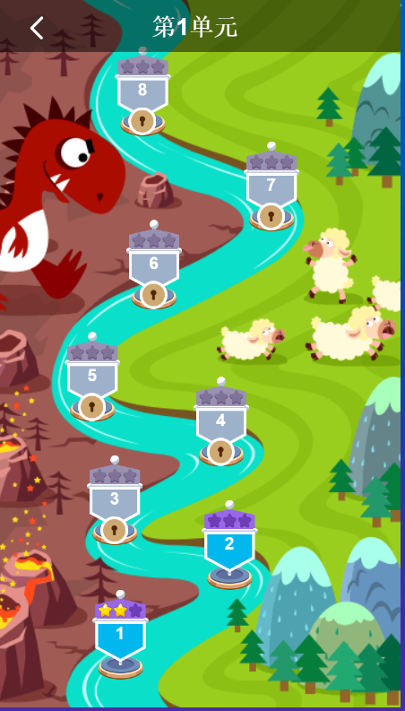
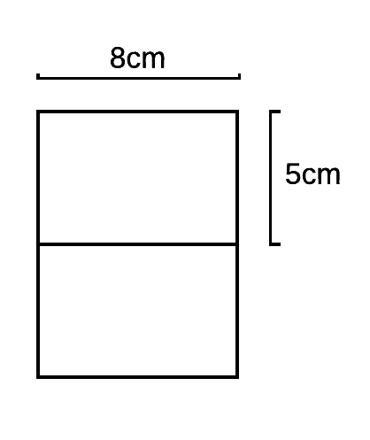
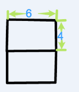
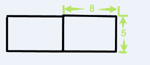

# Effort Induced Measurement Error in the Pedagogical Efficacy Estimation{#effort}

```{r, echo=FALSE,message=FALSE,warning=FALSE}
library(dplyr)
library(tidyr)
library(ggplot2)
library(stargazer)
library(gridExtra)
library(knitr)
rm(list=ls())

proj_dir = getwd()
input_file_path = paste0(proj_dir,'/_data/03/paper_data.RData')
load(input_file_path)
options(digits=2)

# filter out vocab

data = data%>%  filter(group %in% c('No-3','Video'))
data$group = factor(as.character(data$group), levels=c( "No-3","Video"), labels=c('Control','Treatment'))

```

## Motivation:Experimental Evaluation of Pedagogical Efficacy

To motivate the discussion of this chapter, consider the task of comparing the pedagogical efficacy of two items by an randomized control trial. The experiment has a random assignment of the learners, two assessments before and after the treatment, and even zero sample attrition. To simplify, assume there is no noise in the signal ($P(Y_t=1|X_t=1)=1,P(Y_t=1|X_t=0)=0$), and no learning for the test instruments, so that the difference in response success rate is the difference in learning gain. The analyst estimate the average difference in pedagogical efficacy ($\gamma$) by the classical DID linear regression


$$
Y_{i,T} = \beta_d D_i + \beta_t T + \gamma D_i T + \epsilon_{i,T}
$$

However, the seemingly rigorous analysis makes a very strong implicit assumption: The DID estimator is unbiased only if learners always exert effort in the experiment. Consider an extreme case where the efficacy of two pedagogical methods are equivalent but the method A make all of learners exert effort while method B make none of the learners exert effort. Under the "no pain no gain" assumption from chapter 2, learners with method B does not show any learning gain. The DID estimator falsely concludes that method A is superior to method B.

The key insight is that with effort choice, the observed response is not the same as the response specified in the response-only model. In a way, the effort choice introduces a measurement error that is not conditional mean indepenent of the treatment assignement. In the absence of an instrumental variable, this chapter solves the measurement problem by explicitly models the data generating process.


The chapter is organized as the following. Section 4.2 characterizes the bias. Section 4.3 discuss the bias correct with the general model and verify the claim with a simulation analysis. Section 4.4 applies the method to a real data set.


## The non-monotoncity of the Difference in Difference Estimator 
Throughout the chapter, assumes there is no exit choice $H_t=0 \quad \forall t$. To simplify the discussion, assume the $M_x=2$ and $M_y=2$. The pre-test item id is 0, the post-test item id is 1. The treatment item id is $T$ and the control item id is $C$

### The non-monotoncity of the Unconditional DID Estimator 
It can be shown that the unconditional DID estimator converges to 

$$
\hat{\delta} \rightarrow [P(Y_0=0,Y_1=1|T)-P(Y_0=1,Y_1=|T)] - [P(Y_0=0,Y_1=1|C)-P(Y_0=1,Y_1=|C)] 
$$
With the model structure, 
$$
\hat{\delta} \rightarrow (\ell_T-\ell_C)(1-\pi)(1-\ell_0)(c_1^{1,1}-c_1^{1,0})
$$

Although $\hat{\delta}$ is not a consistent estimator of difference of pedagogical efficacy($\ell_T-\ell_C$), it is a montone function of the pedagogical efficacy under fairly loose conditions. If the researcher is only interested in the ranking of the two items, the DID estimator is a valid measurement, although not efficient. 

**Theorem 1**: If $\pi<1$, $\ell_0<1$ and $c_1^{1,1} \geq c_1^{1,0}$, the DID estimator is a montone function of the pedagogical efficacy.

However, if there is effort choice, the DID estimator now converges to  

$$
\hat{\delta} \rightarrow (\ell_Te^0_T-\ell_Ce^0_C)(1-\pi)(1-\ell_0e^0_0)(c_1^{1,1}e_1^1-c_1^{1,0}e_1^0)
$$
To establish the monotonicity, one needs a stronger assumption.

**Theorem 2**: With effort choice, if $\pi<1$ and $\ell_0<1$, $(\ell_Te^0_T-\ell_Ce^0_C)(c_1^{1,1}e_1^1-c_1^{1,0}e_1^0)>0$  the DID estimator is a montone function of the pedagogical efficacy difference.

Theorem 2 does not have an intuitive reading, further constain the behavior of effort choice $e_j^0 \leq e_j^1$

**Lemma 1** If the effort probability is monotone function of the mastery, the necessary and sufficient condition for DID estimator to be a montone function of the pedagogical efficacy difference is
$$
(\ell_T-\ell_C)(\frac{\ell_T}{\ell_C}-\frac{e^0_C}{e^0_T}) > 0
$$
Assume $\ell_T>\ell_C$, then $\frac{\ell_T}{\ell_C}>\frac{e^0_C}{e^0_T}$. Intuitively, it means that the more pedagogical effective item must either induces more effort or not discouraging enough. This is not always the case because the path less traveled can be the shorter path.

### The non-monotoncity of the Conditional DID Estimator 

One intuitive solution is to condition the analysis on the sub-sample that exerts effort on the training question. However, the conditional DID estimator does not guarantee a monotone function of the pedagogical efficacy. The key insight is that conditioning on the effort changes initial state desnity.

$$
\tilde{\pi}_D=P(X_0=1|E_D=1) = \frac{\pi e^1_D}{[(1-\pi)(1-\ell_0)e_0+(1-\pi)(1-e_0)]e^0_D+[(1-\pi)\ell_0e_0+\pi]e_D^1} \neq \pi
$$

It is general the case that $\tilde{\pi}_T \neq \tilde{\pi}_C$. Therefore, the balanced sample assumption is no longer true.

**Theorem 3** Conditioning on the effort on the training question is not a sufficient condition of being montone function of the pedagogical efficacy difference.


## Simulation

This section demostrates theorem 1 and theorem 2 in the previous section. The relevant parameters are

$$
\begin{aligned}
P(X_0=1) = \pi &= 0.4\\
P(X_t=1|X_{t-1}=0,0)=\ell_0 &= 0.1\\
P(X_t=1|X_{t-1}=0,T)=\ell_T &= 0.6\\
P(X_t=1|X_{t-1}=0,C)=\ell_C &= 0.4\\
P(Y_1=1|X_t=1) =c_1^{1,1}&= 0.9\\
P(Y_1=1|X_t=0) =c_1^{1,0}&= 0.1\\
\end{aligned}
$$
Consequently the expected DID difference is 0.0864.

1000 learners are simulated. Half of the learner receives item sequence (0,T,1) and the other receives item sequence (0,C,1).

### No Effort Choice

```{r,echo=FALSE,message=FALSE,warning=FALSE}
data_dir = paste0(proj_dir, '/_data/03/sim/')

exp1_data = read.table(paste0(data_dir, 'exp1.txt'),sep=',',col.names=c('i','t','j','y'))
treat_status = exp1_data %>% filter(t==1) %>% mutate(D=j-1) %>% select(i,D)
analysis_data = merge(exp1_data %>% filter(t!=1) %>% mutate(t=t/2) %>% select(i,t,y), treat_status)
mod1 = lm(data=analysis_data, y~t*D)
mcmc_param1 =  read.table(paste0(data_dir, 'exp1_param.txt'),sep=',') %>% select(V2,V3) %>% rename(l0=V2,l1=V3) %>% mutate(ldif=l1-l0)
```

The DID estimates is `r -mod1$coefficients[4]`, although the sign is right(monotone) and it is significant. In comparison, the MAP of $\delta_{\ell}=\ell_T-\ell_C$ is `r -mean(mcmc_param1$ldif)` and the 95% credible interval is (`r quantile(mcmc_param1$ldif, prob=0.05)`,`r quantile(mcmc_param1$ldif, prob=0.95)`). 

### With Effort Choice
The effort rate is set to offset the learning gain difference, All effort rates are 1 except for 

$$
\begin{aligned}
P(E_T=1|X_t=0) =e_T^0&= 0.4\\
P(E_C=1|X_t=0) =e_T^0&= 0.6\\
\end{aligned}
$$

The DID should return 0.
```{r,echo=FALSE,message=FALSE,warning=FALSE}

exp3_data = read.table(paste0(data_dir, 'exp3.txt'),sep=',',col.names=c('i','t','j','y','h','e'))
treat_status = exp3_data %>% filter(t==1) %>% mutate(D=j-1) %>% select(i,D)
analysis_data = merge(exp3_data %>% filter(t!=1) %>% mutate(t=t/2) %>% select(i,t,y), treat_status)
mod3 = lm(data=analysis_data, y~t*D)
mcmc_param3 =  read.table(paste0(data_dir, 'exp3_param.txt'),sep=',') %>% select(V2,V3) %>% rename(l0=V2,l1=V3) %>% mutate(ldif=l1-l0)
```

The DID estimates is `r -mod3$coefficients[4]`, it is no longer significant.. In comparison, the MAP of $\delta_{\ell}=\ell_T-\ell_C$ is `r -mean(mcmc_param3$ldif)` and the 95% credible interval is (`r quantile(mcmc_param3$ldif, prob=0.05)`,`r quantile(mcmc_param3$ldif, prob=0.95)`). 


## Case Study with a Real Dataset

This section applies the effort-bias correction to an experimental dataset. The section first describes the data collection process, then describes the effort level identification, then provide evidence of differential effort choice, and finally shows the distribution of estimated parameters from different model and effort specification.


### The Learning Environment

The experiment is carried out in a paid self-learning product offered by a Chinese online learning service provider. The product is used after school, rather than in the classroom.

The product is framed as a role-playing game where the learner clears a level to claim the reward. Level clearance is defined as accumulating 12 correct answers. The screen shots of the initiation, practice and the completion of the level are shown from figure 4.1 to 4.3.


```{r,echo=FALSE,message=FALSE,warning=FALSE, fig.cap = "Level Initiation", fig.align='center',out.height='8cm',out.width='8cm'}

```

```{r,echo=FALSE,message=FALSE,warning=FALSE, fig.cap = "Practice Interface", fig.align='center',out.height='8cm',out.width='8cm'}

```

```{r,echo=FALSE,message=FALSE,warning=FALSE, fig.cap =  "Level Completion", fig.align='center',out.height='8cm',out.width='8cm'}

```


The monetary value of the reward for a correct response is very low. The virtual currency (Xuedou) can exchange for in-game gears or real world gifts. During the experiment, the reward for each correct response is about  a tenth of a penny in RMB (or $0.00014). Although the incentive is tiny, the learners nevertheless game the system to efficiently mine the virtual currency. To "encode success into exercises"[@lemov2012practice], the system lowers the cost of errors almost to zero so as to encourage the learners to practice until correct.There is no punishment for an incorrect answer and the correct answer is shown to them before they go to the next question. If they make a mistake, the learner can practice a similar item to earn an additional but smaller reward. Because the reward is independent of the item difficulty, some students developed a strategy to skip difficult items in hope to get an easier one to score a correct response on the first attempt. All these system gaming behavior results in significant measurement error in the logged response. The overall frequency of observing a blank answer for the math practices is about 20%.

Another detail worth mentioning is the interaction when there are multiple sub-questions. The learner does not get feedback on any subquestion but the overall result when they submit all answers. The submit is irreversible. Once the learner moves to the next sub-question, they cannot go back to the last.

### The Design and the Implementation of The Experiment 

The experiment is administrated from June 9th, 2016 to June 10th 2016 to third-grade students whose parents paid for the learning product. By then, all learners should have been taught the required knowledge point in the school.


The learning task trains the knowledge point of the circumference and area formula of rectangles. 

The pre-test item (Figure 4.4) asks the learner to calculate the circumference and area of two identical rectangles joined by length, given the length and width of the small rectangle.
```{r,echo=FALSE,message=FALSE,warning=FALSE, fig.cap =  "The Pre-test Item", fig.align='center',out.height='8cm',out.width='8cm'}

```


The training item is a modified version of the original question(Figure 4.5). The question is identical to the original one except for the value of the length and width. It also preserves the feature that the joined width is the new length.
```{r,echo=FALSE,message=FALSE,warning=FALSE, fig.cap =  "The Training Exercise", fig.align='center',out.height='8cm',out.width='8cm'}

```

The scaffolding guides the learner to find the width and length of the new shape and then apply the formula. It implicitly assumes that the student mastered the formula of circumference and area, but cannot piece the information together. The scaffolding is drawn from the teaching experiment of in-house tutor experts. To wit:

(1) What is the length and width of the new rectangle

(2) What is the circumference of the new rectangle

(3) What is the area of the new rectangle

The post-test item skill (Figure 4.6) asks the learner to calculate the same quantities for two rectangles joined by width. A highly similar yet not identical item enhances the measurement validity while prevents student memorizing the answer.

```{r,echo=FALSE,message=FALSE,warning=FALSE, fig.cap =  "The Post-test Item", fig.align='center',out.height='8cm',out.width='8cm'}

```

In the 12 item recommendation package, the experiment package occupies the 5th to 7th position for all qualified users in the order of the pre-test, training item, and the post-test. Other items are recommended base on their previous learning record. If the learner does not quit during the level, they finished the experiment in one setting. The control group receives the training item without scaffolding. The treatment group receives the item with a link to the animation of the scaffolding with human voice over. If the learner chooses not to open the link and directly answers the item, it is effectively the same as the control group. Unfortunately, the log does not track if the learner watches the video or if the learner finished the video. On aggregate, the video is played about 800 times. If each view is a by a separate id, the maximum exposure to the video treatment is about 30% of the  group. The average watch time is about 47 seconds, out of the total length of 67 seconds.

The recruited users are randomly assigned with one of three item packets based on the remainder of their user id divided by 5: 0 is the control group and 4 the treatment group. The user id is randomly generated.

### Effort Identification

#### Log Data
The identification of the model hinges on the identification of the effort level. The effort level is not directly observed but has to be inferred from auxiliary data. The log data collected for the experiment includes the following fields:

(1) learner id

(2) question id

(3) Submit time

(4) time spent on the question (seconds)

(5) the grade (0-1)

(6) the actual answer in the text

Table 5.1 is a sample of the original data log

```{r, echo=FALSE,message=FALSE,warning=FALSE}
kable(
  head(data%>%select(uid, eid, cmt_time, cmt_timelen,atag_pct, answers), 1), booktabs = TRUE,
  col.names = c('User ID', 'Item ID', 'Submit Time', 'Time Spent on Item', 'Score', 'Answers'),
  align='c',
  caption = 'Demo data from the Log'
)
```

The time spent on the item is defined as the time elapsed between the time the server sends out the question to the learner's device and the time the  learner's submitted answer on the last subquestion received by the server. The transmission time in the network is negligible, usually in the magnitude of 10 milliseconds. The time spent does not distinguish how much time spent on each sub question and it is not a clean measure of student's active learning time. What student did between the question  presentation and the answer submission is not observed.

#### Answer Classifcation

The answers are initially classified into six categories:

(1) Blank answer: The learner submits nothing on the circumference and the area

(2) Non-blank wrong answer: Neither circumference nor area is correctly calculated and not includes in the slip or the wrong shape category 

(3) Slip: The answer is correctly calculated but the learner inputs in a wrong way

(4) Wrong Shape: The learner calculates correctly either the circumference or the area of the small rectangle

(5) right circumference: The learner correctly calculates the circumference of the large rectangle 

(6) right area: The learner correctly calculates the area of the large rectangle

(7) Correct Answer: Both circumference and area of the large rectangle are correctly calculated

The Table 4.2 and Table 4.3 show the summary statistics of different groups' answer composition at a different stage of the experiment. Appendix 2 shows a breakdown of the top answers in each category. Other than the non-blank wrong answer, all four error categories have clustered answer patterns: The top 5 answers cover over 50% of the answers. The category of the non-blank answer has a wide dispersion. The top non-blank answer for all but the pre-test item is the correct answer to the pre-test question, which occupies about 30% of the non-blank answer.


```{r, echo=FALSE,message=FALSE,warning=FALSE}
ans_composition = data  %>%
  group_by(group, qtype) %>% 
  summarize(blank = mean(blank_ans)*100,
            nonblank=mean(nonblank)*100,
            wrongshape=mean(wrong_shape)*100,
            rightcirc=mean(circ_right)*100,
            rightarea=mean(area_right)*100,
            slip=mean(is_slip)*100,
            correct=mean(score==1)*100)
kable(
  ans_composition %>% arrange(qtype,group)%>% select(-rightcirc,-rightarea,-wrongshape,-correct), booktabs = TRUE,
  col.names=c('Group','Task','Blank Ans(%)','Non Blank Wrong Ans (%)', 'Slip(%)'),
  align='c',
  caption = 'Answer Composition - All Wrong'
)
```

Conditional on making an valid effort, here are the success rate of each step of the scaffolding. It turns out that the scaffolding does not increase the identification of the right but reduce the error of the wrong circumference!

```{r, echo=FALSE,message=FALSE,warning=FALSE}
ans_composition = data %>% group_by(qtype,group) %>% summarize(p0=mean(score0)*100,p1=mean(score1)*100,p2=mean(score2)*100,p=mean(score)*100)
kable(
  ans_composition, booktabs = TRUE,
  col.names=c('Group','Task','Wrong Shape(%)', 'Right Circ(%)', 'Right Area(%)','Correct(%)'),
  align='c',
  caption = 'Answer Composition - Other'
)
```

#### Definition of Effort

The effort level is assumed to be a binary variable, slack or valid attempt. The blank answer and nonblank wrong answer is classified as a slack. All the rest is defined as a valid attempt. The harsh definition of the slack aims to justify the assumption 7 that if there is no effort then no learning. It also satisfies the assumption 8 because the guess rate is assumed to be 0 for the fill-in-the-blank questions thus no effort means the wrong answer for sure. The summary statistics of the effort levels are presented in Table 4.4. The key take away from the table is that the treatment group has higher slack error rate in the training questions.


```{r, echo=FALSE,message=FALSE,warning=FALSE}
giveup_stat = data %>% group_by(group, qtype) %>% 
  summarize(slack = mean(giveup)*100, 
            deligent=mean(valid)*100,
            correct=mean(atag_pct==1)*100)
kable(
  giveup_stat %>% arrange(qtype,group), booktabs = TRUE,
  col.names=c('Group','Task','Slack Error (%)', 'Valid Error(%)','Correct(%)'),
  align='c',
  caption = 'Effort Level Composition'
)
```

#### Robust Check of the Effort Identification

One way to check the validity of the classification is to look at the distribution of time spent on the item. 


Figure 4.1 shows the distribution of time spent on task when submitting a blank answer. The overall pattern is that the duration gets shorter after the learner passes the pre-test. If there is a small chance that the learner who submits a blank answer ponders on it, for the training practice and post-test, the blank answer is clearly


In the pre-test, the distribution of the blank answer is not so left skewed compared to that in the later items. The learner may at least read through the question text before decides to drop it. In the subsequent items, except for the vocabulary scaffolding question, the learner submit a blank answer in such a short time that they give up so easily. The average time to submit a blank answer drops from 14 seconds on the pre-test to 6 seconds in the training and post-test. 

```{r,echo=FALSE,message=FALSE,warning=FALSE, fig.cap = "Distribution of Time Spent on Item with Blank Answer", fig.align='center',out.height='8cm',out.width='8cm'}
qplot(data=data %>% filter(cmt_timelen<=60&blank_ans), x=cmt_timelen, geom='density', facets=group~qtype)+xlab('Time Spent on Task (Seconds)')
```

Examine the time distribution for the rest three categories as shown in Figure 4.2. The time distribution of valid effort is very similar to that of the correct answer. The distribution centres around 40 seconds and is stable across different tasks, which reflects the time needed to comprehend and solve the problem. In contrast, the distribution of the slack is very different. The slack distribution is skewed to the left and the skewness increase from pre-test to the training practice and the post-test. Both properties of the slack distribution echo that of the blank answer. It is thus a suggestive evidence that the non-blank totally wrong answer is the result of slacking rather than good faith effort.


```{r,echo=FALSE,message=FALSE,warning=FALSE, fig.cap = "Distribution of Time Spent on Item by Error Types With Nonblank Answers", fig.align='center',out.height='8cm',out.width='8cm'}
qplot(data=data %>% filter(cmt_timelen<=120&!blank_ans), x=cmt_timelen, geom='density', col=etype, linetype=etype,facets=group~qtype) + xlab('Time Spent on Task (Seconds)')

```

#### Differential Effort Level Choice

Figure 4.3 describes the frequency of slack pattern by groups. The first tick on the x-axis ('0,0,0') means the learner never slack. The last tick on the x-axis ('1,1,1') means the learner always slacks. In general, the effort level is quite persistent. about 50% of the users always exert effort while about 15% of the users never do. An alternative specification of slack, which only defines blank answer as slack, shows a similar pattern.

```{r,echo=FALSE,message=FALSE,warning=FALSE, fig.cap = "Slack Pattern", fig.align='center',out.height='8cm',out.width='8cm'}
# Check the sequence dependence
wide_data=  data %>%
  select(uid,group,seq_id,giveup) %>%
  spread(seq_id,giveup)
names(wide_data) = c('uid','group','t1','t2','t3')

effort_persistence = merge(wide_data %>% group_by(group,t1,t2,t3) %>% summarize(n=n()), wide_data %>% group_by(group) %>% summarize(N=n())) %>% mutate(pct=n/N)

effort_persistence$pattern = '0,0,0'
effort_persistence$pattern[effort_persistence$t1&effort_persistence$t2&!effort_persistence$t3] = '1,1,0'
effort_persistence$pattern[effort_persistence$t1&!effort_persistence$t2&!effort_persistence$t3] = '1,0,0'
effort_persistence$pattern[effort_persistence$t1&!effort_persistence$t2&effort_persistence$t3] = '1,0,1'
effort_persistence$pattern[effort_persistence$t1&effort_persistence$t2&effort_persistence$t3] = '1,1,1'
effort_persistence$pattern[!effort_persistence$t1&!effort_persistence$t2&effort_persistence$t3] = '0,0,1'
effort_persistence$pattern[!effort_persistence$t1&effort_persistence$t2&!effort_persistence$t3] = '0,1,0'
effort_persistence$pattern[!effort_persistence$t1&effort_persistence$t2&effort_persistence$t3] = '0,1,1'


effort_persistence$pattern = factor(effort_persistence$pattern)

ggplot(data=effort_persistence, aes(x=pattern,y=pct, fill=group))+ geom_bar(stat = "identity",position="dodge") + xlab('Slack Pattern') + ylab('Frequency') + ggtitle('Frequency of the Slack Pattern: 1=Slack,0=Effort. Three Items (E1,E2,E3)')
```

Another evidence of differential effort choice is the increasing likelihood for the learned students to give up. Because the guess rate is effectively zero, the learners who correctly answers the pre-test question must master the knowledge point. If they exert full effort, the true effect is zero, thus the placebo group. Table 4.5 describes their effort level choice in the training practice and the post-test. There is a slight uptick in the giveup rate for the treatment group. 

```{r,echo=FALSE,message=FALSE,warning=FALSE, fig.cap = "", fig.align='center',out.height='8cm',out.width='8cm'}
placebo=  data %>%filter(is_placebo==1)%>% group_by(qtype, group) %>% summarize(gpct=mean(giveup)*100)

knitr::kable(
  placebo %>% filter(qtype!='pre')%>% select(group, qtype,gpct), booktabs = TRUE,
  col.names=c('Group','Task','Slack (%)'),
  align='c',
  caption = 'The Slack Probability for the Placebo Learners'
)
```


### The result

#### Summary Statistics

Before revealing the distribution of the estimated parameter, it is helpful to look at learning curve and slack curve of the original data. Figure 4.4 describes the percentage of the correct response by the group and by the task. The raw data show that the control group and the video scaffolding is almost identical but the vocabulary scaffolding group declines. Figure 4.5 describes the percentage of slackers by the group and by the task. The probability of slacking increases over time and the vocabulary scaffolding has the biggest increase. Because not all users exert full efforts, the estimated pedagogical efficacy is biased downwards. Because there is a differential probability of slacking, there is a differential degree of bias in the estimated parameters.


```{r,echo=FALSE,message=FALSE,warning=FALSE, fig.cap = "The Learning Curve", fig.align='center',out.height='8cm',out.width='8cm'}
all =  data %>% group_by(seq_id, group) %>% summarize(ypct=mean(score),yint=mean(y),gpct=mean(giveup))

 qplot(data=all, x=seq_id, y =yint, geom='line', col=group,linetype=group) + ggtitle('Learning Curve ')+ xlab('Task') + ylab('Average')+scale_x_continuous(breaks=c(1,2,3),labels=c("Pre", "Train","Post"))


```

```{r,echo=FALSE,message=FALSE,warning=FALSE, fig.cap = "The Slack Curve", fig.align='center',out.height='8cm',out.width='8cm'}

qplot(data=all, x=seq_id, y =gpct, geom='line', col=group,linetype=group) + ggtitle('Slack Curve')+ xlab('Task') + ylab('Average')+scale_x_continuous(breaks=c(1,2,3),labels=c("Pre", "Train","Post"))
```


#### The MCMC results
The MCMC constrains all the items to have the same observational proability. 

Figure 4.7 compares the parameters estimated by a model without effort choice with that by a model with effort choice. It shows that even a slight difference in the effort rate leads to a large, although imprecise, difference in the estimated pedagogical efficacy.

```{r,echo=FALSE,message=FALSE,warning=FALSE, fig.cap = "Distribution of Learning Rate", fig.align='center',out.height='8cm',out.width='8cm'}
no_param = read.table(paste0(proj_dir,'/_data/03/exp/no_effort.txt'),sep=',') %>%
  select(V2,V3) %>% rename(control=V2,treatment=V3) %>%
  gather(group,val) %>%
  mutate(model='no effort')

manual_param = read.table(paste0(proj_dir,'/_data/03/exp/manual_effort.txt'),sep=',') %>%
  select(V2,V3) %>% rename(control=V2,treatment=V3) %>%
  gather(group,val) %>%
  mutate(model='manual coding')
param = rbind(no_param, manual_param)
param$model = factor(param$model, levels=c('no effort','manual coding'))
qplot(data=param, x=val, col=group, geom='density', facets=.~model)
```

Now decouple the three steps. Identify shape, calculate circumference and calculate area. There is a slightly edge for the treatment group in identifying the shape, but a hudge edge in calculating the circumference. Moreover, since the three answers are correlated, the difference observed in the other can be just spill-over from the gain in circumference.

```{r,echo=FALSE,message=FALSE,warning=FALSE, fig.cap = "Distribution of Learning Rate of Shape Identification", fig.align='center',out.height='8cm',out.width='8cm'}
no_param = read.table(paste0(proj_dir,'/_data/03/exp/no_effort_0.txt'),sep=',') %>%
  select(V2,V3) %>% rename(control=V2,treatment=V3) %>%
  gather(group,val) %>%
  mutate(model='no effort')

manual_param = read.table(paste0(proj_dir,'/_data/03/exp/manual_effort_0.txt'),sep=',') %>%
  select(V2,V3) %>% rename(control=V2,treatment=V3) %>%
  gather(group,val) %>%
  mutate(model='manual coding')
param = rbind(no_param, manual_param)
param$model = factor(param$model, levels=c('no effort','manual coding'))
qplot(data=param, x=val, col=group, geom='density', facets=.~model)
```

```{r,echo=FALSE,message=FALSE,warning=FALSE, fig.cap = "Distribution of Learning Rate of Circumference", fig.align='center',out.height='8cm',out.width='8cm'}
no_param = read.table(paste0(proj_dir,'/_data/03/exp/no_effort_1.txt'),sep=',') %>%
  select(V2,V3) %>% rename(control=V2,treatment=V3) %>%
  gather(group,val) %>%
  mutate(model='no effort')

manual_param = read.table(paste0(proj_dir,'/_data/03/exp/manual_effort_1.txt'),sep=',') %>%
  select(V2,V3) %>% rename(control=V2,treatment=V3) %>%
  gather(group,val) %>%
  mutate(model='manual coding')
param = rbind(no_param, manual_param)
param$model = factor(param$model, levels=c('no effort','manual coding'))
qplot(data=param, x=val, col=group, geom='density', facets=.~model)
```


```{r,echo=FALSE,message=FALSE,warning=FALSE, fig.cap = "Distribution of Learning Rate of Area", fig.align='center',out.height='8cm',out.width='8cm'}
no_param = read.table(paste0(proj_dir,'/_data/03/exp/no_effort_2.txt'),sep=',') %>%
  select(V2,V3) %>% rename(control=V2,treatment=V3) %>%
  gather(group,val) %>%
  mutate(model='no effort')

manual_param = read.table(paste0(proj_dir,'/_data/03/exp/manual_effort_2.txt'),sep=',') %>%
  select(V2,V3) %>% rename(control=V2,treatment=V3) %>%
  gather(group,val) %>%
  mutate(model='manual coding')
param = rbind(no_param, manual_param)
param$model = factor(param$model, levels=c('no effort','manual coding'))
qplot(data=param, x=val, col=group, geom='density', facets=.~model)
```

## Appendix

### Theorem 1

Let it be three items. The pre-test and the post-test items are the same, while the training item differs. Let the item id for pre-test, post-test, training and control to be $0,1,T,C$ respectively. Let the group status be $D$.

When there is no effort choice, the first difference within each group is 

$$
\begin{aligned}
\delta_D&=P(Y_1=1,Y_0=1|D)-P(Y_1=1,Y_0=1|D) \\
&= (1-\pi)(1-\ell_0)(1-\ell_D)(c_1^{1,0}-c_0^{1,0})+((1-\pi)[(1-\ell_0)\ell_D+\ell_0])(c_1^{1,1}-c_0^{1,0})+(1-\pi)(c_1^{1,1}-c_0^{1,1})
\end{aligned}
$$
The second difference is

$$
\delta =\delta_T-\delta_C = (\ell_T-\ell_C)(1-\pi)(1-\ell_0)(c_1^{1,1}-c_1^{1,0})
$$
It is thus easy to see that DID estimator is a strictly monotone function of $\ell_T-\ell_C$ if $\ell_0<1$, $\pi<1$, and $c_1^{1,1}>c_1^{1,0}$.

Now, if there exists effort choice, the first difference is

$$
\begin{aligned}
\tilde{\delta}_D&=P(O_0=0,O_1=1|D)-P(O_0=1,O_1=0|D) \\
&=P(E_0=0,E_1=1,Y_1=1|D)+P(E_0=1,E_1=1,Y_0=0,Y_1=1|D)-P(E_0=1,E_1=0,Y_0=1|D)-P(E_0=1,E_1=1,Y_0=1,Y_1=0|D)\\
&= (1-\pi)(1-\ell_0e^0_0)(1-\ell_De_D)(c_1^{1,0}e^0_1-c_0^{1,0}e^0_0)+((1-\pi)[(1-\ell_0e^0_0)\ell_De^0_D+\ell_0e^0_0])(c_1^{1,1}e^1_1-c_0^{1,0}e^0_0)+(1-\pi)(c_1^{1,1}e^1_1-c_0^{1,1}e^0_0)
\end{aligned}
$$

The second difference is
$$
\tilde{\delta} = \tilde{\delta}_T-\tilde{\delta}_C = (\ell_Te^0_T-\ell_Ce^0_C)(1-\pi)(1-\ell_0e^0_0)(c_1^{1,1}e_1^1-c_1^{1,0}e_1^0)
$$
To keep monotoncity, in addition to the previous conditions, it is sufficient and necessary to have

$$
(\ell_Te^0_T-\ell_Ce^0_C)(c_1^{1,1}e_1^1-c_1^{1,0}e_1^0)>0
$$


### Lemma 1
The analysis is almost the same as in theory except for the initial state density is $P(X_0=1|E_D=1)$. It can be shown that
$$
\tilde{\pi}_D=P(X_0=1|E_D=1) = \frac{\pi e^1_D}{[(1-\pi)(1-\ell_0)e_0+(1-\pi)(1-e_0)]e^0_D+[(1-\pi)\ell_0e_0+\pi]e_D^1}
$$

Now 

$$
\tilde{\delta} = \tilde{\delta}_T-\tilde{\delta}_C = [\ell_T(1-\tilde{\pi_T})-\ell_C(1-\tilde{\pi_T})](1-\ell_0e^0_0)(c_1^{1,1}e^1_1-c_1^{1,0}e^0_1)+(\tilde{\pi_T}-\tilde{\pi_C})(c_1^{1,1}-c_0^{1,1})e^1_1
$$
Even under the favorable condition that $c_1^{1,1}=c_0^{1,1}$, the monotonicity requires

$$
(\ell_T-\ell_C)(\frac{\ell_T}{\ell_c}-\frac{1-\tilde{\pi}_T}{1-\tilde{\pi}_C})>0
$$
In general, the inequality is not true. Thus the difference in difference estimator is not a consistent estimator of the true pedagogical efficacy difference. 


### 2. Breakdown of the answer category

**TODO:SUPPLY THE RIGHT ANSWER**

```{r, echo=FALSE,message=FALSE,warning=FALSE}
type_ans_stat = data %>% group_by(qtype, eid, ans_type, raw_ans) %>% summarize(n=n()) %>%
  group_by(qtype,eid,ans_type) %>% arrange(desc(n))


type_stat = data %>% group_by(qtype,eid, ans_type) %>% summarize(N=n())

ans_stat = merge(type_ans_stat, type_stat) %>% mutate(pct=n/N) %>%
  filter(ans_type %in% c('wrong shape', 'slip','non-blank ans', 'right area','right circumference')) %>%
  group_by(qtype,eid, ans_type) %>% arrange(qtype, eid, ans_type, desc(pct)) %>%
  mutate(cum_pct = cumsum(pct)) %>%
  mutate(idx = row_number()) %>% filter(idx<=5) %>%
  select(qtype,eid, ans_type, raw_ans,n, pct, cum_pct) %>% ungroup()
```


```{r,echo=FALSE,message=FALSE,warning=FALSE}

kable(
  ans_stat %>% filter(ans_type=='non-blank ans')%>% select(-ans_type) , booktabs = TRUE,
  caption = 'Answer Breakdown: Nonblank Answer'
)
```


```{r,echo=FALSE,message=FALSE,warning=FALSE}


kable(
  ans_stat %>% filter(ans_type=='wrong shape') %>% select(-ans_type) , booktabs = TRUE,
  caption = 'Answer Breakdown: Wrong Shape'
)
```


```{r,echo=FALSE,message=FALSE,warning=FALSE}

kable(
  ans_stat %>% filter(ans_type=='right area') %>% select(-ans_type) , booktabs = TRUE,
  caption = 'Answer Breakdown: Right Area'
)
```


```{r,echo=FALSE,message=FALSE,warning=FALSE}

kable(
  ans_stat %>% filter(ans_type=='right circumference') %>% select(-ans_type) , booktabs = TRUE,
  caption = 'Answer Breakdown: Right Circumference'
)
```


```{r,echo=FALSE,message=FALSE,warning=FALSE}

kable(
  ans_stat %>% filter(ans_type=='slip') %>% select(-ans_type) , booktabs = TRUE,
  caption = 'Answer Breakdown: Slip'
)
```
