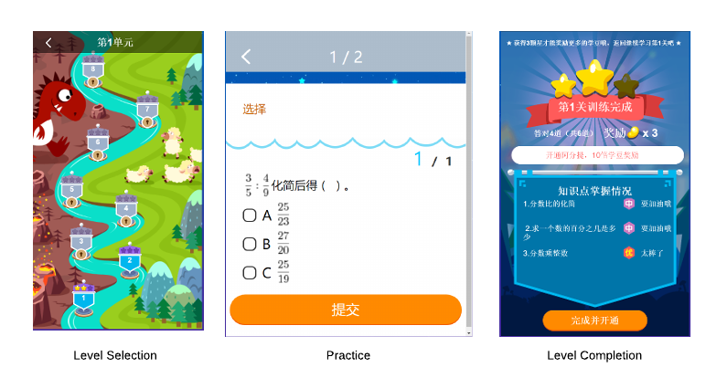
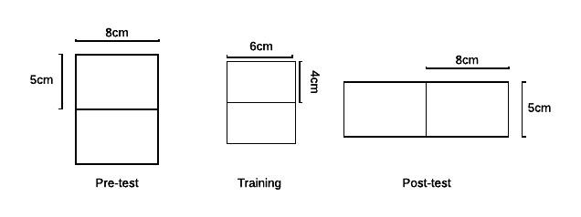

---
output:
  pdf_document: default
  html_document: default
---

## Effort Induced Measurement in Low Stake Pedagogical Efficacy Experiments

```{r global_options, include=FALSE}
knitr::opts_chunk$set(fig.pos = 'H')
options(digits=3)
```

```{r, echo=FALSE,message=FALSE,warning=FALSE}
library(dplyr)
library(tidyr)
library(ggplot2)
library(stargazer)
library(gridExtra)
library(knitr)
rm(list=ls())

proj_dir = 'C:\\Users\\junchen\\Documents\\GitHub\\thesis'
input_file_path = paste0(proj_dir,'/_data/03/paper_data.RData')
load(input_file_path)

# filter out vocab

data = data%>%  filter(group %in% c('No-3','Video'))
data$group = factor(as.character(data$group), levels=c( "No-3","Video"), labels=c('Control','Treatment'))

data = data %>% mutate(effort=1-giveup, correct=as.numeric(score==1), ec_status=effort+correct)

data$effort = factor(data$effort,labels=c('No Effort','Effort'))
data$correct = factor(data$correct, labels=c('Incorrect','Correct'))
data$ec_status = factor(data$ec_status, labels=c('Give-up','Honest Error','Correct'))

```

**Abstract**


# 1.Introduction
Randomized control trials(RCT) have become an important tool for the pedagogy research in the intelligent tutor literature. Consider an RCT that compares the efficacy of two pedagogical methods. The experiment assigns the learners randomly to two groups, each group receives a pre-test item, a training session, and a post-test item. To simplify, assume the learner does not guess or slip in answering the test instruments and the learner only learns from the training session. Let $i$ be the learner id, $Y$ be the response, $D$ be the group assignment, $t$ mark the pre-test(0) or post-test(1). The analyst estimates the difference in pedagogical efficacy ($\gamma$) by the difference in difference(DID) linear regression: 


$$
Y_{i,t} = \beta_d D_i + \beta_t t + \gamma D_i t + \epsilon_{i,t}
$$

The seemingly rigorous analysis makes a very strong implicit assumption: The learners always exert effort in the experiment. Consider an extreme case where the efficacy of two methods is equivalent but method A makes all learners exert effort while method B make none of them exert effort. If no effort leads to no learning, the DID estimator will falsely conclude that method A is superior to method B.

Low effort is a common phenomenon in low stake learning environment. If the learner can choose to shirk from effort in the training session, they may not learn. Let $D_i^*$ be the assigned, $E_i$ be the effort level, if no effort means no learning, the observed assignment is $D_i=D_i^*E_i$. It is a multiplicative measurement error in the right-hand side variable. If the effort level differs between the treatment training and the control training, the measurement error is not independent of the group assignment, consequently biased the DID estimator. This is the effort induced measurement bias in a nutshell. 

This paper identifies the effort level, traces the data generating process of the effort and the response with a structural model, and estimates the pedagogical efficacy directly by recovering the latent mastery conditional on the effort the observed response. The paper is organized as the following: The first section describes the structural model. The second section describes the non-monotonicity of the DID estimator with respect to the rank order of the pedagogical efficacies. The third section applies the model to a real experiment.

# 2.A Structural Learning Model with the Effort Choice

This paper builds the structural model based on the bayesian knowledge tracing (BKT) model because it is the most parsimonious structural model that allows for dynamic learning. This paper extends the BKT model to incorporate the state dependent effort choice

## 2.1 The Response Only Bayesian Knowledge Tracing Model

The classical bayesian knowledge tracing(BKT) model infers the latent mastery only from the observed response. It assumes a binary latent mastery ($X_t$) where 1 stands for mastery and a binary observed response($Y_t$) where 1 stands for a correct response. Conditional on the latent mastery, the observed response is generated by a Bernoulli distribution. Traditionally, the two Bernoulli distributions are described by the parameter of slip($s=P(Y_t=0|X_t=1)$) and guess($g=P(Y_t=1|X_t=0)$). At each practice opportunity, if the learners have not reached mastery ($X_t=0$), they learn (reach mastery) with a probability ($\ell=P(X_t=1|X_{t-1}=0)$). If the learners have already reached mastery, they never forget($P(X_t=0|X_{t-1}=1)=0$).

## 2.2 The Effort Choice Bayesian Knowledge Tracing Model

The extended model infer the latent mastery from both the observed response and the effort level. The critical assumption on how effort affects learning is no pain no gain. It leads to the multiplicative from measurement error, which is at the core of the DID estimator bias.

**Assumption 1**: If the learners do not exert effort at the practice, they learn with probability 0. ($P(X_t=1|X_{t-1}=0,E_t=0)=0$)


Additional assumptions on the effort level and response generation are needed to complete the structural model.


**Assumption 2**: If the learners do not exert effort at the practice, they produce the correct response with probability 0 regardless of the latent mastery ($P(Y_t=1|E_t=0)=0$). 

**Assumption 3**: The effort choice is I.I.D conditional on the current mastery. ($P(E_t=1|X_t=k)=P(E_t=1|X_m=k) \quad \forall t,m$)

Both assumptions are not true in general. Assumption 2 is not valid for all question types. For example, if the test instrument is a multiple choice problem, it is possible to make a lucky guess without any thinking. However, if the test instrument is a fill-in-the-blank problem, the probability of a blind correct guess is almost zero and the assumption 2 is validated. Assumption 3 assumes that the learner does not succumb to the learned pessimism. In order to accurately document the effect of the training, the pre-test item and the post-test item are usually similar to the training session in the underlying knowledge point. If the learners fail the pre-test item and the training does not fortify their will to overlook the past failure, they are likely to shirk from the effort in the training and the post-test item. In this paper, this possibility is ignored.


## 2.3 Model Structure

The joint likelihood of $\{X_t,Y_t,E_t\}$ is

$$
P(Y1,\dots, Y_t,E_1\dots,E_t,X_1,\dots,X_t) =[\prod_{t} P(Y_t|X_t)P(E_t|X_t)]P(X_1,\dots,X_t)
$$
The likelihood of $\{X_t\}$ is
$$
P(X_1,\dots,X_t) =P(X_1)P(X_2|X_1)\dots P(X_t|X_{t-1})
$$

The likelihood of the observed data is

$$
P(Y_1, \dots, Y_t,E_1\dots,E_t) = \sum_{X_1=0}^1\dots\sum_{X_t=0}^1 P(Y_1, \dots, Y_t, E_1, \dots,E_t,X_1,\dots,X_t)
$$

The three equations above recursively define the system dynamics. Notice the pedagogical efficacy is estimated incorporating the information about the observed response and effort.

$$
\hat{\ell} = \frac{\sum_{t=1}^T P(X_t=1,X_{t-1}=0|Y_1,\dots,Y_T,E_1,\dots,E_T)}{\sum_{t=1}^T P(X_{t-1}=0|Y_1,\dots,Y_T,E_1,\dots,E_T)}
$$

## 2.4 Model Estimation

The structural model is estimated with MCMC algorithm. The MCMC algorithm first augments the latent state given the observed data and parameter by $P(X_1,\dots,X_t|Y_1,\dots,Y_t,E_1,\dots,E_t,\Theta)$, then updates the parameter given the latent states and the observed data by $P(\Theta|Y_1,\dots,Y_t,E_1,\dots,E_t,X_1,\dots,X_t)$. The state augmentation is carried out by the forward recursion backward sampling algorithm while the parameter update is carried out by the Gibbs sampler. All models are estimated with 4 chains of 1000 iterations. The first 300 iterations are burn-in and the posterior distribution is sampled every 10 iterations from the remainder of the chain. 


# 3. Non-monotonicity of the Difference in Difference Estimator

The randomized control trial does not aim to estimate the pedagogical efficacy with precision but to establish a rank order between the treatment and the control. Therefore, the DID estimator is valid for inference as long as it is a monotone function of the pedagogical efficacy difference, even though it is a biased estimator of the actual difference. Therefore, to argue that DID estimator is invalid is equivalent to prove that it is not a monotone function of the efficacy difference.

## 3.1 Notation

Let  $J$ denote the item sequence each group received. In the context of random control trials, the item sequence has the generic form of (pre-test, training, post-test). Let the pre-test be 0, the post-test be 1, the treatment training be $T$, and the control training be $C$. In short, the treatment group receives the item sequence $J_T=(0,T,1)$ and the control group receives the item sequence $J_C=(0,C,1)$.

Let the correct rate of item $j$ conditional on the latent state $k$ be $c_j^{k}$. Let the effort rate of the item $j$ conditional on the latent state $k$ be $e_j^{k}$. Let the pedagogical efficacy of the item $j$ be $\ell_j$. Let the initial probability of being mastered be $\pi$. For simplicity, assume the effort rates only differs for the unmastered learner($X_t=0$) between the treatment group and control group. Further, assume the effort rate is increasing with respect to the latent mastery for all items($e_j^0<e_j^1$).


## 3.2 The Monotonicity of DID Estimator with Response Only

If the learner always exerts effort, it is frivolous to condition on the effort. The data generating process reduces to response only. It can be proved (in Appendx A) that

**Theorem 1**: The DID estimator is a monotone function of the pedagogical efficacy difference if and only if there is unmastered learner before the experiment($\pi<1$), the pre-test item does not convert the learner to the mastery status for sure($\ell_0<1$), and the post-test item discriminates between two latent states($c_1^1 \geq c_1^0$).

## 3.3 The Non-monotonicity of the DID estimator with Effort Choice

However, if there is effort choice, a stronger assumption is required to establish the monotonicity (in Appendix B).

**Theorem 2**: With the effort choice, the DID estimator is a monotone function of the pedagogical efficacy difference if and only if $\pi<1$ and $\ell_0<1$, and 

$$
(\ell_T-\ell_C)(\frac{\ell_T}{\ell_C}-\frac{e^0_C}{e^0_T}) > 0
$$

For example, when $\ell_T>\ell_C$, DID estimator is monotone if $\frac{\ell_T}{\ell_C}>\frac{e^0_C}{e^0_T}$. Intuitively, it means that the more pedagogical effective item cannot be too discouraging for the unmastered learners. This is not always the case.

One intuitive solution of the multiplicative measurement error is to condition the analysis on the subset of learners who exert efforts on the training question. However, the conditional DID estimator does not guarantee the monotonicity either.

**Theorem 3** Conditioning on the effort on the training question is not a sufficient condition of the DID estimator being a monotone function of the pedagogical efficacy difference.

The key insight is that conditioning on the effort changes initial state density,

$$
\tilde{\pi}_D=P(X_0=1|E_D=1) = \frac{\pi e^1_D}{[(1-\pi)(1-\ell_0)e_0+(1-\pi)(1-e_0)]e^0_D+[(1-\pi)\ell_0e_0+\pi]e_D^1}
$$

Unless $e_D^1=e_D^0$, $\tilde{\pi}_T \neq \tilde{\pi}_C$. Therefore, conditional DID estimator breaks the random assignment of the RCT and the DID is not a monotone function of pedagogical efficacy difference in general. 


## 3.5 Simulation
The simulation demonstrates theorem 1 and theorem 2 in the previous section. The simulation parameters are in Appendix D. The treatment is set to be superior to the control. For the response only data generating process, the parameters are set so that the DID estimator converges to 0.176. For the effort choice data generating process, the parameters are set so that the DID estimator converges to 0. 

The DID model and the structural Bayesian Knowledge Tracing(BKT) model estimate different quantities. While the DID is estimating a function of the pedagogical efficacy difference, the BKT is estimating the difference directly. Therefore, the meaningful comparison between the two models is whether the confidence/credible interval reaches the same conclusion. In this case, the lower end of the interval shall be positive. Table 1 shows the result of the simulation. In response-only data generating process, both models arrive at the correct conclusion. In the effort choice data generating process, only the BKT model arrives at the correct conclusion.


```{r,echo=FALSE,message=FALSE,warning=FALSE}
data_dir = paste0(proj_dir, '/_data/03/sim/')

exp1_data = read.table(paste0(data_dir, 'exp1.txt'),sep=',',col.names=c('i','t','j','y'))
treat_status = exp1_data %>% filter(t==1) %>% mutate(D=j-1) %>% select(i,D)
analysis_data = merge(exp1_data %>% filter(t!=1) %>% mutate(t=t/2) %>% select(i,t,y), treat_status)
mod1 = lm(data=analysis_data, y~t*D)
se <- sqrt(diag(vcov(mod1)))
mcmc_param1 =  read.table(paste0(data_dir, 'exp1_param.txt'),sep=',') %>% select(V2,V3) %>% rename(l0=V2,l1=V3) %>% mutate(ldif=l0-l1)


exp3_data = read.table(paste0(data_dir, 'exp3.txt'),sep=',',col.names=c('i','t','j','y','h','e'))
treat_status = exp3_data %>% filter(t==1) %>% mutate(D=j-1) %>% select(i,D)
analysis_data = merge(exp3_data %>% filter(t!=1) %>% mutate(t=t/2) %>% select(i,t,y), treat_status)
mod3 = lm(data=analysis_data, y~t*D)
se <- sqrt(diag(vcov(mod3)))
mcmc_param3 =  read.table(paste0(data_dir, 'exp3_param.txt'),sep=',') %>% select(V2,V3) %>% rename(l0=V2,l1=V3) %>% mutate(ldif=l0-l1)


sim_param = data.frame(dgp=c('Response Only','Response Only','Effort Choice','Effort Choice'),
                       model=c('DID','Strutucal Model','DID','Strutucal Model'),
                       true=c(0.176,0.4,0.0,0.4),
                       point_est = as.numeric(0),
                       lower = as.numeric(0),
                       upper = as.numeric(0))

sim_param$point_est[1] = - mod1$coefficients[4]
sim_param$lower[1] = - mod1$coefficients[4] - 1.96*se[4]
sim_param$upper[1] = - mod1$coefficients[4] + 1.96*se[4]

sim_param$point_est[3] = - mod3$coefficients[4]
sim_param$lower[3] = - mod3$coefficients[4] - 1.96*se[4]
sim_param$upper[3] = - mod3$coefficients[4] + 1.96*se[4]

sim_param$point_est[2] = mean(mcmc_param1$ldif)
sim_param$lower[2] = quantile(mcmc_param1$ldif, prob=0.05)
sim_param$upper[2] = quantile(mcmc_param1$ldif, prob=0.95)

sim_param$point_est[4] = mean(mcmc_param3$ldif)
sim_param$lower[4] = quantile(mcmc_param3$ldif, prob=0.05)
sim_param$upper[4] = quantile(mcmc_param3$ldif, prob=0.95)

kable(
  sim_param, booktabs = TRUE,
  col.names=c('Data Generating Process','Model','True Val','Point Estimation','95% CI(L)','95% CI(H)'),
  align='c',
  caption = 'Simulation Result'
)

```


# 4.Case Study
This section applies the effort-bias correction to an experimental dataset. The section first describes the data collection process, then describes the identification of the effort choice and evidence of differential effort choice, and finally shows the distribution of estimated parameters from different model and effort specification.


##  4.1 The Learning Environment

The experiment is carried out in a paid self-learning product offered by a Chinese online learning service provider. The product is used after school, rather than in the classroom. The product is framed as a role-playing game where the learner clears a level to claim the reward. The screen shots of the selection, the practice and the completion of a level are shown in Figure 1.

```{r,echo=FALSE,message=FALSE,warning=FALSE, fig.cap = "Level Initiation", fig.align='center'}

```


The product is a low stake learning environment because it offers a small monetary incentive to good performance and no direct punishment for poor performance. If the learners correctly answer the question, they receive xuedou, an in-game virtual currency, that can buy in-game gears or real world gifts.During the experiment, the reward for each correct response is about  a tenth of a penny in RMB (or $0.00014). If the learners answer the question wrong, they receive nothing and lose nothing at the spot but are offered a second chance later to try again for a smaller reward. Because the learning environment is low stake, it does not inspire the learners to struggle when challenged with difficult questions. In addition, because each correct answer is worth the same regardless of the item difficulty, some students develop the strategy of picking the easy item and skipping the hard item. Both the low incentive and the deliberate system gaming lead to learners withholding full effort observed in the data.


## 4.2 The Design and the Implementation of The Experiment 

The experiment is administrated from June 9th to June 10th 2016 to third-grade students whose parents paid for the learning product. By then, all learners should have been taught the required knowledge in the school, the formula of circumference and area of a rectangle. 

Each group receives three items, the pre-test item, the training item and the post-test item, as shown in Figure 2. All items ask the learner to calculate the circumference and the area of two identical rectangles joined by one side given the length and width of the small rectangle. The pre-test item and the training item are rectangles joined by length but have different values. The pre-test and post-test item share the same value but joined by different sides. A highly similar yet not identical item aim to increase the measurement validity while prevents student memorizing the answer.

```{r,echo=FALSE,message=FALSE,warning=FALSE, fig.cap =  "The Item Description", fig.align='center'}

```


The learners are randomly assigned to the treatment group and the control group by the user id, which is randomly generated. The treatment and the control group differ in the pedagogical methods.The control group does not receive any tutoring except for a practice question with different values. The treatment group receives the same practice question plus a link to an animated video tutorial containing the following scaffolding:


1. Calculate the circumference and the area of the small rectangle
2. To get the circumference of the large rectangle, multiply the circumference of the small rectangle by two and subtract two times of the length of the joined side.
3. To get the area of the large rectangle,  multiply the area of the small rectangle by two


The learner can choose to skip the video tutorial. Unfortunately, the log does not track if the learner watches the video or not. On aggregate, the video is played about 800 times. If count each view as a different user , the maximum exposure to the treatment is about 30%. The video tutorial is 67 seconds long. The average watch time is about 47 seconds.


## 4.3 Differential Effort Choice 

The identification of the model hinges on the identification of the effort level. Unfortunately, the effort level is not directly observed but has to be inferred from the log data. A description and example of the log are available in appendix E. 

## 4.3.1 Effort Classification

The paper identifies the effort from the actual text response student submitted. A correct response or an honest error is labeled as "effort" while a blank answer or a non-blank but also the non-sense answer is labeled as "no-effort"/"give-up". In the context of this experiment, there are only four honest mistakes:

1. Wrong shape: The learner calculates correctly either the circumference or the area of the small rectangle
2. Wrong circumference: The learner correctly calculates the area but not the circumference
3. Wrong area: The learner correctly calculates the circumference but not the area
4. Slip:  The answer is correctly calculated but the learner inputs in a wrong way (for example an extra trailing 0)

The following table shows a breakdown of the answer classification. The classification issue is discussed in details in appendix F.

```{r, echo=FALSE,message=FALSE,warning=FALSE}
# the four groups are noefforts, honest errors and correct response
ans_composition = data  %>%
  mutate(subscore=score0+score1+score2) %>%
  group_by(group, qtype) %>% 
  summarize(n=n(),
            noeffort = mean(subscore==0),
            se_noeffort = sqrt((1-noeffort)*noeffort/n),
            honesteror=mean(subscore>0&score<1),
            se_honesteror = sqrt((1-honesteror)*honesteror/n),
            corret=mean(score==1),
            se_corret = sqrt((1-corret)*corret/n))%>%
 select(-n) %>%
    mutate(noeffort=noeffort*100,
           honesteror=honesteror*100,
           corret=corret*100,
           se_noeffort=se_noeffort*100,
           se_honesteror=se_honesteror*100,
           se_corret=se_corret*100)

kable(
  ans_composition %>% arrange(qtype,group), booktabs = TRUE,
  col.names=c('Group','Task','No Effort(%)','No Effort(SE)','Honest Error (%)','Honest Error (SE)', 'Correct(%)','Correct(SE)'),
  align='c',
  caption = 'Answer Composition - All Wrong'
)
```


### 4.3.2 Robustness Check of the Effort Classification


Time spent on the item is suggestive of the learner's effort input. The time spent on the item is defined as the time between the time the server receives the learner's item request and the time the server receives the learner's answer submit. It does not guarantee that the learner is actively engaged between the two events. Although there are 4% of the observations logged response time longer than 2 minutes, the majority of the response time falls within a reasonable time range.

Figure 3 shows the distribution of time spent on the item. The honest error is very similar to the correct answer. However, the give-up answers have a very distribution of time spent. The median time spent on the honest error and the correct answer is about 47 seconds while that on the give-up is about 10 seconds. The first quartile of the response time of the honest error and the correct answer is about 34 seconds, which is higher than the third quartile of the response time of give-up answer, 29 seconds. The similarity between the honest error and the correct answer and the difference of the two from the give-up answer support the validity of the effort classification. 

```{r, echo=FALSE,message=FALSE,warning=FALSE,, fig.cap = "Boxplot of Time Spent By Effort and Response", fig.align='center',out.height='8cm',out.width='8cm'}

qplot(data=data,x=ec_status,y=cmt_timelen,geom='boxplot') + ylab('Time Spent on Item(Sec)') + xlab('Answer Type')

```


The reader may argue the classification strategy underestimate the level of effort because it is possible that learner types in non-sense answer or leave it blank after some serious thought. Although it is an issue for the pre-test item, such miscoding is less problematic for the training item and the post-test item. Figure 4 shows the distribution of response time when submitting a give-up answer. Compared to the pre-test item, the response time distribution of the training item and the post-test item shifts and skews toward 0. The learners are spending less time on the problem, so little that it may not allow for a careful reading of the question. Therefore, the effort identification is likely to be more accurate in the next two items. 

```{r,echo=FALSE,message=FALSE,warning=FALSE, fig.cap = "Distribution of Time Spent on Item without Effort by Answer Classification", fig.align='center',out.height='8cm',out.width='8cm'}
qplot(data=data %>% filter(cmt_timelen<=120&giveup), x=cmt_timelen, geom='density', col=etype, linetype=etype, facets=group~qtype)+xlab('Time Spent on Task (Seconds)')
```

In contrast, the answers with effort do not demonstrate the same shift. Figure 5 shows the distribution of response time when submitting a valid answer.The honest error and the correct answer tax the mind and take time, while the decision of giving up is made on the fly. The comparison of response time distribution between effort and no effort further supports the validity of the classification.


```{r,echo=FALSE,message=FALSE,warning=FALSE, fig.cap = "Distribution of Time Spent on Item With Effort by Answer Classification", fig.align='center',out.height='8cm',out.width='8cm'}
qplot(data=data %>% filter(cmt_timelen<=120&!giveup), x=cmt_timelen, geom='density', col=ec_status, linetype=ec_status,facets=group~qtype) + xlab('Time Spent on Task (Seconds)')

```


### 4.3.3 Differential Effort Level Choice

Ideally, one needs to compare the effort rate of the unmastered learner at the training session ($e^0_D$) to check if the effort choice is different between the treatment and the control. Since the latent mastery is not observable, it is infeasible. However, If the pre-test question discriminates sharply between those who has mastered and those who has not, conditional on the observed response is a good proxy. Empirically, the pre-test item does have high discriminatory power($c_1^0=0.18,c_1^1=0.94$), thus justifies approximating the state-dependent effort rate with the response-dependent effort rate.

Conditioning on a wrong response in the pre-test item, the treatment group is less likely to exert effort in the training item but not the post-test item. This is strong evidence that the treatment group does exert less effort than the control group. The exact cause of the differential effort choice is unknow. The author speculates that the learners may be just intimiated by the length explanation on how to watch the video because third graders are not very enthusiastic about reading instructions. 


```{r,echo=FALSE,message=FALSE,warning=FALSE,results='asis'}
e_mod_D_x0 = lm(data=data%>% filter(is_placebo==0)%>% filter(qtype=='train'), 1-giveup~group)
e_mod_1_x0 = lm(data=data%>% filter(is_placebo==0)%>% filter(qtype=='post'), 1-giveup~group)
stargazer(e_mod_D_x0,e_mod_1_x0, 
          type='latex',          
          dep.var.labels = 'Effort Rate(Conditional on First Failure)',
          keep=c('groupTreatment'),
          covariate.labels=c('Difference'), 
          column.labels=c('Train','Post-test'), 
          model.numbers          = FALSE,
          header=FALSE ,
          keep.stat=c("n"))

```


Compare the diference of effort rate without conditioning on the first failure, there is still a effort deficit in the training item and no difference in the post-test item. However, the effort deficit, albeit smaller, also occurs in the pre-test item. Therefore, the effort difference at the training session cannot be entirely attributed to the item characteristics.

```{r,echo=FALSE,message=FALSE,warning=FALSE,results='asis'}
e_mod_0 = lm(data=data%>% filter(qtype=='pre'), 1-giveup~group)
e_mod_D = lm(data=data%>% filter(qtype=='train'), 1-giveup~group)
e_mod_1 = lm(data=data%>% filter(qtype=='post'), 1-giveup~group)
stargazer(e_mod_0, e_mod_D,e_mod_1, 
          type='latex',          
          dep.var.labels = 'Effort Rate (Unconditional)',
          keep=c('groupTreatment'),
          covariate.labels=c('Difference'), 
          column.labels=c('Pre-test','Train','Post-test'), 
          model.numbers          = FALSE,
          header=FALSE ,
          keep.stat=c("n"))

```

## 4.4 The result

This section compares the DID estimator to the structural model estimator. It demonstrates how a small difference in the effort rate can lead to substantial bias in the estimation of the difference. A prior, the pedagogical experts agreed that the presence of a video scaffolding tutorial shall increase the pedagogical efficacy of the treatment. Especially, because the circumference of the large rectangle is not simply double that of the small rectangle, they expect that the special trick in the video leads to a larger gains in the knowledge component of the circumference. In short, the effort-choice BKT model confirms the prior expectation of the domain experts, while the rest two models do not.


### 4.4.1 Aggregate Efficacy

The DID estimator, the response-only BKT model, and the effort choice BKT model are applied to the aggregate score. Table 4 shows that estimation result. Both DID and the response-only BKT model fails to conclude that the treatment pedagogy is superior to the control pedagogy. In contrast, the effort-choice BKT model strongly suggests that the treatment is superior to the control because its 95% credible interval excludes 0. 

```{r,echo=FALSE,message=FALSE,warning=FALSE}
y0data = data %>% filter(eid=='Q_10201056649366') %>% mutate(t=0)
y1data = data %>% filter(eid=='Q_10201056666357') %>% mutate(t=1)

ydata = rbind(y0data,y1data)
ydata = ydata %>% transform(d=as.numeric(gid!=0))

mod = lm(data=ydata,y~d*t)
se <- sqrt(diag(vcov(mod)))

no_param = read.table(paste0(proj_dir,'/_data/03/exp/no_effort.txt'),sep=',') %>%
  mutate(ldif=V3-V2) %>% select(ldif) %>%
  mutate(model='response only')

manual_param = read.table(paste0(proj_dir,'/_data/03/exp/manual_effort.txt'),sep=',') %>%
  mutate(ldif=V3-V2) %>% select(ldif) %>%
  mutate(model='effort choice')

param_data = data.frame(model=c('DID','Response Only','Effort Choice'), point_est = as.numeric(0), lower=as.numeric(0), upper=as.numeric(0))
param_data$point_est[1] =mod$coefficients[4] 
param_data$lower[1] =mod$coefficients[4] - 1.96*se[4]
param_data$upper[1] =mod$coefficients[4] + 1.96*se[4]

param_data$point_est[2] =mean(no_param$ldif) 
param_data$lower[2] = quantile(no_param$ldif, 0.05)
param_data$upper[2] = quantile(no_param$ldif, 0.95)

param_data$point_est[3] =mean(manual_param$ldif) 
param_data$lower[3] = quantile(manual_param$ldif, 0.05)
param_data$upper[3] = quantile(manual_param$ldif, 0.95)


kable(
  param_data, booktabs = TRUE,
  col.names=c('Model','Point Estimation','95% CI(L)','95% CI(H)'),
  align='c',
  caption = 'Model Comparison'
)

```

### 4.4.2 The Efficacy Difference of Knowledge Components 

To correctly solve the problem, the learner must master three knowledge components: shape identification, circumference calculation, and area calculation. Therefore, it is possible to score each knowledge components and analyze the pedagogical efficacy difference separately. The effort choice is inherited from the aggregate score and is not redefined. For example, if the learner leaves a blank for circumference but fills in the area, the response is considered a valid effort for all three components, rather than treating it as a give-up for the circumference due to the blank answer.

When analyzing the response only BKT model, none of the knowledge components show a significant difference between two groups.

```{r,echo=FALSE,message=FALSE,warning=FALSE}
no_param_0 = read.table(paste0(proj_dir,'/_data/03/exp/no_effort_0.txt'),sep=',') %>%
  mutate(ldif=V3-V2) %>% select(ldif) %>%
  mutate(model='response only')


no_param_1 = read.table(paste0(proj_dir,'/_data/03/exp/no_effort_1.txt'),sep=',') %>%
  mutate(ldif=V3-V2) %>% select(ldif) %>%
  mutate(model='response only')


no_param_2 = read.table(paste0(proj_dir,'/_data/03/exp/no_effort_2.txt'),sep=',') %>%
  mutate(ldif=V3-V2) %>% select(ldif) %>%
  mutate(model='response only')

param_data = data.frame(model=c('Shape','Circumference','Area'), point_est = as.numeric(0), lower=as.numeric(0), upper=as.numeric(0))
param_data$point_est[1] =mean(no_param_0$ldif) 
param_data$lower[1] = quantile(no_param_0$ldif, 0.05)
param_data$upper[1] = quantile(no_param_0$ldif, 0.95)

param_data$point_est[2] =mean(no_param_1$ldif) 
param_data$lower[2] = quantile(no_param_1$ldif, 0.05)
param_data$upper[2] = quantile(no_param_1$ldif, 0.95)

param_data$point_est[3] =mean(no_param_2$ldif) 
param_data$lower[3] = quantile(no_param_2$ldif, 0.05)
param_data$upper[3] = quantile(no_param_2$ldif, 0.95)


kable(
  param_data, booktabs = TRUE,
  col.names=c('Step','Point Estimation','95% CI(L)','95% CI(H)'),
  align='c',
  caption = 'Efficacy Difference Estimation - Responses Only BKT'
)

```

However, when analyzing with the effort choice structural model, the treatment is superior to the control in teaching the learner circumference but not the other two steps. This is consistent with the prior expectation.

```{r,echo=FALSE,message=FALSE,warning=FALSE}

manual_param_0 = read.table(paste0(proj_dir,'/_data/03/exp/manual_effort_0.txt'),sep=',') %>%
  mutate(ldif=V3-V2) %>% select(ldif) %>%
  mutate(model='effort choice')

manual_param_1 = read.table(paste0(proj_dir,'/_data/03/exp/manual_effort_1.txt'),sep=',') %>%
  mutate(ldif=V3-V2) %>% select(ldif) %>%
  mutate(model='effort choice')

manual_param_2 = read.table(paste0(proj_dir,'/_data/03/exp/manual_effort_2.txt'),sep=',') %>%
  mutate(ldif=V3-V2) %>% select(ldif) %>%
  mutate(model='effort choice')

param_data = data.frame(model=c('Shape','Circumference','Area'), point_est = as.numeric(0), lower=as.numeric(0), upper=as.numeric(0))
param_data$point_est[1] =mean(manual_param_0$ldif) 
param_data$lower[1] = quantile(manual_param_0$ldif, 0.05)
param_data$upper[1] = quantile(manual_param_0$ldif, 0.95)

param_data$point_est[2] =mean(manual_param_1$ldif) 
param_data$lower[2] = quantile(manual_param_1$ldif, 0.05)
param_data$upper[2] = quantile(manual_param_1$ldif, 0.95)

param_data$point_est[3] =mean(manual_param_2$ldif) 
param_data$lower[3] = quantile(manual_param_2$ldif, 0.05)
param_data$upper[3] = quantile(manual_param_2$ldif, 0.95)


kable(
  param_data, booktabs = TRUE,
  col.names=c('Step','Point Estimation','95% CI(L)','95% CI(H)'),
  align='c',
  caption = 'Efficacy Difference Estimation - Effort Choice BKT'
)

```


# 5.Discussion

The paper has demonstrated that differential effort choice, even small, can lead to substantial change in the rank order inference. Although the paper uses a trivial experiment as the case study, the model has wide implication for the evaluation of education programs. For one thing, simple difference in difference does not account for the discrimatory power of the test instruments, which leads to lower test power and higher false negative. For another, the DID are estimating the joint effect of the program on learning and effort, which cannot distinguish an effective but not engaging program and an ineffective but engaging program. The author argues that such distinguishment is important for the improvement of the program. If the program is effective not not engaging, there are many ways to raise user engagement. If the program is not pedagogically effective, it shall be dropped.

One problem of the analysis is the heavy reliance on the manual text analysis for effort identification. It is time-consuming and not scalable. To automatically code the effort choice, future models need to incorporate other information, such as time, cursor movement, and auxiliary censor data. Another problem is the knowledge component efficacy analysis does not account for the dependence among the factors. It is easy to verify that the three factors is not independent but they are treated as such in the paper. Future works need to extend the single factor latent variable model to the coupled factor latent variable model. 

```{r,echo=FALSE,message=FALSE,warning=FALSE}
# # Check the sequence dependence
# wide_data=  data %>%
#     mutate(effort=1-giveup)%>%
#   select(uid,group,seq_id,effort) %>%
#   spread(seq_id,effort)
# names(wide_data) = c('uid','group','t1','t2','t3')
# 
# effort_persistence = merge(wide_data %>% group_by(group,t1,t2,t3) %>% summarize(n=n()), wide_data %>% group_by(group) %>% summarize(N=n())) %>% mutate(pct=n/N)
# 
# effort_persistence$pattern = '0,0,0'
# effort_persistence$pattern[effort_persistence$t1&effort_persistence$t2&!effort_persistence$t3] = '1,1,0'
# effort_persistence$pattern[effort_persistence$t1&!effort_persistence$t2&!effort_persistence$t3] = '1,0,0'
# effort_persistence$pattern[effort_persistence$t1&!effort_persistence$t2&effort_persistence$t3] = '1,0,1'
# effort_persistence$pattern[effort_persistence$t1&effort_persistence$t2&effort_persistence$t3] = '1,1,1'
# effort_persistence$pattern[!effort_persistence$t1&!effort_persistence$t2&effort_persistence$t3] = '0,0,1'
# effort_persistence$pattern[!effort_persistence$t1&effort_persistence$t2&!effort_persistence$t3] = '0,1,0'
# effort_persistence$pattern[!effort_persistence$t1&effort_persistence$t2&effort_persistence$t3] = '0,1,1'
# 
# 
# effort_persistence$pattern = factor(effort_persistence$pattern)
# 
# ggplot(data=effort_persistence, aes(x=pattern,y=pct, fill=group))+ 
#     geom_bar(stat = "identity",position="dodge") +
#     xlab('Slack Pattern') + ylab('Frequency') + ggtitle('Joint Distribution of Efforts') 
# 
# 
# # read in the data
# effort_fit_dist = read.table(paste0(proj_dir,'/data/exp/effort_dist.txt'),sep='\t', col.names = c('pattern','fC','fT'))
# effort_fit_dist =  effort_fit_dist %>% group_by(pattern) %>% summarize(fC=mean(fC),fT=mean(fT))
# 
# ctrl_effort_data = effort_persistence %>% filter(group=='Control')%>% select(pattern, pct)
# treat_effort_data = effort_persistence %>% filter(group=='Treatment')%>% select(pattern, pct)
# 
# ctrl_effort = merge(ctrl_effort_data, effort_fit_dist%>% select(pattern,fC)) %>% gather(type,val,-pattern) %>% mutate(group='control')
# ctrl_effort$type = factor(ctrl_effort$type, levels=c('pct','fC'), labels=c('data','fitted'))
# treat_effort = merge(treat_effort_data, effort_fit_dist%>% select(pattern,fT))  %>% gather(type,val,-pattern) %>% mutate(group='treatment')
# treat_effort$type = factor(treat_effort$type, levels=c('pct','fT'), labels=c('data','fitted'))
# 
# effort_dist = rbind(ctrl_effort, treat_effort)
# 
# m1= ggplot(data=effort_dist, aes(x=pattern,y=val, fill=type))+ 
#     geom_bar(stat = "identity",position="dodge") +
#     xlab('Slack Pattern') + ylab('Frequency') + ggtitle('Joint Distribution of Efforts') 
# 
# m2= ggplot(data=effort_dist %>% filter(group=='treatment'), aes(x=pattern,y=val, fill=type))+ 
#     geom_bar(stat = "identity",position="dodge") +
#     xlab('Slack Pattern') + ylab('Frequency') + ggtitle('Joint Distribution of Efforts') 
# grid.arrange(m1,m2)

```

# Appendix

## Appendix A:Proof of Theorem 1

Let it be three items. The pre-test and the post-test items are the same, while the training item differs. Let the item id for pre-test, post-test, training and control to be $0,1,T,C$ respectively. Let the group status be $D$.

When there is no effort choice, the first difference within each group is 

$$
\begin{aligned}
\delta_D&=P(Y_1=1,Y_0=1|D)-P(Y_1=1,Y_0=1|D) \\
&= (1-\pi)(1-\ell_0)(1-\ell_D)(c_1^0-c_0^{1,0})+((1-\pi)[(1-\ell_0)\ell_D+\ell_0])(c_1^1-c_0^{1,0})+(1-\pi)(c_1^1-c_0^{1,1})
\end{aligned}
$$
The second difference is

$$
\delta =\delta_T-\delta_C = (\ell_T-\ell_C)(1-\pi)(1-\ell_0)(c_1^1-c_1^0)
$$

If $\ell_0<1$, $\pi<1$, and $c_1^1>c_1^0$, $\delta>0$. If $\delta>0$, $c_1^1>c_1^0$ because $0\leq\ell_0,\pi\leq1$.

##  Appendix B: Proof of Theorem 2 and Lemma 1
Now, if there exists effort choice, the first difference is

$$
\begin{aligned}
\tilde{\delta}_D&=P(O_0=0,O_1=1|D)-P(O_0=1,O_1=0|D) \\
&=P(E_0=0,E_1=1,Y_1=1|D)+P(E_0=1,E_1=1,Y_0=0,Y_1=1|D)\\
&\quad-P(E_0=1,E_1=0,Y_0=1|D)-P(E_0=1,E_1=1,Y_0=1,Y_1=0|D)\\
&= (1-\pi)(1-\ell_0e^0_0)(1-\ell_De_D)(c_1^0e^0_1-c_0^{1,0}e^0_0)+((1-\pi)[(1-\ell_0e^0_0)\ell_De^0_D+\ell_0e^0_0])(c_1^1e^1_1-c_0^{1,0}e^0_0)+(1-\pi)(c_1^1e^1_1-c_0^{1,1}e^0_0)
\end{aligned}
$$

The second difference is
$$
\tilde{\delta} = \tilde{\delta}_T-\tilde{\delta}_C = (\ell_Te^0_T-\ell_Ce^0_C)(1-\pi)(1-\ell_0e^0_0)(c_1^1e_1^1-c_1^0e_1^0)
$$
To keep monotoncity, in addition to the previous conditions, it is sufficient and necessary to have

$$
(\ell_Te^0_T-\ell_Ce^0_C)(c_1^1e_1^1-c_1^0e_1^0)>0
$$

##  Appendix C: Proof of Theorem 3

The analysis is almost the same as in theory except for the initial state density is $P(X_0=1|E_D=1)$. It can be shown that
$$
\tilde{\pi}_D=P(X_0=1|E_D=1) = \frac{\pi e^1_D}{[(1-\pi)(1-\ell_0)e_0+(1-\pi)(1-e_0)]e^0_D+[(1-\pi)\ell_0e_0+\pi]e_D^1}
$$

Now 

$$
\tilde{\delta} = \tilde{\delta}_T-\tilde{\delta}_C = [\ell_T(1-\tilde{\pi_T})-\ell_C(1-\tilde{\pi_T})](1-\ell_0e^0_0)(c_1^1e^1_1-c_1^0e^0_1)+(\tilde{\pi_T}-\tilde{\pi_C})(c_1^1-c_0^{1,1})e^1_1
$$
Even under the favorable condition that $c_1^1=c_0^{1,1}$, the monotonicity requires

$$
(\ell_T-\ell_C)(\frac{\ell_T}{\ell_c}-\frac{1-\tilde{\pi}_T}{1-\tilde{\pi}_C})>0
$$
In general, the inequality is not true. Thus the difference in difference estimator is not a consistent estimator of the true pedagogical efficacy difference. 

## Appendix D: Simulation Parameter

$$
\begin{aligned}
P(X_0=1) = \pi &= 0.4\\
P(X_t=1|X_{t-1}=0,0)=\ell_0 &= 0.1\\
P(X_t=1|X_{t-1}=0,T)=\ell_T &= 0.7\\
P(X_t=1|X_{t-1}=0,C)=\ell_C &= 0.3\\
P(Y_1=1|X_t=1) =c_1^1&= 0.9\\
P(Y_1=1|X_t=0) =c_1^0&= 0.1\\
\end{aligned}
$$

In the effort choice model, the effort rate is specified to offset the difference in the pedagogical efficacy.All effort rates are 1 except for 

$$
\begin{aligned}
P(E_T=1|X_t=0) =e_T^0&= 0.3\\
P(E_C=1|X_t=0) =e_C^0&= 0.7\\
\end{aligned}
$$

3000 learners are simulated. Half of the learner receives item sequence (0,T,1) and the other receives item sequence (0,C,1).


## Appendix E: The Log file


The log data collected for the experiment includes the following fields:

1. learner id
2. question id
3. Submit time
4. time spent on the question (seconds)
5. the grade (0-1)
6. the actual answer in the text

The time spent on the item is defined as the time elapsed between the time the server sends out the question to the learner's device and the time the learner's submitted answer on the last subquestion received by the server. The transmission time in the network is negligible, usually in the magnitude of 10 milliseconds. The time spent does not distinguish how much time spent on each sub question and it is not a clean measure of student's active learning time. What student did between the question  presentation and the answer submission is not observed.

Here is a sample of the original data log

```{r, echo=FALSE,message=FALSE,warning=FALSE}
kable(
  head(data%>%select(uid, eid, cmt_time, cmt_timelen,atag_pct, answers), 1), booktabs = TRUE,
  col.names = c('User ID', 'Item ID', 'Submit Time', 'Time Spent on Item', 'Score', 'Answers'),
  align='c',
  caption = 'Demo data from the Log'
)
```

## Appendix F: Answer Classification

The answers are initially classified into six categories:

(1) Blank answer: The learner submits nothing on the circumference and the area

(2) Non-blank wrong answer: Neither circumference nor area is correctly calculated and not includes in the slip or the wrong shape category 

(3) Slip: Both circumference and area are correctly calculated but the learner type in the wrong way. For example, switch the two blanks or add the unit of measurements

(4) Wrong Shape: The learner correctly calculates either the circumference or the area but for the small rectangle.

(5) wrong circumference: The learner correctly calculates the area of the large rectangle but not the circumference

(6) wrong area: The learner correctly calculates the circumference of the large rectangle but not the area

(7) Correct Answer: Both circumference and area of the large rectangle are correctly calculated

The Table  and Table  show the summary statistics of different groups' answer composition at a different stage of the experiment. There is a steady increase in the blank answer as the item sequence progresses. The nonblank answer increases most in the training session.


```{r, echo=FALSE,message=FALSE,warning=FALSE}
ans_composition = data  %>%
  group_by(group, qtype) %>% 
  summarize(blank = mean(blank_ans)*100,
            nonblank=mean(nonblank)*100,
            wrongshape=mean(wrong_shape)*100,
            rightcirc=mean(circ_right)*100,
            rightarea=mean(area_right)*100,
            slip=mean(is_slip)*100)
kable(
  ans_composition %>% arrange(qtype,group)%>% select(-rightcirc,-rightarea,-wrongshape,-slip), booktabs = TRUE,
  col.names=c('Group','Task','Blank Ans(%)','Non Blank Wrong Ans (%)'),
  align='c',
  caption = 'Answer Composition - All Wrong'
)
```

For learners who make a valid effort but still do not get all blanks correct, the percentage of the wrong shape declines steadily, but not the wrong area and the wrong circumference. In fact, there is a large increase in the wrong area in the post-test item and a large decrease in the wrong circumference. This observation is consistent with the step-wise efficacy analysis.

```{r, echo=FALSE,message=FALSE,warning=FALSE}
kable(
  ans_composition %>% arrange(qtype,group) %>% select(-blank,-nonblank), booktabs = TRUE,
  col.names=c('Group','Task','Wrong Shape(%)', 'Wrong Area(%)', 'Wrong Circumference(%)','Slip(%)'),
  align='c',
  caption = 'Answer Composition - Partial Correct'
)
```

The reader may also be interested in the detailed breakdown of the answer composition. Other than the non-blank wrong answer, all four error categories have clustered answer patterns: The top 5 answers cover over 50% of the answers. The category of the non-blank answer has a wide dispersion. The top non-blank answer for all but the pre-test item is the correct answer to the pre-test question, which occupies about 30% of the non-blank answer.

As a reminder, the right answer for the pre-test item is (36,80), for the training item (28,48), for the post-test item (42,80). 


```{r, echo=FALSE,message=FALSE,warning=FALSE}
type_ans_stat = data %>% group_by(qtype, ans_type, raw_ans) %>% summarize(n=n()) %>%
  group_by(qtype,ans_type) %>% arrange(desc(n))


type_stat = data %>% group_by(qtype, ans_type) %>% summarize(N=n())

ans_stat = merge(type_ans_stat, type_stat) %>% mutate(pct=n/N) %>%
  filter(ans_type %in% c('wrong shape', 'slip','non-blank ans', 'right area','right circumference')) %>%
  group_by(qtype, ans_type) %>% arrange(qtype,  ans_type, desc(pct)) %>%
  mutate(cum_pct = cumsum(pct)) %>%
  mutate(idx = row_number()) %>% filter(idx<=5) %>%
 ungroup()  %>%
  select(qtype,ans_type, raw_ans,n, pct, cum_pct) 
```

For the non-blank answer, the most common error of the training item and the post-test item is (38,80), which is the correct answer to the pre-test item. The second common error for the post-test is (28,48), which is the correct answer to the training item.  The learners just memorized the answer key from the previous question, which signals that they are not making effort.

```{r,echo=FALSE,message=FALSE,warning=FALSE}

kable(
  ans_stat %>% filter(ans_type=='non-blank ans')%>% select(-ans_type) , booktabs = TRUE,
  caption = 'Answer Breakdown: Nonblank Answer'
)
```

The top category of the wrong shape is the right circumference and the right shape of the small rectangle, which is not surprising.

```{r,echo=FALSE,message=FALSE,warning=FALSE}


kable(
  ans_stat %>% filter(ans_type=='wrong shape') %>% select(-ans_type) , booktabs = TRUE,
  caption = 'Answer Breakdown: Wrong Shape'
)
```

It is not surprising that either the circumference  or the double of the circumference of the small rectangle is in top 3 wrong answer category of the wrong circumference. In all three items, substitute the circumference with a (wrong) area is also a common mistake. For example, (160,80) in the pre-test and (24,48) in the training.

```{r,echo=FALSE,message=FALSE,warning=FALSE}

kable(
  ans_stat %>% filter(ans_type=='right area') %>% select(-ans_type) , booktabs = TRUE,
  caption = 'Answer Breakdown: Wrong Circumference'
)
```

The most common mistake of the wrong area is using the area of the small rectangle.

```{r,echo=FALSE,message=FALSE,warning=FALSE}

kable(
  ans_stat %>% filter(ans_type=='right circumference') %>% select(-ans_type) , booktabs = TRUE,
  caption = 'Answer Breakdown: Wrong Area'
)
```


Slip mainly involves adding 1 before or 0 after the right answer.

```{r,echo=FALSE,message=FALSE,warning=FALSE}

kable(
  ans_stat %>% filter(ans_type=='slip') %>% select(-ans_type) , booktabs = TRUE,
  caption = 'Answer Breakdown: Slip'
)
```


