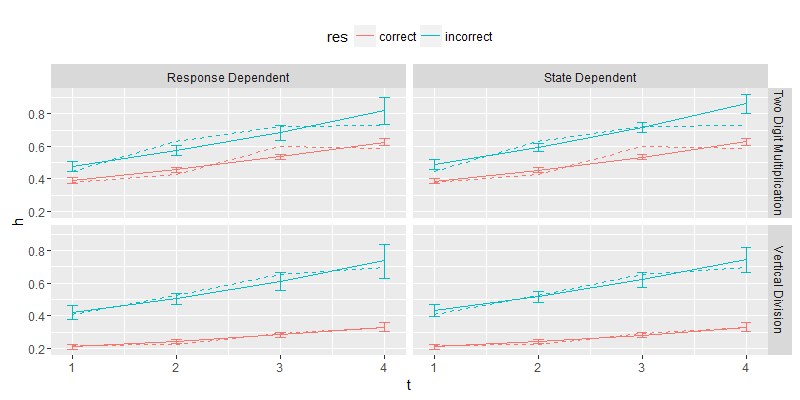
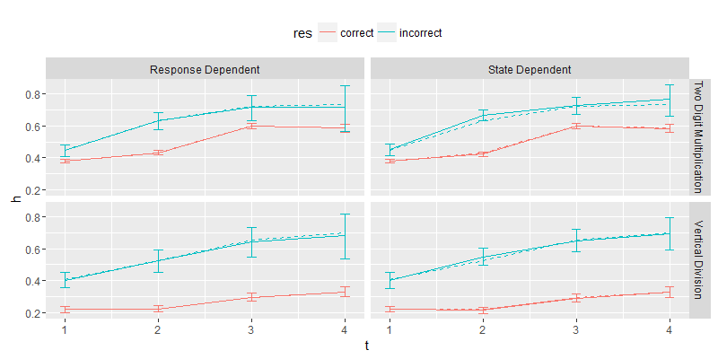
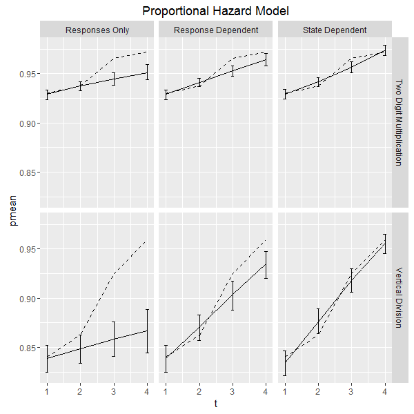
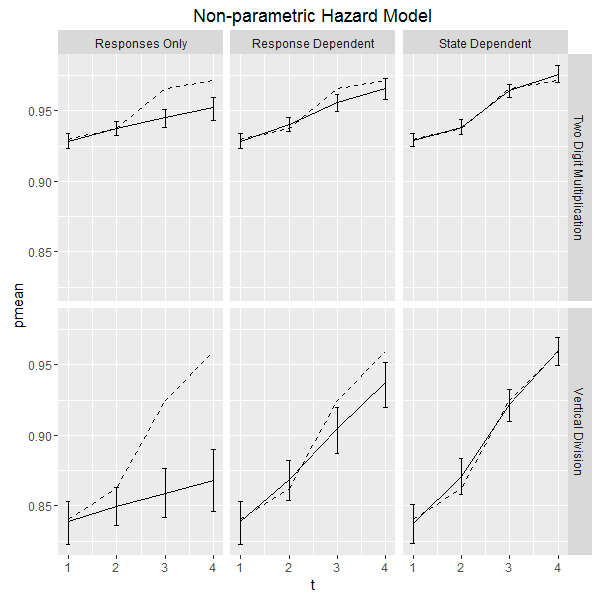
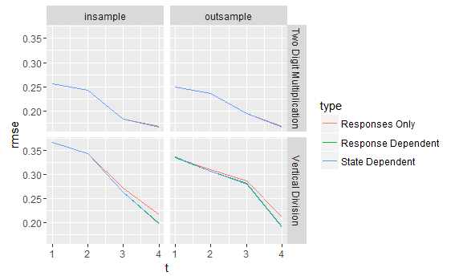
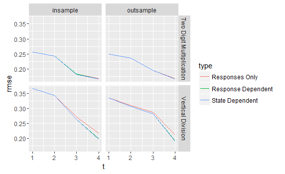

---
output:
  pdf_document: default
  html_document: default
---

# Dynamic Selection Bias of Sample Attrition  {#exit}

```{r, include=FALSE}
knitr::opts_chunk$set(fig.pos = 'H')
options(digits=3)
proj_dir = getwd()
```


```{r env, echo=FALSE, warning=FALSE, message=FALSE}
library(ggplot2)
library(dplyr)
library(tidyr)
library(gridExtra)
library(knitr)
```

```{r func, echo=FALSE, warning=FALSE, message=FALSE}
imputate_hazard_rate <- function(test_data, Tmax){
  alldata = data.frame(t=seq(1,Tmax), hr=as.numeric(0), pc = as.numeric(0), pw = as.numeric(0),Nc=as.numeric(0),Nw=as.numeric(0))
  for (t in seq(1,Tmax)){
    base_num = sum(test_data$t==t)
    exit_num = sum(test_data$t==t & test_data$idx==1)
    base_yes_num = sum(test_data$t==t & test_data$atag==1)
    base_no_num = sum(test_data$t==t & test_data$atag==0)
    exit_yes_num = sum(test_data$t==t & test_data$atag==1 & test_data$idx==1)
    exit_no_num =  sum(test_data$t==t & test_data$atag==0 & test_data$idx==1)
    alldata[t,] = c(t, exit_num/base_num, exit_yes_num/base_yes_num, exit_no_num/base_no_num, base_yes_num, base_no_num)
  }
  alldata =  alldata %>% mutate(sdc=sqrt(pc*(1-pc)/Nc),sdw=sqrt(pw*(1-pw)/Nw))
  
  hr_point = alldata %>% select(t,pc,pw) %>% rename(correct=pc,incorrect=pw) %>% gather(res,h,-t)
  hr_sd = alldata %>% select(t,sdc,sdw) %>% rename(correct=sdc,incorrect=sdw) %>% gather(res,sd_h,-t)
  harzard_rate_data = merge(hr_point,hr_sd,by=c('t','res'))
  return(harzard_rate_data)
}
```


## Introduction

One way to improve the intelligent tutor system is to identify knowledge components that student are not learning even though they are practicing. An intuitive plan is to examine the slope of the average success rate at each practice opportunity (the unconditional learning curve) and identify those with flats slope as not pedagogically effective. This is not a good plan. Let us assume the true pedagogical efficacy is zero. At each practice opportunity, the learner makes an exit decision on whether or not to continue the practice sequence. It is possible to generate positive and negative "learning" in the learning curve by manipulating the rule of the exit condition For spurious positive learning, consider the "X-strike" rule. The learner is forced to stop after accumulating X number of wrong answers. As the unmastered learners are more prone to errors, they drop out early, inflating the proportion of the mastered learners and, therefore, the success rate.  For spurious negative learning, consider the opposite of the "X-strike" rule. The learner is forced to stop after accumulating X number of correct answers. The success rate is deflated because the mastered learners drop out early.

There is a strand in the learning analytics literature points out that the learning curve is not a reliable metric for pedagogical efficacy if the learners have differential attrition rate[@murray2013revealing;@pelanek2016impact]. Without rigorous proof, the literature then proceeds to argue the pedagogical efficacy estimated by the Bayesian Knowledge Tracing (BKT) model is inconsistent as a result of the sample attrition. This paper shows that differential sample attrition does not necessary produce inconsistent BKT parameter estimation. The paper derives a sufficient and necessary condition of the consistency of the BKT model in the presence of sample attrition. In addition, when the BKT model is inconsistent, the paper proposes a BKT-hazard hybrid model to estimate the parameters consistently. The hybrid model describes the sample attrition by either hazard rate curves conditioning on the observed response or that conditioning on the latent mastery. By explicitly accounting for the differential sample attrition, the pedagogical efficacy is free from the dynamic selection process if the model describes the true data generating process of the sample attrition. 

The paper is organized as follows. The first section characterizes the selection bias caused by sample attrition. The second section describes how to correct the bias by incorporating the hazard model and verifies the correction with simulation. The last section applies the model to a real learning dataset.

## Sample Attrition and Dynamic Selection Bias


### Dynamic Selection Bias

Dynamic selection bias is a well-studied inference problem in econometrics[@heckman1984identifiability] and program evaluation[@@ham1996effect]. The population under study is categorized into a latent type, with a different value of the parameter of interest for each type. If the population has a changing composition in the latent type, a model is biased if it implicitly assumes a static composition of the latent type. Such bias is termed as dynamic selection bias. Pelánek et al[-@pelanek2016impact] make a similar argument as for why sample attrition is a cause for concern in the Bayesian Knowledge Tracing model. In the context of the BKT model, the mastery is the latent type variable. Assume the mastered learner drops out earlier than the unmastered learners, the sample attrition leads to a lower proportion of latent mastery over time. If the model assumes there is no differential sample attrition, the change in the mastery due to dynamic selection is attributed to the learning process because the two processes are observational equivalent. Therefore, the pedagogical efficacy is under-estimated.

Although Pelánek is correct in arguing that the state-dependent sample attrition leads to a bias in the BKT model, it is not true that the change of latent composition in the latent mastery unconditional on the observed response is a sufficient condition for the bias in the BKT model. If the differential sample attrition is caused by a function of observed response, as will be proved in the next subsection, the parameters of the BKT model is still consistently estimated, even though the posterior inference of latent mastery changes with or without the sample attrition. The paradox can be resolved by observing that the BKT model is identified from the marginal distribution of the latent mastery CONDITIONAL on the observed response. If the sample attrition can be described as a function of the observed response, it brings no additional information because the BKT model is already conditioning on the joint distribution of the observed response. In contrast, if the differential sample attrition is caused by a function of the latent mastery, the parameters of the BKT model are not consistently estimated. The exit decision has information value even after conditioning on the observed response because of the state-dependent hazard function. It changes the latent mastery conditional on the observed response, and thus the parameter estimation. 

In sum, although the dynamic selection process explains the intuition behind the parameter bias caused by differential attrition, the  composition change of the latent variable is a necessary, but not sufficient, condition for the bias in the Bayesian Knowledge Tracing model. The next subsection develops a formal mathematical proof for this intuitive explanation.


### Dynamic Selection bias and Dependence Structure


Let $t$ be the pratice sequence id, $Y_t$ be the observed response at sequence $t$, $X_t$ be the latent mastery, and $H_t$ be the stop decision where $H_t=1$ denotes attrition at $t^{th}$ attempt . For simplicity, let $\mathbf{Y_{1,t}}=\{Y_1,\dots,Y_t\}$. When referencing the whole practice sequence($t=T$), denote $\mathbf{Y_{1,t}}=\mathbf{Y}$ for short.


```{theorem}
The pedagogical efficacy is consistently estimated by the Bayesian Knowledge Tracing Model only if 
$$
P(\mathbf{X_{t_1,t_2}}|\mathbf{Y},H_{t-1}=0) = P(\mathbf{X_{t_1,t_2}}|\mathbf{Y}) \quad \forall \quad 0<t_1<t_2\leq T 
$$
```

```{proof}
To prove the necessity of consistency, the true parameter must be a stational point. Given the true parameter $\Theta$, the EM algorithm estimates $\ell^{nm}=P(X_t=m|X_t=n)$ by

$$
\begin{aligned}
\hat{\ell}_{BKT}^{mn} &= \frac{\sum_{t=2}^T\sum_{i=1}^NI(X^i_t=m,X^i_{t-1}=n|\Theta,\mathbf{Y}^i)}{\sum_{t=2}^T\sum_{i=1}^NI(X^i_{t-1}=n|\Theta,\mathbf{Y}^i)}\\
&= \frac{\sum_{t=2}^{T}\frac{\sum_{i=1}^NI(X^i_t=m,X^i_{t-1}=n|\Theta,\mathbf{Y}^i)}{N}}{\sum_{t=2}^{T}\frac{\sum_{i=1}^NI(X^i_{t-1}=n|\Theta,\mathbf{Y}^i)}{N}}
\end{aligned}
$$


By law of large number, 

$$
\begin{aligned}
\lim_{N\rightarrow \infty}\frac{\sum_{i=1}^NI(X^i_t=m,X^i_{t-1}=n|\Theta,\mathbf{Y}^i)}{N}&\rightarrow P(X_t=m,X_{t-1}=n|\mathbf{Y})\\
\lim_{N\rightarrow \infty} \frac{\sum_{i=1}^NI(X^i_{t-1}=n|\Theta,\mathbf{Y}^i)}{N} &\rightarrow P(X_{t-1}=n|\mathbf{Y})\\
\lim_{N\rightarrow\infty}\hat{\ell}_{BKT}^{mn} &\rightarrow \frac{\sum_{t=2}^TP(X_t=m,X_{t-1}=n|\mathbf{Y})}{\sum_{t=2}^TP(X_{t-1}=n|\mathbf{Y})}
\end{aligned}
$$
It is easy to show that true model paramete is  

$$
\begin{aligned}
\ell^{mn} = \frac{\sum_{t=2}^TP(X_t=m,X_{t-1}=n|\mathbf{Y},H_{t-1}=0)}{\sum_{t=2}^TP(X_{t-1}=n|\mathbf{Y},H_{t-1}=0)}
\end{aligned}
$$
If 
$$
P(\mathbf{X_{t_1,t_2}}|\mathbf{Y},H_{t-1}=0) = P(\mathbf{X_{t_1,t_2}}|\mathbf{Y}) \quad \forall \quad 0<t_1<t_2\leq T 
$$
then 
$$
\begin{aligned}
\lim_{N\rightarrow\infty}\hat{\ell}_{BKT}^{mn} &\rightarrow\frac{\sum_{t=2}^TP(X_t=m,X_{t-1}=n|\mathbf{Y})}{\sum_{t=2}^TP(X_{t-1}=n|\mathbf{Y})}\\
&=  \frac{\sum_{t=2}^TP(X_t=m,X_{t-1}=n|\mathbf{Y},H_{t-1}=0)}{\sum_{t=2}^TP(X_{t-1}=n|\mathbf{Y},H_{t-1}=0)}\\
&= \ell^{mn}
\end{aligned}
$$
```


Theorem 1 essentially states that the exit decision is independent of the latent mastery conditional on the response. Therefore, the sample attrition does not affect the conditional state transition probability, nor the inference of the learning parameter. This result leads to the following two lemmas.


```{lemma}
If the exit decision depends only on the observed response, $P(H_t=1)=f(Y_1,\dots,Y_t)$, the Bayesian Knowledge Tracing model consistently estimates the pedagogical efficacy.
```

```{lemma}
If the exist decision depends on the latent state, $P(H_t=1)=f(Y_1,\dots,Y_t,X_1,\dots,X_t)$, the Bayesian Knowledge Tracing model consistently estimates the pedagogical efficacy if and only if $f(Y_1,\dots,Y_t,X_1=x_1^1,\dots,X_t=x_t^1)=f(Y_1,\dots,Y_t,X_1=x_1^2,\dots,X_t=x_t^2) \quad \forall x_1^1,x_1^2,\dots,x_t^1,x_t^2$.
```

```{proof}
To prove Lemma 3.1, notice that 

$$
\begin{aligned}
P(\mathbf{X_{t_1,t_2}}|\mathbf{Y},H_{t-1}=0) &=\frac{P(\mathbf{X_{t_1,t_2}},\mathbf{Y},H_{t-1}=0)}{P(\mathbf{Y},H_{t-1}=0)} \\
&= \frac{P(H_{t-1}=0|\mathbf{Y})P(\mathbf{Y}|\mathbf{X_{t_1,t_2}})P(\mathbf{X_{t_1,t_2}})}{\sum_{X_{t1}}\dots \sum_{X_{t_2}}P(H_{t-1}=0|\mathbf{Y})P(\mathbf{Y}|\mathbf{X_{t_1,t_2}})P(\mathbf{X_{t_1,t_2}})} \\
&= \frac{P(\mathbf{Y}|\mathbf{X_{t_1,t_2}})P(\mathbf{X_{t_1,t_2}})}{\sum_{X_{t1}}\dots \sum_{X_{t_2}}P(\mathbf{Y}|\mathbf{X_{t_1,t_2}})P(\mathbf{X_{t_1,t_2}})} \\
&= P(\mathbf{X_{t_1,t_2}}|\mathbf{Y})
\end{aligned}
$$

The results follow by theorem 3.1.

To prove Lemma 3.2, start with the posterior distribution of the marginal distribution 

$$
\begin{aligned}
P(X_t=m|\mathbf{Y},H_{t-1}=0) &= \frac{\sum_{k=1}^{m}P(X_t=m|X_{t-1}=k)P(H_{t-1}=0|X_{t-1}=k)P(X_{t-1}=k|\mathbf{Y})}{\sum_{n=1}^{M_x}[\sum_{l=1}^{n}P(X_t=n|X_{t-1}=l)P(H_{t-1}=0|X_{t-1}=l)P(X_{t-1}=k|\mathbf{Y})]}\\
P(X_t=m|\mathbf{Y}) &= \frac{\sum_{k=1}^{m}P(X_t=m|X_{t-1}=k)P(X_{t-1}=k|\mathbf{Y})}{\sum_{n=1}^{M_x}[\sum_{l=1}^{n}P(X_t=n|X_{t-1}=l)P(X_{t-1}=l|\mathbf{Y})]}\\
\end{aligned}
$$
Let $P(X_t=m|X_{t-1}=n)$ be $\ell^{nm}$,$P(X_{t-1}=k|\mathbf{Y})=\pi_k$, $P(H_{t-1}=0|X_{t-1}=k)=h^k$. 

$$
P(X_t=m|\mathbf{Y},H_{t-1}=0) = P(X_t=m|\mathbf{Y}) \rightarrow \sum_{n=1}^{M_x}\sum_{l=1}^{n}\sum_{k=1}^{m} \ell^{km}\ell^{ln}\pi_k\pi_l(h_l-h_k) = 0
$$

If $h_l=h_k \quad \forall{\ell,k}$, it is obvious that the equality stands. If the equality stands, but for $h_l\neq h_k\quad \text{for some }l,k$, then it must be true that $\ell^{km}\ell^{ln} = \ell^{lm}\ell^{kn}$. Since no conditions are imposed on the pedagogical efficacy, it must not be the case. Therefore, the sufficient and necessary condition is that the conditional hazard rates are equal across states.

A similar argument can be made to prove that constant conditional hazard rate is also a sufficient and necessary condition for the joint distribution of latent states conditional on the observed response to be independent of the exit decision.
```

Lemma 3.1 and Lemma 3.2 highlights the importance of the dependence structure in determining the existence of the selection bias in the BKT model. As long as the sample attrition is not driven exclusively by the observed response, except for the degenerate case of identical sample attrition rate at each practice opportunities, the BKT model does not consistently estimate the item parameters. It shall be noted that the response dependent exit decision is very common in practice. Any X-strike rule is response-dependent. For example, in the old version of Duolingo, the learner is forced to quit the level after 3 (at most 4) errors. Any proficiency rule is also response dependent. For example, Carnegie Learning's intelligent tutor[@murray2013revealing] terminates the practice sequence if the posterior probability of mastery reaches 95%. A similar mechanism can be found in the new version of Duolingo and the recommendation algorithm by Knewton. That said, it is unlikely that student never drops out early before they trigger the mechanical stop rule. As the practice drags on, the mastered learner is bored and the unmastered learner is frustrated. Both boredom and frustration lead to an early exit. Therefore, it is reasonable to expect the BKT model is biased when applied to the learning data that allows for an early exit.


### The sign of Dynamic Selection Bias

Lemma 2 states the BKT model is biased, yet it does not predict the sign of the dynamic selection bias. Although a rigorous proof is not established, this subsection makes an educated guess, supported by later simulation evidence, on the sign of the selection bias for a special class of the state-dependent sample attrition. 

Assume the hazard rate only depends on the concurrent latent mastery, $P(H_t=1|H_{t-1}=0)=f(X_t)$. If the mastered learner has a lower attrition rate than the unmastered learners, the BKT model attributes the relative increase in the proportion of the mastered learners caused by differential attrition to the pedagogical effect of the practices. Therefore, the estimated pedagogical efficacy is biased upwards. Such reasoning leads to proposition 3.1.

```{proposition}
If the data generating process is $P(H_t=1|H_{t-1}=0)=f(X_t)$ and $h_t^{X=1}<h_t^{X=0}$, the BKT model overestimates the pedagogical efficacy. 
```

In contrast, assume the sample attrition is only determined by observed responses, yet the analyst falsely believes the data generating process is state dependent. In this case, the reverse of proposition 3.1 happens. The model falsely attributes the relative caused by the pedagogical effect of the practice to the differential attrition. Therefore, the estimated pedagogical efficacy is biased downwards. Such reasoning leads to proposition 1.

the analytics specifies the state dependent hazard model,  
```{proposition}
If the data generating process is $P(H_t=1|H_{t-1}=0)=f(Y_1,\dots,Y_t)$ and $h_t^{Y_1,\dots,Y_t=1}<h_t^{Y_1,\dots,Y_t=0}$, the hybrid model of state-dependent hazard rate(SDH) underestimates the pedagogical efficacy. 
```

The author suspects the data generating process is a mixture of response-dependent exit decision and the state-dependent exit decision in reality. Therefore, neither the BKT model nor the SDH model is consistent. However, proposition 3.1 and 3.2 shows that they  constitute the bounds of the true pedagogical efficacy.


## BKT-Hazard Hybrid Model

The previous section establishes the sufficient and necessary condition for the bias in the BKT model. This section describes a hybrid of the BKT model and the hazard model that corrects the inconsistency by accounting for the differential sample attrition.

### The Model

The general solution is to model the sample attrition explicitly. The dependence structure has two key components, the dependent factor (observed response or latent mastery) and the memory lag of dependence (concurrent, first order Markov, etc). This paper assumes the exit decision only depends on the concurrent data, thus limit the discussion to only the dependent factor.

For the response dependent exit decision, the join likelihood of $\{X_t,Y_t,H_t\}$ conditional on the learner continues at last period($H_{t-1}=0$) is 

$$
P(X_t,Y_t,H_t|H_{t-1}=0)=P(H_t|Y_t,H_{t-1}=0)P(Y_t|X_t)P(X_t|H_{t-1}=0)
$$

Similarly, for the state dependent exit decision, the conditional joint likelihood of $\{X_t,Y_t,H_t\}$ is

$$
P(X_t,Y_t,H_t|H_{t-1}=0)=P(H_t|X_t,H_{t-1}=0)P(Y_t|X_t)P(X_t|H_{t-1}=0)
$$

In the statistics literature, $P(H_t=1|H_{t-1}=0)$ is called the hazard rate, meaning the probability to exit at this period given survived the last period. If the functional form of the conditional hazard rate is specified, the conditional likelihood can be computed. This paper offers both parametric and non-parametric specification. 

The parametric model is the discrete time version of the proportional hazard model. For example, if the exit function depends on the latent state, the hazard rate is specified as 

$$
P(H_t=1|X_t,H_{t-1}=0) = \lambda e^{\gamma t+\beta_1X_t+\gamma_1tX_t}
$$
$\lambda$ is the baseline hazard rate. $\gamma$ is the proportional growth of hazard rate over time. $\beta_1$ is the relative difference between two states in the baseline hazard rate, and $\gamma_1$ is the relative difference between two states in the proportional growth. Except for $\lambda$, all other parameters can take negative values. 

The non-parametric model imposes no structure on the hazard function and assumes the conditional hazard rates are drawn from independent Bernoulli distributions with different means. For example, if the exit function depends on the latent state, the hazard rate is specified as 

$$
P(H_t=1|X_t=k,H_{t-1}=0) = p_{t,k}
$$

If the true data generating process is indeed a proportional hazard model, both specifications are consistent but the parametric specification is more efficient because it only needs to estimate 4 parameters, as compared to $2T$ parameters required by the non-parametric specification. However, if the data generating process is not a proportional hazard model, the parametric specification is not consistent but the non-parametric specification is.

### Estimation

The structural model is estimated with MCMC algorithm. The MCMC algorithm first augments the latent state given the observed data and parameter by $P(X_1,\dots,X_t|Y_1,\dots,Y_t,H_1,\dots,H_t,\Theta)$, then updates the parameter given the latent states and the observed data by $P(\Theta|Y_1,\dots,Y_t,H_1,\dots,H_t,X_1,\dots,X_t)$. 

The state augmentation is carried out by the forward recursion backward sampling algorithm. Except for the parameters of the hazard model, the parameter update is carried out by the Gibbs sampler. For the parametric hazard model, the parameters are updated by the adaptive rejection sampling algorithm. For the non-parametric hazard model, the parameters are updated by the Gibbs sampler.

All models are estimated with 4 chains of 1000 iterations. The first 300 iterations are burn-in and the posterior distribution is sampled every 10 iterations from the remainder of the chain.

### Simulation

This section illustrates the previous section by simulations. It first shows the consistency of the BKT model if the true data generating process of the exit decision depending on the response. It then demonstrates the selection bias of the BKT model if the true data generating process of the exit decision depending on the response. The simulation parameters are listed in Appendix B.

#### Response Dependent Sample Attrition 

Response dependent sample attrition is illustrated by the "2-strike" rule: The learners are forced to stop if they accumulate two errors. The hazard rate only depends on the responses. The conditional hazard rate curves are listed in Table 1.

```{r,echo=FALSE, warning=FALSE, message=FALSE}
data_dir = paste0(proj_dir,'/_data/02/sim/')
strike_data = read.table(paste0(data_dir, 'xstrike_data.txt'),sep=',',col.names=c('i','t','S','H','y'))
strike_data = strike_data %>% group_by(i) %>% mutate(S0=lag(S))
transit_cnt = strike_data %>% group_by(S0,S) %>% summarize(n=n())
strike_ell = transit_cnt$n[2]/(transit_cnt$n[1]+transit_cnt$n[2])
hazard_rates = strike_data %>% group_by(y,t) %>% summarize(h=mean(H)) %>% filter(y==0)

kable(hazard_rates %>%ungroup(y) %>% mutate(sequence=t+1) %>% rename(y0 = h) %>% mutate(y1=0) %>% select(sequence,y0,y1),
      col.names=c('Practice Sequence','Hazard Rate(Y=0)','Hazard Rate(Y=1)'),
      caption = 'Conditional Hazard Rate of the Response Dependent Sample Attrition'
      )

```

Because the hazard rate curve conditioning on the wrong response is not monotonic in time, the hazard model is estimated with the non-parametric model. Table 2 shows the point estimation of the pedagogical efficacy obtained from the bayesian knowledge tracing(BKT) model, the hybrid model of response dependent hazard rate(RDH), and the hybrid model of state-dependent hazard rate(SDH). Both BKT model and the RDH model produce point estimations close to the true value of pedagogical efficacy, in contrast to the substantial downward bias of the SDH model. When the data generating process of exit decision is response-dependent, the BKT model, as well as the RDH model, is consistent.

```{r,echo=FALSE, warning=FALSE, message=FALSE}
strike_no_param = read.table(paste0(data_dir,'strike_no.txt'), header = F, sep=',')
strike_y_param = read.table(paste0(data_dir,'strike_yh.txt'), header = F, sep=',')
strike_x_param = read.table(paste0(data_dir,'strike_xh.txt'), header = F, sep=',')

names(strike_no_param)[1] = 'l'
names(strike_y_param)[1] = 'l'
names(strike_x_param)[1] = 'l'

strike_no_param$model='BKT'
strike_y_param$model='RDH'
strike_x_param$model='SDH'

strike_lrs = rbind(strike_no_param%>%select(model,l), strike_y_param%>%select(model,l), strike_x_param%>%select(model,l))

strike_map =  strike_lrs %>% group_by(model) %>% summarize(l=mean(l))
strike_map = rbind(data.frame(model='True', l=strike_ell), strike_map)
kable(strike_map,col.names=c('Model','Estimates'),
      caption = 'Estimated Pedagogical Efficacy of the Response Dependent Sample Attrition Simulation')
```


#### State Dependent Sample Attrition
As for the state dependent sample attrition, the simulation characterizes monotonic hazard curves that have different baseline hazard rates and growth for each state. The hazard curve for the mastered learner has lower baseline hazard rate($\lambda_0=0.5$ Vs.$\lambda_1 0.2=$) but higher growth rate ($\beta_0=\log(1.1)$ V.S. $\beta_1=\log(1.2)$). The conditional hazard curves are listed in Table 3.

```{r,echo=FALSE, warning=FALSE, message=FALSE}
hazard_rates = data.frame(sequence=seq(4),x0=0.5*(1.1**(seq(4)-1)),x1=0.2*(1.2**(seq(4)-1)))
kable(hazard_rates,
      col.names=c('Practice Sequence','Hazard Rate(X=0)','Hazard Rate(X=1)'),
      caption = 'Conditional Hazard Rate of the Response Dependent Sample Attrition'
      )
```

Because the conditional hazard rate curve is monotonic over time, the hazard model is estimated with the parametric hazard model. Table 4 shows the point estimation of the pedagogical efficacy obtained from the bayesian knowledge tracing(BKT) model, the hybrid model of response dependent hazard rate(RDH), and the hybrid model of state-dependent hazard rate(SDH). The estimated pedagogical efficacy of the SDH model is close to the true value, while both BKT model and the RDH model suffers from an upward bias. When the data generating process of exit decision is state dependent, neither the BKT model nor the RDH model is consistent.

```{r,echo=FALSE, warning=FALSE, message=FALSE}
state_data = read.table(paste0(data_dir, 'x_data.txt'),sep=',',col.names=c('i','t','S','H','y'))
state_data = state_data %>% group_by(i) %>% mutate(S0=lag(S))
transit_cnt = state_data %>% group_by(S0,S) %>% summarize(n=n())
state_ell = transit_cnt$n[2]/(transit_cnt$n[1]+transit_cnt$n[2])

state_no_param = read.table(paste0(data_dir,'x_no.txt'), header = F, sep=',')
state_y_param = read.table(paste0(data_dir,'x_yh.txt'), header = F, sep=',')
state_x_param = read.table(paste0(data_dir,'x_xh.txt'), header = F, sep=',')

names(state_no_param)[1] = 'l'
names(state_y_param)[1] = 'l'
names(state_x_param)[1] = 'l'

state_no_param$model='BKT'
state_y_param$model='RDH'
state_x_param$model='SDH'

state_lrs = rbind(state_no_param%>%select(model,l), state_y_param%>%select(model,l), state_x_param%>%select(model,l))

state_map =  state_lrs %>% group_by(model) %>% summarize(l=mean(l))
state_map = rbind(data.frame(model='True', l=state_ell), state_map)

kable(state_map,col.names=c('Model','Estimates'),
      caption = 'Estimated Pedagogical Efficacy of the State Dependent Sample Attrition Simulation')

```

To further examine the issue, the posterior distribution of the estimated pedagogical efficacy is in 

```{r,echo=FALSE, warning=FALSE, message=FALSE, fig.cap = "Posterior Distribution of Pedagogical Efficacy:Simulation",fig.align='center',out.height='12cm',out.width='12cm'}
strike_lrs$type = 'Response Dependent'
state_lrs$type = 'State Dependent'

h1= qplot(data=strike_lrs, x=l, geom='density',col=model, linetype=model) + geom_vline(xintercept = strike_ell) + ggtitle('2 Strike')+theme(legend.position="top")
h2= qplot(data=state_lrs, x=l, geom='density',col=model, linetype=model) + geom_vline(xintercept = state_ell) + ggtitle('State Differential Hazard')+theme(legend.position="top")
grid.arrange(h1,h2,ncol=2)
```


## Case Study

### The Learning Environment

The data were collected on a Chinese online learning platform from December 2015 and January 2016. The learning product embeds the math practices in a turn-based role-playing game. Figure 1 shows a screenshot of the product interface. The learning game is supplemental learning material that the learners practice on their own initiative in addition to the homework. The target learners are K-6, mainly from first grade to third grade.The demographics of the learner population are unknown beyond the grade distribution.

```{r, echo=FALSE, warning=FALSE, message=FALSE, fig.cap = "The Interface of the Learning Game", fig.align='center',out.height='12cm',out.width='12cm'}

```

To complete a level in the game, the learner must defeat the enemy by doing practice questions. Each turn, the learner is challenged with a practice problem. If he answers correctly, the health point of the AI is randomly reduced. If he answers incorrectly, the health point of the Avatar is randomly reduced. If the health point of the learner's avatar drops to or below zero, he is forced to quit. If the health point of the AI is no longer positive, it is defeated. In expectation, the learner fails the level if he accumulates 2 or 3 errors and clears the level if he scores 3 or 4 hits. At any time, the learner is free to quit before he clears or fails the level. There is no punishment for early exit and the learner can try the same level as often as he wants.

For each level, the algorithm only recommends practice questions on one knowledge point. For example, if the knowledge point is "reducing fractions", the question may be "5:8=x:32" (as in Figure 1) or "3:7=9:x". Because the questions are highly similar by design, the parameters of items belonging to the same knowledge point are considered identical across items. This paper chooses two representative knowledge points out of more than 200 candidates:  two digits multiplication(grade 2) and vertical division(grade 3). Appendix C details the data cleaning process.  

The two items represent "slow learning" and "fast learning" judged by the unconditional learning curve, which is plotted in Figure 2.

```{r, echo=FALSE, warning=FALSE, message=FALSE, fig.cap = "Empirical Learning Curves of Different Knowledge Points", fig.align='center',out.height='12cm',out.width='12cm'}

kpids =  c('87','138')
kp_names = c('Two Digit Multiplication','Vertical Division')
n = length(kpids)
for (i in seq(n)){
    file_path = paste0(proj_dir,'/_data/02/spell_data_',kpids[i],'.csv')
    tmp_data = read.csv(file_path, col.names=c('spell_id','t','atag','idx'),header=F)  
    tmp_data$kpid = kpids[i]
    if (i==1){
        spell_data = tmp_data
    }else{
        spell_data = rbind(spell_data, tmp_data)
    }
}

spell_data$knowlege_point = factor(spell_data$kpid, levels=kpids, labels=kp_names)

lc_plot = spell_data %>% group_by(knowlege_point, t) %>% summarize(pct=mean(atag)) %>% filter(t<=5)

qplot(data=lc_plot , x=t, y=pct, geom='line', col=knowlege_point, linetype=knowlege_point) + ggtitle('Observed Learning Curve') + ylab('Success Rate') + xlab('Number of Practice Opportunity')

```

### Empirical Hazard Curve and the Dependence Structure
The hazard rate curve is plotted in Figure 3. The X-axis is the practice sequence number, the Y-axis is the hazard rate conditional on the response($P(H_t=1|H_{t-1}=0,Y_t=k)$). The solid line represents the correct answer while the dotted line represents the incorrect answer. 95% confidence interval is plotted as error bar. Both knowledge points exhibit differential conditional hazard rates that incorrect answer is correlated with higher hazard rate. The difference between two conditional learning curves is smaller for the two digit multiplication than the vertical integration.

```{r, echo=FALSE, warning=FALSE, message=FALSE, fig.cap = "Empirical Hazard Rates of Different Knowledge Points", fig.align='center',out.height='12cm',out.width='12cm'}
#Check the hazard rate
#There is significant difference for item 138. Not so much for other items
maxT = 4
kp_spell_data = spell_data %>% filter(kpid==87)
hr_data = imputate_hazard_rate(kp_spell_data, maxT)
hr_data$res = factor(hr_data$res)
hr_data =  hr_data %>% mutate(hmax=h+1.97*sd_h,hmin=h-1.97*sd_h)
# check the fitted hazard rate
h1=qplot(data=hr_data, x=t,y=h,geom='line', color=res,linetype=res) + 
  geom_errorbar( mapping=aes(x=t, ymin=hmin, ymax=hmax,color=res),width=0.1)+
  ylim(c(0,1))+
  ylab('Hazard Rate')+ 
  theme(axis.text.x=element_blank(),
        axis.title.x=element_blank(),
        axis.ticks.x=element_blank())+ 
  ggtitle('Two Didit Multiplication')


kp_spell_data = spell_data %>% filter(kpid==138)
hr_data = imputate_hazard_rate(kp_spell_data, maxT)
hr_data$res = factor(hr_data$res)
hr_data =  hr_data %>% mutate(hmax=h+1.97*sd_h,hmin=h-1.97*sd_h)

h2=qplot(data=hr_data, x=t,y=h,geom='line', col=res,linetype=res) + 
  geom_errorbar( mapping=aes(x=t, ymin=hmin, ymax=hmax,color=res),width=0.1)+
  ylim(c(0,1))+
  ylab('Hazard Rate')+ 
  xlab('Number of practice') + ggtitle('Vertical Division')


grid.arrange(h1, h2, ncol=1)

```

Because the learning game uses the X-strike rule, part of the exit decision is response-dependent. The hazard rate increases sharply in the third practice and flattens on the fourth practice is partial evidence of the X-strike rule. However, not all the exit decisions are driven by the X-strike rule. Otherwise, the hazard rate conditions on a correct response shall be zero, as well as the hazard rate of the first period. The slow increase of the hazard rate curve conditioning on correct response is partial evidence of the state dependent exit decision. Therefore, it is reasonable to assume that neither the hybrid model of response-dependent hazard rate (RDH) nor the hybrid model of state-dependent hazard rate(SDH) correctly estimates the true pedagogical efficacy. That said, proposition 1 and 2 suggest that they constitute bounds on the true parameter.


Both parametric and nonparametric specification are fitted for the RDH and SDH model. Figure 4 shows the fitness of the parametric specification. The solid line is the fitted hazard curve while the dotted line is the empirical hazard rate curve. The 95% credible interval derived from the posterior parameters are plotted as the error bar. The parametric model overestimates the hazard rate of the fourth practice. The upward bias is larger for the SDH.

```{r, echo=FALSE, warning=FALSE, message=FALSE, fig.cap = "Fitted Conditional Hazard Curve:Parametric Specification(Solid:Fitted, Dot:Data)", fig.align='center',out.height='12cm',out.width='12cm'}

```


Figure 5 shows the fitness of the non-parametric specification. Compared with result of the parametric specification, the nonparametric specification produces better fit to the empirical hazard rate curve but also large 95% credible interval. The widening of the 95% credible interval at the fourth practice reflects the large uncertainty in the original dataset.

```{r, echo=FALSE, warning=FALSE, message=FALSE, fig.cap = "Fitted Conditional Hazard Curve:Nonparametric Specification(Solid:Fitted, Dot:Data)", fig.align='center',out.height='12cm',out.width='12cm'}

```

Overall, both parametric and nonparametric specification fits the empirical hazard rate curve reasonably well. 


### Selection Bias in the Pedagogical Efficacy

Because the differential sample attrition is largely accounted for, one can compare the influence of the dependence structure on the estimated pedagogical efficacy. Because the RDH model and the BKT model has identical parameter estimation, the comparison between the RDH model and the SDH model is also a comparison between the BKT model and the SDH model.

Table 5 shows the estimated pedagogical efficacy under the parametric specification (full posterior distribution in appendix F). The SDH model produces significantly lower efficacy estimates. Because the vertical division has a larger difference in the conditional hazard rates, it also has a larger reduction in estimated pedagogical efficacy: While the pedagogical efficacy of the two digit multiplication shrinks by a factor of 5, that of the vertical division shrinks by a factor of 7.

```{r, echo=FALSE, warning=FALSE, message=FALSE}
for (i in seq(2)){
  file_path = paste0(proj_dir,'/_data/02/res/',kpids[i],'/yh.txt')
  y_param_data = read.table(file_path, col.names=c('l','pi','c0','c1','lambda0','beta0','lambda1','beta1'), header=F,sep=',')
  y_param_data = y_param_data %>% select(l) %>% mutate(type='RDH', model='Proportional')
  
  file_path = paste0(proj_dir,'/_data/02/res/',kpids[i],'/xh.txt')
  x_param_data = read.table(file_path, col.names=c('l','pi','c0','c1','lambda0','beta0','lambda1','beta1'), header=F,sep=',') 
  x_param_data = x_param_data %>% select(l) %>% mutate(type='SDH', model='Proportional')
  
  file_path = paste0(proj_dir,'/_data/02/res/',kpids[i],'/yh_np.txt')
  y_param_data_np = read.table(file_path, col.names=c('l','pi','c0','c1','h01','h02','h03','h04','h11','h12','h13','h14'), header=F,sep=',')
  y_param_data_np = y_param_data_np %>% select(l) %>% mutate(type='RDH', model='Nonparametric')
  
  file_path = paste0(proj_dir,'/_data/02/res/',kpids[i],'/xh_np.txt')
  x_param_data_np = read.table(file_path, col.names=c('l','pi','c0','c1','h01','h02','h03','h04','h11','h12','h13','h14'), header=F,sep=',') 
  x_param_data_np = x_param_data_np %>% select(l) %>% mutate(type='SDH', model='Nonparametric')
  
  tmp = rbind(y_param_data, x_param_data, y_param_data_np, x_param_data_np)
  tmp$kp = kp_names[i]
  
  if (i==1){
    chp3_param_data = tmp
  }else{
    chp3_param_data = rbind(chp3_param_data, tmp)
  }
}

param_stat = chp3_param_data %>% group_by(kp,model,type) %>% summarize(map=mean(l), lower=quantile(l,prob=0.05), uppwer=quantile(l,prob=0.95))
kable(param_stat %>% ungroup() %>% filter(model=='Proportional') %>% select(-model),
      col.names=c('Knowledge Point', 'Dependence', 'Estimates','95% CI(L)','95% CI(H)'),
      caption = 'Estimated Pedagogical Efficacy of the Parametric Specification')

```

Table 6 shows the estimated pedagogical efficacy of the nonparametric model. Since the two specifications have similar hazard rate curve fit, the two specifications also demonstrate similar behavior of the estimated pedagogical efficacy. The SDH model produces significantly lower estimates and larger difference in the hazard rate curve leads to larger reduction in magnitude.

```{r, echo=FALSE, warning=FALSE, message=FALSE}
param_stat = chp3_param_data %>% group_by(kp,model,type) %>% summarize(map=mean(l), lower=quantile(l,prob=0.05), uppwer=quantile(l,prob=0.95))
kable(param_stat %>% ungroup() %>% filter(model=='Nonparametric') %>% select(-model),
      col.names=c('Knowledge Point', 'Dependence', 'Estimates','95% CI(L)','95% CI(H)'),
      caption = 'Estimated Pedagogical Efficacy of the Non-parametric Specification')
```

To further examine the issue, the posterior distribution of the Pedagogical Efficacy is plotted in 

```{r,echo=FALSE, warning=FALSE, message=FALSE, fig.cap = "Posterior Distribution of Pedagogical Efficacy:Real Dataset", fig.align='center',out.height='12cm',out.width='12cm'}
qplot(data=chp3_param_data, x=l, facets = kp~model, col=type,linetype=type,geom='density')+theme(legend.position="top")
```

Overall, the shrinkage of the estimated pedagogical efficacy from the BKT/RDH model to the SDH model is quite significant. The shrinkage is stable across specifications. Because the exit decision is likely to be a mixture of X-strike rule and state dependent attrition, the dynamic selection bias of the BKT/RDH model may not be as extreme as the SDH model suggests. 

### Learning Gain Decomposition

Because the observed learning gain is a combined result of practice efficacy and selection bias, it is possible to evaluate their contribution to the observed learning gain after the model parameters are estimated. The RDH and SDH models provide an upper bound and the lower bound of the efficacy contribution. The analysis shows that selection bias contributes significantly to the learning gain. The RDH attributes about 50% of the learning gain in the two digit multiplication and 80% in the vertical division to the selection bias. The SDH attributes about 90% of the learning gain in the two digit multiplication and 95% in the vertical division to the selection bias. 

```{r, echo=FALSE, warning=FALSE, message=FALSE}
# generate three fit
update_mastery <- function(mastery, learn_rate){
  return (mastery + (1-mastery)*learn_rate)
}

compute_success_rate <- function(slip, guess, mastery){
  return ( guess*(1-mastery) + (1-slip)*mastery )
}

generate_learning_curve <- function(slip, guess, init_mastery, learn_rate, Tl){
  p = init_mastery
  lc = data.frame(t= seq(1,Tl), ypct = as.numeric(0), xpct=as.numeric(0) )

  lc$ypct[1] = compute_success_rate(slip, guess, p)
  lc$xpct[1] = p

  for (t in seq(2,Tl)){
    p = update_mastery(p,learn_rate)
    lc$ypct[t] = compute_success_rate(slip, guess, p)
    lc$xpct[t] = p
  }
  return(lc)
}


lg_data = data.frame(kp=kp_names, log=as.numeric(0), y=as.numeric(0), x=as.numeric(0))

for (i in seq(2)){
  # read in data
  file_path = paste0(proj_dir,'/_data/02/res/',kpids[i],'/yh.txt')
  y_param_data = read.table(file_path, col.names=c('l','pi','c0','c1','lambda0','beta0','lambda1','beta1'), header=F,sep=',')
  file_path = paste0(proj_dir,'/_data/02/res/',kpids[i],'/xh.txt')
  x_param_data = read.table(file_path, col.names=c('l','pi','c0','c1','lambda0','beta0','lambda1','beta1'), header=F,sep=',')

  y_l = mean(y_param_data$l)
  y_pi = 1-mean(y_param_data$pi)
  y_s = 1-mean(y_param_data$c1)
  y_g = mean(y_param_data$c0)

  x_l = mean(x_param_data$l)
  x_pi = 1-mean(x_param_data$pi)
  x_s = 1-mean(x_param_data$c1)
  x_g = mean(x_param_data$c0)

  y_lc = generate_learning_curve(y_s,y_g,y_pi,y_l,4)
  x_lc = generate_learning_curve(x_s,x_g,x_pi,x_l,4)

  file_path = paste0(proj_dir,'/_data/02/spell_data_',kpids[i],'.csv')
  log_data = read.csv(file_path, col.names=c('spell_id','t','atag','idx'),header=F)
  log_lc = log_data %>% group_by(t) %>% summarize(pct=mean(atag)) %>% filter(t<=5)

  lg_data$log[i] = log_lc$pct[4]-log_lc$pct[1]
  lg_data$y[i] = y_lc$ypct[4]-y_lc$ypct[1]
  lg_data$x[i] = x_lc$ypct[4]-x_lc$ypct[1]
}

lg_data = lg_data %>% mutate(ypct=y/log*100,xpct=x/log*100) %>% select(kp,ypct,xpct) 

kable(lg_data,
      col.names=c('Knowledge Point', 'RDH Efficacy Contribution(%)', 'SDH Efficacy Contribution(%)'),
      caption = 'Percentage of Learning Gain Attributed to the Practice Efficacy')
```


### The Predicted Learning Curve

Compared to the BKT model, One important advantage of the hybrid model is the better inference of the posterior latent mastery. It is obvious that SDH model leads to a different learning curve from that of the BKT model. The RDH model also produces a different observed learning curve from the BKT model, although the two share similar item parameters. The difference between the BKT model and the RDH model is the latter conditions on the learner surviving at the last period.

Figure 6 shows the learning curves derived from the parametric specification. The solid line is the predicted learning curve and the dotted line is the empirical learning curve. The BKT model significantly under-predicts the learning curve, especially for the third and the fourth practice. In contrast, both RDH and SDH model produces close fit to the empirical learning curve. The SDH model fits slightly better. 

```{r, echo=FALSE, warning=FALSE, message=FALSE, fig.cap = "Fitted Observed Learning Curve:Proportional Model", fig.align='center',out.height='12cm',out.width='12cm'}

```

Figure 7 shows the learning curve derived from the nonparametric specification. The nonparametric SDH model fits the empirical learning curve too well, which may be an overfit.

```{r, echo=FALSE, warning=FALSE, message=FALSE, fig.cap = "Fitted Observed Learning Curve:Nonparametric Model", fig.align='center',out.height='12cm',out.width='12cm'}

```

Despite a visually singificant improvement on the fitness of the learning curve, the improvement on the insample fitness and the outsample forecast power is only marginal. The following two figures plot the residual mean square error(RMSE) of different models at each practice opportunity for different knowledge points. In general, the RDH and SDH outperforms the baseline responses-only posterior inference in the longer sequence, especially in the vertical division practice where hazard rate is relatively high. 

```{r, echo=FALSE, warning=FALSE, message=FALSE, fig.cap = "Insample and Outsample RMSE:Proportional Model", fig.align='center',out.height='12cm',out.width='12cm'}

```

```{r, echo=FALSE, warning=FALSE, message=FALSE, fig.cap = "Insample and Outsample RMSE:Nonparametric Model", fig.align='center',out.height='12cm',out.width='12cm'}

```

## Discussion

The paper shows the sample attrition has a large influence on the predicted learning curve, it does not necessary lead to inconsistent estimated pedagogical efficacy. From a practical perspective, it is a very strong assumption to separate the response-dependent and the state-dependent exit decision. In reality, the exit decision is likely to be driven by both dependence structures. The mixture model is likely to produce a more accurate pedagogical efficacy estimation.


