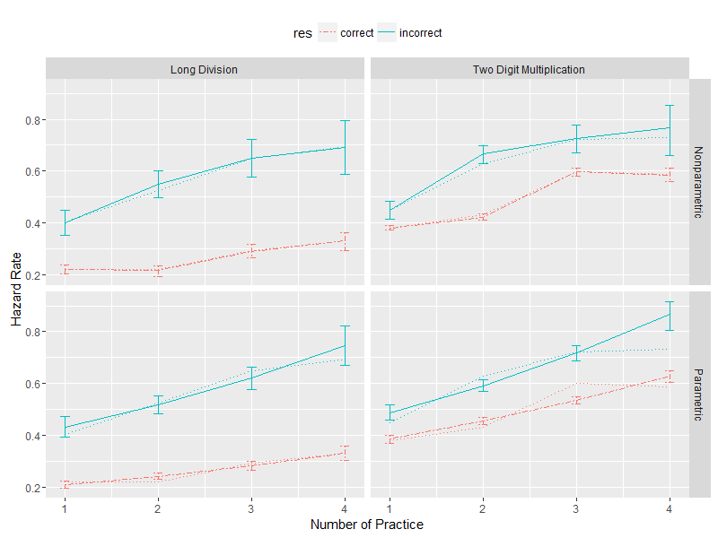

---
output:
  pdf_document: default
  html_document: default
---

# Dynamic Selection Bias of Sample Attrition  {#exit}

```{r, include=FALSE}
knitr::opts_chunk$set(fig.pos = 'H')
options(digits=3)
proj_dir = getwd()
```


```{r env, echo=FALSE, warning=FALSE, message=FALSE}
library(ggplot2)
library(dplyr)
library(tidyr)
library(gridExtra)
library(knitr)
```

```{r func, echo=FALSE, warning=FALSE, message=FALSE}
imputate_hazard_rate <- function(test_data, Tmax){
  alldata = data.frame(t=seq(1,Tmax), hr=as.numeric(0), pc = as.numeric(0), pw = as.numeric(0),Nc=as.numeric(0),Nw=as.numeric(0))
  for (t in seq(1,Tmax)){
    base_num = sum(test_data$t==t)
    exit_num = sum(test_data$t==t & test_data$idx==1)
    base_yes_num = sum(test_data$t==t & test_data$atag==1)
    base_no_num = sum(test_data$t==t & test_data$atag==0)
    exit_yes_num = sum(test_data$t==t & test_data$atag==1 & test_data$idx==1)
    exit_no_num =  sum(test_data$t==t & test_data$atag==0 & test_data$idx==1)
    alldata[t,] = c(t, exit_num/base_num, exit_yes_num/base_yes_num, exit_no_num/base_no_num, base_yes_num, base_no_num)
  }
  alldata =  alldata %>% mutate(sdc=sqrt(pc*(1-pc)/Nc),sdw=sqrt(pw*(1-pw)/Nw))
  
  hr_point = alldata %>% select(t,pc,pw) %>% rename(correct=pc,incorrect=pw) %>% gather(res,h,-t)
  hr_sd = alldata %>% select(t,sdc,sdw) %>% rename(correct=sdc,incorrect=sdw) %>% gather(res,sd_h,-t)
  harzard_rate_data = merge(hr_point,hr_sd,by=c('t','res'))
  return(harzard_rate_data)
}
```


## Introduction

One way to improve the intelligent tutoring system is to identify knowledge components that student are not learning even though they are practicing. An intuitive plan is to examine the slope of the average success rate at each practice opportunity (the observed learning curve) and identify those with a flat slope as not pedagogically effective [@ritter2007cognitive]. 

This may not be a good plan when learners can stop practicing at different times. Even when the true pedagogical efficacy is zero, it is still possible to generate positive or negative "learning" in the observed learning curve. For example, if a learner is forced to stop after accumulating X number of wrong answers, learners with low mastery drop out earlier than learners with high mastery because they are more likely to make errors. Consequently, the proportion of learners with high mastery is inflated. The observed learning curve slope upward and spurious positive learning is generated. Similarly, if a learner is forced to stop after accumulating X number of right answers, learners with high mastery exit earlier than learners with low mastery. As a consequence, the observed learning curve slopes downward. [@murray2013revealing]

Pelánek et al [-@pelanek2016impact] point out that the learning curve is not a reliable metric of pedagogical efficacy if learners have differential attrition rates. Without rigorous proof, they proceed to argue that pedagogical efficacy estimated by the Bayesian Knowledge Tracing (BKT) model is inconsistent as a result of selective attrition. This chapter shows that differential sample attrition is not a sufficient condition of inconsistent parameter estimation for the BKT model. The mechanism of the stop decision matters. If learners stop by rule, the BKT model can still consistently estimate the pedagogical efficacy. If learners stop by choice, the BKT model is likely to produce inconsistent parameter estimation and the learning through practice (LTP) model can consistently estimate the pedagogical efficacy by correcting the selective sample attrition with a hazard model.

This chapter is organized as the following: The first section characterizes the relationship between hazard rate dependence structure and selection bias. The second section briefly reviews how the LTP model correct for the selection bias, supported by a simulation exercise. The last section applies the model to a quiz dataset of math learning in third grade. The selection bias accounts for a large share of the "learning gain" as defined by the slope of the observed learning curve.

## Sample Attrition and Dynamic Selection Bias


### Dynamic Selection Bias

Dynamic selection bias is a well-studied inference problem in econometrics [@heckman1984identifiability] and program evaluation [@ham1996effect]. The population under study is categorized into latent types, with a different set of parameters for each type. If the population has a changing composition in latent types, a model would be biased with an implicit assumption that the composition of latent types is static. Such bias is called as dynamic selection bias. Pelánek et al [-@pelanek2016impact] make a similar argument for why sample attrition is a cause for concern in the Bayesian Knowledge Tracing (BKT) model. In the context of the BKT model, the mastery is the latent type. Assume learners with mastery drop out earlier than those without, the differential sample attrition leads to a lower proportion of learners with mastery over time. Since the BKT model assumes either no sample attrition or equal sample attrition, the change in the proportion of learners with mastery due to dynamic selection is attributed to the learning process, the two processes being observational equivalent. Consequently, the pedagogical efficacy is under-estimated.

Although Pelánek et al are correct in reasoning that the change in the mastery trajectory due to selective attrition is the source of the bias of the BKT model, they fail to realize that it is only a necessary condition, but not sufficient. They fail to distinguish two types of selective sample attrition: response-dependent sample attrition and mastery-dependent sample attrition. Only the latter type leads to the dynamic selection bias in the parameter learning. Their mistake, similar to that made by Beck and Chang, is to base their inference of parameter estimation on the shape of the observed learning curve. The observed learning curve and the parameter learning, as well as the posterior inference on learner mastery, condition on different information sets. Each point on the observed learning curve conditions only on continuing at the previous practice opportunity. In contrast, the parameter learning conditions on all observed response in addition to survival at previous practice opportunities. If the sample attrition is response-dependent, it does not affect parameter learning because the inference is already conditional on the response. Further conditioning on a function of responses does not bring in any new information. However, the observed learning curve is changed because conditioning on a function of responses does change the posterior inference of the latent mastery and thus the success rate. In short, although both types of sample attrition alter the observed learning curve, only the mastery-dependent sample attrition can change the posterior distribution of latent mastery conditional on the observed response, thus change the estimation of pedagogical efficacies.


In sum, although the dynamic selection process explains the intuition behind the parameter bias caused by selective sample attrition, the composition change of latent mastery unconditional on the observed response is only a necessary condition of estimation bias in the BKT model. The next subsection develops a formal mathematical proof for the above intuitive reasoning.


### Dynamic Selection bias and Dependence Structure


Let $t$ be the pratice sequence id, $Y_t$ be the observed response at sequence $t$, $X_t$ be the latent mastery, and $H_t$ be the stop decision where $H_t=1$ denotes attrition at $t^{th}$ attempt . For simplicity, let $\mathbf{Y_{t_1,t_2}}=\{Y_{t_1},\dots,Y_{t_2}\}$. When referencing the whole practice sequence ($t=T$), denote $\mathbf{Y_{1,t}}=\mathbf{Y}$ for short.


```{theorem}
The pedagogical efficacy is consistently estimated by the Bayesian Knowledge Tracing Model only if 
$$
P(\mathbf{X_{t_1,t_2}}|\mathbf{Y},H_{t-1}=0) = P(\mathbf{X_{t_1,t_2}}|\mathbf{Y}) \quad \forall \quad 1<t_1<t_2\leq T 
$$
```

```{proof}

If the true parameter set $\Theta$ is stationary in the iterative estimation procedure of the BKT model, which means the estimated parameter set of iteration $s+1$ is the same as that of iteration $s$, the BKT model converges to the true parameter. Take all parameters other than the pedagogical efficacy from iteration $s$ as given, update the pedagogical efficay parameter ($\ell^{mn}=P(X_t=n|X_{t-1}=m)$) for iteration $s+1$:


$$
\begin{aligned}
\hat{\ell}_{BKT}^{mn} &= \frac{\sum_{t=2}^T\sum_{i=1}^NI(X^i_t=n,X^i_{t-1}=m|\Theta_s,\mathbf{Y}^i)}{\sum_{t=2}^T\sum_{i=1}^NI(X^i_{t-1}=m|\Theta_s,\mathbf{Y}^i)}\\
&= \frac{\sum_{t=2}^{T}\frac{\sum_{i=1}^NI(X^i_t=n,X^i_{t-1}=m|\Theta_s,\mathbf{Y}^i)}{N}}{\sum_{t=2}^{T}\frac{\sum_{i=1}^NI(X^i_{t-1}=m|\Theta_s,\mathbf{Y}^i)}{N}}
\end{aligned}
$$


By law of large number, 

$$
\begin{aligned}
\lim_{N\rightarrow \infty}\frac{\sum_{i=1}^NI(X^i_t=n,X^i_{t-1}=m|\Theta_s,\mathbf{Y}^i)}{N}&\rightarrow P(X_t=n,X_{t-1}=m|\mathbf{Y})\\
\lim_{N\rightarrow \infty} \frac{\sum_{i=1}^NI(X^i_{t-1}=m|\Theta_s,\mathbf{Y}^i)}{N} &\rightarrow P(X_{t-1}=m|\Theta_s,\mathbf{Y})\\
\lim_{N\rightarrow\infty}\hat{\ell}_{s+1}^{mn} &\rightarrow \frac{\sum_{t=2}^TP(X_t=n,X_{t-1}=m|\mathbf{Y})}{\sum_{t=2}^TP(X_{t-1}=m|\Theta_s,\mathbf{Y})}\\
&=\frac{\sum_{t=2}^T \ell^{mn} P(X_{t-1}=m|\Theta_s,\mathbf{Y})}{ \sum_{t=2}^TP(X_{t-1}=m|\Theta_s,\mathbf{Y})}\\
&=\ell^{mn} 
\end{aligned}
$$

```


In order for the BKT model to be consistent, Theorem 5.1 claims that the stop decision should be independent of the latent mastery conditional on the response. Therefore, the sample attrition essentially only a function of responses. This observation is captured by the two following lemmas 


```{lemma}
If the stop decision depends only on the observed response, $P(H_t=1)=f(Y_1,\dots,Y_t)$, the Bayesian Knowledge Tracing model consistently estimates the pedagogical efficacy.
```

```{proof}
To prove Lemma 5.1, notice that 

$$
\begin{aligned}
P(\mathbf{X_{t_1,t_2}}|\mathbf{Y},H_{t-1}=0) &=\frac{P(\mathbf{X_{t_1,t_2}},\mathbf{Y},H_{t-1}=0)}{P(\mathbf{Y},H_{t-1}=0)} \\
&= \frac{P(H_{t-1}=0|\mathbf{Y})P(\mathbf{Y}|\mathbf{X_{t_1,t_2}})P(\mathbf{X_{t_1,t_2}})}{\sum_{X_{t1}}\dots \sum_{X_{t_2}}P(H_{t-1}=0|\mathbf{Y})P(\mathbf{Y}|\mathbf{X_{t_1,t_2}})P(\mathbf{X_{t_1,t_2}})} \\
&= \frac{P(\mathbf{Y}|\mathbf{X_{t_1,t_2}})P(\mathbf{X_{t_1,t_2}})}{\sum_{X_{t1}}\dots \sum_{X_{t_2}}P(\mathbf{Y}|\mathbf{X_{t_1,t_2}})P(\mathbf{X_{t_1,t_2}})} \\
&= P(\mathbf{X_{t_1,t_2}}|\mathbf{Y})
\end{aligned}
$$

The results follow by theorem 5.1.
```


```{lemma}
If the stop decision depends on the latent mastery, $P(H_t=1)=f(Y_1,\dots,Y_t,X_1,\dots,X_t)$, the Bayesian Knowledge Tracing model consistently estimates the pedagogical efficacy only if $f(Y_1,\dots,Y_t,X_1=x_1^1,\dots,X_t=x_t^1)=f(Y_1,\dots,Y_t,X_1=x_1^2,\dots,X_t=x_t^2) \quad \forall x_1^1,x_1^2,\dots,x_t^1,x_t^2$.
```

```{proof}
To prove Lemma 5.2, start with the posterior distribution of the marginal distribution 

$$
\begin{aligned}
P(X_t=m|\mathbf{Y},H_{t-1}=0) &= \frac{\sum_{k=1}^{m}P(X_t=m|X_{t-1}=k)P(H_{t-1}=0|X_{t-1}=k)P(X_{t-1}=k|\mathbf{Y})}{\sum_{n=1}^{M_x}[\sum_{l=1}^{n}P(X_t=n|X_{t-1}=l)P(H_{t-1}=0|X_{t-1}=l)P(X_{t-1}=k|\mathbf{Y})]}\\
P(X_t=m|\mathbf{Y}) &= \frac{\sum_{k=1}^{m}P(X_t=m|X_{t-1}=k)P(X_{t-1}=k|\mathbf{Y})}{\sum_{n=1}^{M_x}[\sum_{l=1}^{n}P(X_t=n|X_{t-1}=l)P(X_{t-1}=l|\mathbf{Y})]}\\
\end{aligned}
$$
Let $P(X_t=m|X_{t-1}=n)$ be $\ell^{nm}$,$P(X_{t-1}=k|\mathbf{Y})=\pi_k$, $P(H_{t-1}=0|X_{t-1}=k)=h^k$. 

$$
P(X_t=m|\mathbf{Y},H_{t-1}=0) = P(X_t=m|\mathbf{Y}) \rightarrow \sum_{n=1}^{M_x}\sum_{l=1}^{n}\sum_{k=1}^{m} \ell^{km}\ell^{ln}\pi_k\pi_l(h_l-h_k) = 0
$$

If $h_l=h_k \quad \forall{\ell,k}$, it is obvious that the equality stands. If the equality stands, but $h_l\neq h_k\quad \text{for some }l,k$, then it must be true that $\ell^{km}\ell^{ln} = \ell^{lm}\ell^{kn}$. Since no conditions are imposed on the pedagogical efficacy, it must not be the case. Therefore, the sufficient and necessary condition is that the conditional hazard rates are equal across states.
```

The contrapositive statement of lemma 5.2 essentially states that BKT model inconsistently estimates the pedagogical efficacy if the stop decision depends on the latent mastery in a meaningful way.

### Stop-by-Rule and Stop-by-Choice

Lemma 5.1 and Lemma 5.2 highlight the importance of dependence structure in determining the existence of dynamic selection bias in the BKT model. The response-dependent stop decision and the mastery dependent stop decision are quite abstract and far away from practical application. This subsection links the dependence structure to learner behavior.

There are two types of stop decision: Stop-by-rule and Stop-by-choice. Stop-by-rule refers to the exit from practice due to a system rule, which is usually the consequence of system design. Conditional on the observed response, the stop decision is deterministic. The "X-strike" rule is the most common example of the stop-by-rule behavior. For instance, in the old version of Duolingo, a learner is forced to quit the level after three (at most four) errors. The case study in later of the chapter uses the X-strike rule in both ways. If a learner accumulates three or four correct answers, she is forced to quit; if a learner accumulates two or three incorrect answers, she is forced to quit. Stop-by-choice refers to the exit from practice due to learner's own initiative when she could have continued to practice, which is usually the consequence of learner's non-cognitive skill. For example, if a learner has mastery, continuing the practice is boring; if a learner has no mastery, continuing the practice is frustrating. Both boredom and frustration lead to an exit from practice sequence, at different rates [@baker2010better].

In the rest of the chapter, the response-dependent stop decision is equivalent to stop-by-rule while the mastery-dependent stop decision is equivalent to stop-by-choice. This generalization of the stop decision mechanism has exceptions. The proficiency rule is one such exception. In the new version of Duolingo, a learner is forced to quit the level after accumulating enough correct answers to reach the proficiency threshold. The cognitive tutor developed by Carnegie Learning LLC has a similar "optimal-stop" decision system [@murray2013revealing] where the practice is terminated once the learner reaches 90% mastery likelihood in the posterior inference. The stop decision depends on latent mastery but it is implemented by a system rule based on responses. However, such exceptions are rare because only very few education service providers have the capability to deliver mastery inference in real time. In most cases, stop-by-rule is response-dependent stop decision and stop-by-choice is mastery dependent stop decision.


### Sign of Dynamic Selection Bias in Stop-by-Choice

Lemma 5.1 and Lemma 5.2 establishes that only stop-by-choice, the mastery-dependent stop decision, results in inconsistent parameter estimation. This subsection further studies the properties of the dynamic selection bias. Although a rigorous proof is not established, an educated guess is made, supported by simulation evidence, on the sign of the selection bias in the stop-by-choice decision system. 

If learners with mastery have a lower attrition rate than those without, the increase in the proportion of learners with mastery stem from differential attrition is falsely attributed to the pedagogical efficacy of the practices by the BKT model. Therefore, the estimated pedagogical efficacy is biased upwards. Such reasoning leads to proposition 5.1.

```{proposition}
If the data generating process is $P(H_t=1|H_{t-1}=0)=f(X_t)$ and $h_t^{X=1}<h_t^{X=0}$, the BKT model over-estimates the pedagogical efficacy. 
```

In contrast, if learners with mastery have a higher attrition rate than those without, the decrease in the proportion of learners with mastery stem from differential attrition is also falsely attributed to the pedagogical efficacy of the practices by the BKT model. Therefore, the estimated pedagogical efficacy is biased downwards. Such reasoning leads to proposition 5.2. 

```{proposition}
If the data generating process is $P(H_t=1|H_{t-1}=0)=f(X_t)$ and $h_t^{X=1}>h_t^{X=0}$, the BKT model under-estimates the pedagogical efficacy. 
```

However, proposition 5.1 and 5.2 are built on the premise that the selective sample attrition is driven only by stop-by-choice. If the selective sample attrition is driven by both stop-by-rule and stop-by-choice, the learning through practice (LTP) model that considers only stop-by-choice is also biased. In a mixture stop decision system, neither the BKT model nor the LTP model estimates the pedagogical efficacy consistently, but they may serve as bounds on the true pedagogical efficacy. The key assumption for the BKT-LTP bound is that response-dependent and mastery dependent sample attrition biased in the same direction. If the response-dependent sample attrition favors learners with lower mastery, the mastery-dependent sample attrition needs to favor learners with lower mastery as well. If the assumption stands, the observed difference in hazard rates reflect the data generating process and the BKT-LTP bound can be established, which leads to the following proposition: 


```{proposition}
If the selective sample attrition is both mastery-dependent and response-dependent, if both processes have the same direction of bias of the attrition rate, the pedagogical efficacies estimated by the BKT model and the LTP model bound the true pedagogical efficacy. When $P(H_t=1|Y=1)>P(H_t=1|Y=0)$, the BKT estimator is the lower bound and the LTP estimator is the upper bound. When $P(H_t=1|Y=1)<P(H_t=1|Y=0)$, the BKT estimator is the upper bound the LTP estimator is the lower bound.
```

In reality, the mixture stop decision process is likely to be true data generating process for the intelligent tutoring systems. Most tutoring systems have some kind of stop-by-rule decision rule so that learners are not trapped in practices they don't need when they have mastery or they don't want when they have no mastery. However, learners can quit by their own initiative by just shutting down the program. Proposition 5.3 argues that both BKT model and LTP model needs to be estimated in order to better understand the true pedagogical efficacy


## Correct Dynamic Selection Bias with the Learning Through Practice Model

The previous section discusses the condition of inconsistent efficacy estimation as a result of selective sample attrition and the property of such inconsistency. This section briefly reviews how the learning through practice (LTP) model introduced in Chapter 2 corrects the dynamic selection bias. This section demonstrates the bias correction procedure with a simulation study of stop-by-rule and stop-by-choice decision process.

### The LTP Model

The LTP model corrects the selection bias by modeling sample attrition explicitly. The dependence structure has two key components, the dependent factor (observed response or latent mastery) and the memory lag of dependence (concurrent, first order Markov, etc). The LTP model assumes the stop decision only depends on the concurrent data, thus limit the discussion to only the dependent factor. For simplicity, this chapter only considers one learner type. Thus the learner type is omitted from the following discussion. Also, the effort decision is omitted.

For the response-dependent stop decision, the join likelihood of $\{X_t,Y_t,H_t\}$ conditional on the learner continues at previous practice opportunity ($H_{t-1}=0$) is 

$$
P(X_t,Y_t,H_t|H_{t-1}=0,\mathbf{Y}_{1,t-1})=P(H_t|H_{t-1}=0,Y_t)P(Y_t|X_t)P(X_t|H_{t-1}=0,\mathbf{Y}_{1,t-1})
$$

Similarly, for the mastery-dependent stop decision, the conditional joint likelihood of $\{X_t,Y_t,H_t\}$ is

$$
P(X_t,Y_t,H_t|H_{t-1}=0,\mathbf{Y}_{1,t-1})=P(H_t|H_{t-1}=0,X_t)P(Y_t|X_t)P(X_t|H_{t-1}=0,,\mathbf{Y}_{1,t-1})
$$

In the statistics literature, $P(H_t=1|H_{t-1}=0)$ is called the hazard rate, meaning the probability to exit at this period given surviving the last period. If the functional form of the conditional hazard rate is specified, the conditional likelihood can be computed. The LTP model offers both parametric and non-parametric specification. 

The parametric model is the discrete time version of the proportional hazard model. For example, if the hazard function depends on the latent mastery, it is specified as 

$$
P(H_t=1|X_t=k,H_{t-1}=0) = \lambda_k e^{\beta_kt}
$$
$\lambda$ is the baseline hazard rate. $\beta$ is the proportional growth of hazard rate over time. $\lambda$ must be positive but $\beta$ can be both positive and negative.

The non-parametric model imposes no structure on the hazard function and assumes the conditional hazard rates are drawn from independent Bernoulli distributions with different means. For example, if the exit function depends on the latent mastery and there is one learner type, the hazard rate is specified as 

$$
P(H_t=1|X_t=k,H_{t-1}=0) = h^k_t
$$

If the true data generating process is a proportional hazard model, both specifications are consistent but the parametric specification is more efficient because it only needs to estimate $2M_X$ parameters while the non-parametric specification needs to estimate $2M_XT$ parameters. However, if the data generating process is not a proportional hazard model, the parametric specification is not consistent while the non-parametric specification is.


### Simulation

This subsection supports the previous discussion by simulations. It first shows the consistency of the BKT estimator and the inconsistency of the LTP estimator if the stop decision is stop-by-rule. It then demonstrates the inconsistency of the BKT estimator and the consistency of the LTP estimator if the stop decision is stop-by-choice. The values of all simulation parameters are in Appendix B.3.


Stop-by-rule (response-dependent) sample attrition is illustrated by the "two-strike" rule: The learners are forced to stop if they accumulate two errors. The learners only stop practicing when they make a mistake (except for the first period) and never quit when they answer correctly.  The conditional hazard rates are listed in Table 5.1.

```{r,echo=FALSE, warning=FALSE, message=FALSE}
data_dir = paste0(proj_dir,'/_data/02/sim/')
strike_data = read.table(paste0(data_dir, 'xstrike_data.txt'),sep=',',col.names=c('i','t','S','H','y'))
strike_data = strike_data %>% group_by(i) %>% mutate(S0=lag(S))
transit_cnt = strike_data %>% group_by(S0,S) %>% summarize(n=n())
strike_ell = transit_cnt$n[2]/(transit_cnt$n[1]+transit_cnt$n[2])
hazard_rates = strike_data %>% group_by(y,t) %>% summarize(h=mean(H)) %>% filter(y==0)

kable(hazard_rates %>%ungroup(y) %>% mutate(sequence=t+1) %>% rename(y0 = h) %>% mutate(y1=0) %>% select(sequence,y0,y1),
      col.names=c('Practice Sequence','Hazard Rate(Y=0)','Hazard Rate(Y=1)'),
      booktabs=T, align='c',format='pandoc',
      caption = ' Hazard Rates Conditional on Observed Response in Stop-by-Rule'
      )

```

Because the hazard rate curve conditioning on the wrong response is not monotonic in time, the LTP model uses the nonparametric specification of the hazard function. Table 5.2 shows the point estimation of the pedagogical efficacy obtained from the BKT model and the LTP model. The BKT estimator produces a point estimation very close to the true value of pedagogical efficacy, in contrast to the substantial downward bias of the LTP estimator.

```{r,echo=FALSE, warning=FALSE, message=FALSE}
strike_no_param = read.table(paste0(data_dir,'strike_no.txt'), header = F, sep=',')
#strike_y_param = read.table(paste0(data_dir,'strike_yh.txt'), header = F, sep=',')
strike_x_param = read.table(paste0(data_dir,'strike_xh.txt'), header = F, sep=',')

names(strike_no_param)[1] = 'l'
#names(strike_y_param)[1] = 'l'
names(strike_x_param)[1] = 'l'

strike_no_param$model='BKT'
#strike_y_param$model='RDH'
strike_x_param$model='LTP'

#strike_lrs = rbind(strike_no_param%>%select(model,l), strike_y_param%>%select(model,l), strike_x_param%>%select(model,l))
strike_lrs = rbind(strike_no_param%>%select(model,l), strike_x_param%>%select(model,l))

strike_map =  strike_lrs %>% group_by(model) %>% summarize(l=mean(l))
strike_map = rbind(data.frame(model='True', l=strike_ell), strike_map)

kable(strike_map,col.names=c('Model','Estimates'),
      booktabs=T, align='c',format='pandoc',
      caption = 'Estimated Pedagogical Efficacy of Stop-by-Rule Sample Attrition')
```


To keep the bias direction the same as the previous stop-by-rule example, the simulation assumes that learners with mastery have lower hazard rate than those without mastery. The hazard rates are generated by a proportional hazard function. The learners with mastery has lower baseline hazard rate ($\lambda_0=0.5$ Vs.$\lambda_1=0.2$) but higher growth rate ($\beta_0=\log(1.1)$ V.S. $\beta_1=\log(1.2)$). However, at the end of the practice sequence, learners with mastery are still less likely to stop than those without mastery. The two hazard rate curves are listed in table 5.3.

```{r,echo=FALSE, warning=FALSE, message=FALSE}
hazard_rates = data.frame(sequence=seq(4),x0=0.5*(1.1**(seq(4)-1)),x1=0.2*(1.2**(seq(4)-1)))
kable(hazard_rates,
      col.names=c('Practice Sequence','Hazard Rate(X=0)','Hazard Rate(X=1)'),
      booktabs=T, align='c',format='pandoc',
      caption = 'Conditional Hazard Rate of Stop-by-Choice Sample Attrition'
      )
```

Table 5.4 shows the point estimation of the pedagogical efficacy obtained from the BKT model and the LTP model. The estimated pedagogical efficacy of the LTP model is close to the true value, while the BKT model suffers from an upward bias.

```{r,echo=FALSE, warning=FALSE, message=FALSE}
state_data = read.table(paste0(data_dir, 'x_data.txt'),sep=',',col.names=c('i','t','S','H','y'))
state_data = state_data %>% group_by(i) %>% mutate(S0=lag(S))
transit_cnt = state_data %>% group_by(S0,S) %>% summarize(n=n())
state_ell = transit_cnt$n[2]/(transit_cnt$n[1]+transit_cnt$n[2])

state_no_param = read.table(paste0(data_dir,'x_no.txt'), header = F, sep=',')
#state_y_param = read.table(paste0(data_dir,'x_yh.txt'), header = F, sep=',')
state_x_param = read.table(paste0(data_dir,'x_xh.txt'), header = F, sep=',')

names(state_no_param)[1] = 'l'
#names(state_y_param)[1] = 'l'
names(state_x_param)[1] = 'l'

state_no_param$model='BKT'
#state_y_param$model='RDH'
state_x_param$model='LTP'

#state_lrs = rbind(state_no_param%>%select(model,l), state_y_param%>%select(model,l), state_x_param%>%select(model,l))
state_lrs = rbind(state_no_param%>%select(model,l), state_x_param%>%select(model,l))

state_map =  state_lrs %>% group_by(model) %>% summarize(l=mean(l))
state_map = rbind(data.frame(model='True', l=state_ell), state_map)
state_map$l[state_map$model=='True'] = 0.3

kable(state_map,col.names=c('Model','Estimates'),
      booktabs=T, align='c',format='pandoc',
      caption = 'Estimated Pedagogical Efficacy of Stop-by-Choice Sample Attrition')

```

Figure 5.1 visualizes the posterior distribution of the estimated pedagogical efficacy by the BKT and the LTP model in the stop-by-rule and the stop-by-choice scenario.

```{r,echo=FALSE, warning=FALSE, message=FALSE, fig.cap = "Posterior Distribution of Pedagogical Efficacy:Simulation",fig.align='center',out.height='12cm',out.width='12cm'}

h1= qplot(data=strike_lrs, x=l, geom='density',col=model, linetype=model) + geom_vline(xintercept = 0.3) + ggtitle('Stop-by-Rule')+theme(legend.position="top")
h2= qplot(data=state_lrs, x=l, geom='density',col=model, linetype=model) + geom_vline(xintercept = 0.3) + ggtitle('Stop-by-Choice')+theme(legend.position="top")
grid.arrange(h1,h2,ncol=2)
```


## Case Study

### The Learning Environment

The data were collected on a Chinese online learning platform from December 2015 to January 2016. The learning product embeds the math practices in a turn-based role-playing game. Figure 5.2 shows a screenshot of the product interface. The learning game is supplemental learning material that students practice on their own initiative in addition to the homework. The target learners are K-6, mainly from first grade to third grade. The demographics of the learner population are unknown beyond the grade distribution.

```{r, echo=FALSE, warning=FALSE, message=FALSE, fig.cap = "The Interface of the Learning Game", fig.align='center',out.height='12cm',out.width='12cm'}
include_graphics('fig/app.png')
```

To complete a level in the game, a learner must defeat the enemy by doing practice questions. Each turn, the learner is challenged with a practice problem. If she answers correctly, the health point of the AI avatar is randomly reduced. If she answers incorrectly, the health point of the learner avatar is randomly reduced. If the health point of either avatar drops to zero, the practice session stops. In expectation, the learner fails the level if he accumulates two or three errors and clears the level if he scores three or four hits. At any time, the learner is free to quit before she clears or fails the level. There is no punishment for early exit and the learner can try the same level as often as she wants.

For each level, the algorithm only recommends practice questions on one knowledge point. For example, if the knowledge point is "reducing fractions", a question may be "5:8=x:32" (as in Figure 5.2) or "3:7=9:x". Because questions are highly similar by design, the parameters of items belonging to the same knowledge point are considered identical across items. This chapter chooses two representative knowledge points out of more than 200 candidates:  two-digit multiplication (grade 2) and long division (grade 3). The two items represent "slow-learning" and "fast-learning" judged by the observed learning curve, which is plotted in Figure 5.3.

```{r, echo=FALSE, warning=FALSE, message=FALSE, fig.cap = "Observed Learning Curves of Knowledge Points", fig.align='center',out.height='12cm',out.width='12cm'}

kpids =  c('87','138')
kp_names = c('Two-Digit Multiplication','Long Division')
n = length(kpids)
for (i in seq(n)){
    file_path = paste0(proj_dir,'/_data/02/spell_data_',kpids[i],'.csv')
    tmp_data = read.csv(file_path, col.names=c('spell_id','t','atag','idx'),header=F)  
    tmp_data$kpid = kpids[i]
    if (i==1){
        spell_data = tmp_data
    }else{
        spell_data = rbind(spell_data, tmp_data)
    }
}

spell_data$knowlege_point = factor(spell_data$kpid, levels=kpids, labels=kp_names)

lc_plot = spell_data %>% group_by(knowlege_point, t) %>% summarize(pct=mean(atag)) %>% filter(t<=5)

qplot(data=lc_plot , x=t, y=pct, geom='line', col=knowlege_point, linetype=knowlege_point) + ggtitle('Observed Learning Curve') + ylab('Success Rate') + xlab('Number of Practice Opportunity')

```


### Data Cleaning Procedure

This chapter collected more than 68 million exercise logs. Only serious learners, defined as those have more than 50 log entries, are retained. Serious learners are only 20% of the total learners but they generate 62% of the total logs (about 42 million).

The recommendation algorithm changes knowledge points between different practice sequences so that the learner is not bored. Therefore, there are two sequence ranks one can compute. The global sequence rank ignores the interval and continues the practice rank count over the whole sample period. The local sequence rank only counts the practice rank within each sequence. Neither sequence ranking is perfect. The global sequence rank completely ignores the dropout; while the local sequence rank violates the assumption of homogeneous initial mastery. For the purpose of this chapter, learner heterogeneity is a lesser evil so the local sequence rank is chosen. If the learner has multiple practice sequences, choose the first one by calendar time.

The two knowledge points all have more than 200,000 practice logs. For two-digit multiplication, 95% of the practice sequences have a life span smaller than 4 periods, 80% for the long division. Because data are quite sparse past the fifth practice, the max practice sequence is 4. 

For the remaining valid data, take 40% random sample of training data and 20% random sample as out sample forecast. The analysis limits the size because the adaptive rejection sampling algorithm has trouble fitting a large dataset. 


### Empirical Hazard Rate Curve
The hazard rate curve is plotted in Figure 5.4. The X-axis is the practice sequence number, the Y-axis is the hazard rate conditional on the response($P(H_t=1|H_{t-1}=0,Y_t=k)$). The solid line represents the correct answer while the dotted line represents the incorrect answer. 95% confidence interval is plotted as the error bar. Both knowledge points exhibit differential conditional hazard rates that incorrect answer is correlated with a higher hazard rate. The difference between two conditional learning curves is smaller for the two-digit multiplication than the long division.

```{r, echo=FALSE, warning=FALSE, message=FALSE, fig.cap = "Empirical Hazard Rates of Different Knowledge Points", fig.align='center',out.height='12cm',out.width='12cm'}
#Check the hazard rate
#There is significant difference for item 138. Not so much for other items
maxT = 4
kp_spell_data = spell_data %>% filter(kpid==87)
hr_data = imputate_hazard_rate(kp_spell_data, maxT)
hr_data$res = factor(hr_data$res)
hr_data =  hr_data %>% mutate(hmax=h+1.97*sd_h,hmin=h-1.97*sd_h)
# check the fitted hazard rate
h1=qplot(data=hr_data, x=t,y=h,geom='line', color=res,linetype=res) + 
  geom_errorbar( mapping=aes(x=t, ymin=hmin, ymax=hmax,color=res),width=0.1)+
  ylim(c(0,1))+
  ylab('Hazard Rate')+ 
  theme(axis.text.x=element_blank(),
        axis.title.x=element_blank(),
        axis.ticks.x=element_blank())+ 
  ggtitle('Two-Digit Multiplication')


kp_spell_data = spell_data %>% filter(kpid==138)
hr_data = imputate_hazard_rate(kp_spell_data, maxT)
hr_data$res = factor(hr_data$res)
hr_data =  hr_data %>% mutate(hmax=h+1.97*sd_h,hmin=h-1.97*sd_h)

h2=qplot(data=hr_data, x=t,y=h,geom='line', col=res,linetype=res) + 
  geom_errorbar( mapping=aes(x=t, ymin=hmin, ymax=hmax,color=res),width=0.1)+
  ylim(c(0,1))+
  ylab('Hazard Rate')+ 
  xlab('Number of practice') + ggtitle('Long Division')


grid.arrange(h1, h2, ncol=1)

```

Because the learning game uses the X-strike rule, part of the stop decision is stop-by-rule (response dependent sample attrition). The hazard rate increases sharply in the third practice and flattens on the fourth practice is partial evidence of the X-strike rule. However, not all the stop decisions are driven by the X-strike rule. Otherwise, the hazard rate conditional on a correct response should be zero, as well as the hazard rate of the first period. The slow increase of the hazard rate curve conditional on the correct response is partial evidence of stop-by-choice (mastery dependent sample attrition). Therefore, it is reasonable to assume that the stop decision is a hybrid of stop-by-rule and stop-by-choice. That said, Proposition 5.3 argues that the BKT estimator and the LTP estimator bounds the true pedagogical efficacy.


Both parametric and nonparametric specification are fitted for the LTP model. Figure 5.5 shows the fitness of hazard rates by the parametric and the nonparametric specification. The solid line is the fitted hazard curve while the dotted line is the empirical hazard rate curve. The 95% credible interval derived from the posterior parameters are plotted as the error bar. Overall, both parametric specification and nonparametric specification fit the empirical hazard rate curve reasonably well. The parametric specification overfits the hazard rate at 4th sequence position for the two-digit multiplication.


```{r, echo=FALSE, warning=FALSE, message=FALSE, fig.cap = "Conditional Hazard Curve of the LTP model(Solid:Fitted, Dot:Data)", fig.align='center',out.height='12cm',out.width='12cm'}

```


### Estimated Pedagogical Efficacy

Since the selective sample attrition is largely accounted for, it is time to compare the pedagogical efficacy estimated by the BKT model and the LTP model. Table 5.5 shows the estimated pedagogical efficacy under the parametric specification. The LTP model produces significantly lower efficacy estimates. Because the long division has a larger difference in the conditional hazard rates, it also has a larger reduction in estimated pedagogical efficacy: While the pedagogical efficacy of the two-digit multiplication shrinks by a factor of 5, that of the long division shrinks by a factor of 7.

```{r, echo=FALSE, warning=FALSE, message=FALSE}
for (i in seq(2)){
  file_path = paste0(proj_dir,'/_data/02/res/',kpids[i],'/yh.txt')
  y_param_data = read.table(file_path, col.names=c('l','pi','c0','c1','lambda0','beta0','lambda1','beta1'), header=F,sep=',')
  y_param_data = y_param_data %>% select(l) %>% mutate(type='BKT', model='Proportional')
  
  file_path = paste0(proj_dir,'/_data/02/res/',kpids[i],'/xh.txt')
  x_param_data = read.table(file_path, col.names=c('l','pi','c0','c1','lambda0','beta0','lambda1','beta1'), header=F,sep=',') 
  x_param_data = x_param_data %>% select(l) %>% mutate(type='LTP', model='Proportional')
  
  file_path = paste0(proj_dir,'/_data/02/res/',kpids[i],'/yh_np.txt')
  y_param_data_np = read.table(file_path, col.names=c('l','pi','c0','c1','h01','h02','h03','h04','h11','h12','h13','h14'), header=F,sep=',')
  y_param_data_np = y_param_data_np %>% select(l) %>% mutate(type='BKT', model='Nonparametric')
  
  file_path = paste0(proj_dir,'/_data/02/res/',kpids[i],'/xh_np.txt')
  x_param_data_np = read.table(file_path, col.names=c('l','pi','c0','c1','h01','h02','h03','h04','h11','h12','h13','h14'), header=F,sep=',') 
  x_param_data_np = x_param_data_np %>% select(l) %>% mutate(type='LTP', model='Nonparametric')
  
  tmp = rbind(y_param_data, x_param_data, y_param_data_np, x_param_data_np)
  tmp$kp = kp_names[i]
  
  if (i==1){
    chp3_param_data = tmp
  }else{
    chp3_param_data = rbind(chp3_param_data, tmp)
  }
}

param_stat = chp3_param_data %>% group_by(kp,model,type) %>% summarize(map=mean(l), lower=quantile(l,prob=0.05), uppwer=quantile(l,prob=0.95))
kable(param_stat %>% ungroup() %>% filter(model=='Proportional') %>% select(-model),
      col.names=c('Knowledge Point', 'Dependence', 'Estimates','95% CI(L)','95% CI(H)'),
      booktabs=T, align='c',format='pandoc',
      caption = 'Estimated Pedagogical Efficacy of the Parametric Specification')

```

Table 5.6 shows the estimated pedagogical efficacy of the nonparametric model. Since the two specifications have a similar fit of the hazard rate curve, they also have a similar estimation of pedagogical efficacy. Again, the LTP model produces significantly lower estimated practice efficacy.

```{r, echo=FALSE, warning=FALSE, message=FALSE}
param_stat = chp3_param_data %>% group_by(kp,model,type) %>% summarize(map=mean(l), lower=quantile(l,prob=0.05), uppwer=quantile(l,prob=0.95))
kable(param_stat %>% ungroup() %>% filter(model=='Nonparametric') %>% select(-model),
      col.names=c('Knowledge Point', 'Dependence', 'Estimates','95% CI(L)','95% CI(H)'),
      booktabs=T, align='c',format='pandoc',
      caption = 'Estimated Pedagogical Efficacy of the Non-parametric Specification')
```


### The Fallacy of "Learning Gain" from Learning Curve

The introduction of this chapter argues that observed learning curve is not a reliable source of inference for learning gain. This subsection verifies this claim with empirical data. A large share of the observed "learning gain" in the learning curve may be the result of sample attrition rather than practice efficacy.

To isolate the effect of sample attrition from practice, a counterfactual learning curve under no sample attrition needs to be estimated. This can be done by using the parameter from the last section while setting the hazard rate at 0. Theorem 5.1 implies that LTP model with response-dependent sample attrition and the BKT model have the same parameter estimation other than the hazard rates. Therefore, the hazard rates associated with the BKT model is estimated from the LTP model with response-dependent sample attrition. Furthermore, because the parametric and non-parametric specifications have a similar estimation of pedagogical efficacy but the non-parametric specification has a slight advantage in fitting the hazard rate curve, this subsection only reports the result from the non-parametric hazard model. Figure 5.6 shows the imputed counterfactual learning curve in solid line, with an error bar of 95% credible interval. The dotted line is the observed learning curve from data. The counterfactual learning curve is almost flat because the estimated efficacy is small.

```{r, echo=FALSE, warning=FALSE, message=FALSE, fig.cap = "Counterfactual Learning Curve:No Sample Attrition", fig.align='center',out.height='12cm',out.width='12cm'}
include_graphics('fig/lc_fit_efficacy.png')
```


In sharp contrast, Figure 5.7 shows the fitted learning curve with both practice efficacy and sample attrition in solid line, with the error bar of 95% credible interval. Again, the dotted line is the observed learning curve from data. Both BKT and LTP model is able to fit the observed learning curve quite well. 

```{r, echo=FALSE, warning=FALSE, message=FALSE, fig.cap = "Counterfactual Learning Curve: With Sample Attrition", fig.align='center',out.height='12cm',out.width='12cm'}
include_graphics('fig/lc_fit_attrition.png')
```


The comparison between Figure 5.6 and Figure 5.7 implies that the learning gain inferred from the observed learning curve is largely spurious because it is the result of sample attrition rather than practice efficacy. Table 5.7 calculated the "learning gain" from the counterfactual learning curve ($P(Y_4=1)-P(Y_1=1)$) as a percentage of the "learning gain" from the observed learning curve ($P(Y_4=1 | H_3=0)-P(Y_1=1)$). The analysis shows that the practice efficacy only accounts for a small portion of observed "learning gain". Under the BKT model, practice efficacy contributes about 50% in the two-digit multiplication and 20% in the long division. Under the LTP model, practice efficacy contributes about 10% in the two-digit multiplication and 5% in the long division! The true contribution of practice efficacy is likely to be between the two models. However, even take the upper bound of BKT model, practice efficacy only accounts for at most half of the observed "learning gain".

```{r, echo=FALSE, warning=FALSE, message=FALSE}
# generate three fit
update_mastery <- function(mastery, learn_rate){
  return (mastery + (1-mastery)*learn_rate)
}

compute_success_rate <- function(slip, guess, mastery){
  return ( guess*(1-mastery) + (1-slip)*mastery )
}

generate_learning_curve <- function(slip, guess, init_mastery, learn_rate, Tl){
  p = init_mastery
  lc = data.frame(t= seq(1,Tl), ypct = as.numeric(0), xpct=as.numeric(0) )

  lc$ypct[1] = compute_success_rate(slip, guess, p)
  lc$xpct[1] = p

  for (t in seq(2,Tl)){
    p = update_mastery(p,learn_rate)
    lc$ypct[t] = compute_success_rate(slip, guess, p)
    lc$xpct[t] = p
  }
  return(lc)
}


lg_data = data.frame(kp=kp_names, log=as.numeric(0), y=as.numeric(0), x=as.numeric(0))

for (i in seq(2)){
  # read in data
  file_path = paste0(proj_dir,'/_data/02/res/',kpids[i],'/yh.txt')
  y_param_data = read.table(file_path, col.names=c('l','pi','c0','c1','lambda0','beta0','lambda1','beta1'), header=F,sep=',')
  file_path = paste0(proj_dir,'/_data/02/res/',kpids[i],'/xh.txt')
  x_param_data = read.table(file_path, col.names=c('l','pi','c0','c1','lambda0','beta0','lambda1','beta1'), header=F,sep=',')

  y_l = mean(y_param_data$l)
  y_pi = 1-mean(y_param_data$pi)
  y_s = 1-mean(y_param_data$c1)
  y_g = mean(y_param_data$c0)

  x_l = mean(x_param_data$l)
  x_pi = 1-mean(x_param_data$pi)
  x_s = 1-mean(x_param_data$c1)
  x_g = mean(x_param_data$c0)

  y_lc = generate_learning_curve(y_s,y_g,y_pi,y_l,4)
  x_lc = generate_learning_curve(x_s,x_g,x_pi,x_l,4)

  file_path = paste0(proj_dir,'/_data/02/spell_data_',kpids[i],'.csv')
  log_data = read.csv(file_path, col.names=c('spell_id','t','atag','idx'),header=F)
  log_lc = log_data %>% group_by(t) %>% summarize(pct=mean(atag)) %>% filter(t<=5)

  lg_data$log[i] = log_lc$pct[4]-log_lc$pct[1]
  lg_data$y[i] = y_lc$ypct[4]-y_lc$ypct[1]
  lg_data$x[i] = x_lc$ypct[4]-x_lc$ypct[1]
}

lg_data = lg_data %>% mutate(ypct=y/log*100,xpct=x/log*100) %>% select(kp,ypct,xpct) 

kable(lg_data,
      col.names=c('Knowledge Point', 'BKT Efficacy Contribution(%)', 'LTP Efficacy Contribution(%)'),
      booktabs=T,align='c',format='pandoc',
      caption = 'Percentage of Learning Gain Attributed to the Practice Efficacy')
```
