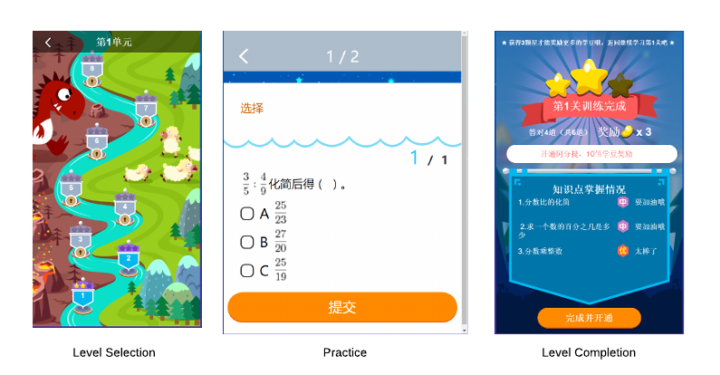

# Effort Choice and Efficacy Ranking {#effort}

```{r global_options, include=FALSE}
knitr::opts_chunk$set(fig.pos = 'H')
options(digits=3)
```

```{r, echo=FALSE,message=FALSE,warning=FALSE}
library(dplyr)
library(tidyr)
library(ggplot2)
library(stargazer)
library(gridExtra)
library(knitr)

proj_dir = 'C:\\Users\\junchen\\Documents\\GitHub\\thesis'
input_file_path = paste0(proj_dir,'/_data/03/paper_data.RData')
load(input_file_path)

# filter out vocab

data = data%>%  filter(group %in% c('No-3','Video'))
data$group = factor(as.character(data$group), levels=c( "No-3","Video"), labels=c('Control','Treatment'))

data = data %>% mutate(effort=1-giveup, correct=as.numeric(score==1), ec_status=effort+correct)

data$effort = factor(data$effort,labels=c('No Effort','Effort'))
data$correct = factor(data$correct, labels=c('Incorrect','Correct'))
data$ec_status = factor(data$ec_status, labels=c('no-effort','Honest Error','Correct'))
```


## Introduction: Efficacy Vesus Effectiveness {-}

Eric Talyor [-@taylor2015new] surveyed the evaluation of new education technology and concluded that education technologies are generally pedagogically ineffective in raising test scores. There are two competing hypotheses in explaining this observation: 

1. New technology does not improve teaching/learning productivity even under ideal conditions.
2. New technology improves productivity under ideal conditions but fails to do so in practical settings.

The medical literature makes a clear distinction between the two hypotheses [@flay1986efficacy]. Efficacy is "whether a technology, treatment, procedure, or program does more good than harm when delivered under optimum conditions". Effectiveness is "whether a technology, treatment, procedure, intervention, or program does more good than harm when delivered under real-world conditions". Following this terminology, the first hypothesis is a test on efficacy, while the second hypothesis is a test on effectiveness.

In medical literature, the difference between efficacy and effectiveness are often illustrated by the observation that patients often do not adhere to dosage and timing prescribed by a doctor. Similarly, in a low stake learning environment, learners have considerable latitude in when and how they do learning activities assigned by an instructor. If the learner does not exert effort in learning, even efficacious intervention would be ineffective. As the proverb "No pain no gain" suggests, some efficacious pedagogical method may elicit the least amount of effort if the learner is not willing to put in the work.

The evaluation of intelligent tutoring systems usually does not make the distinction between efficacy and effectiveness. This makes sense because the program evaluation is usually performed in the dissemination stage [@flay2005standards] during which the effectiveness is the key measurement of success. However, from the perspective of product development via rapid iterations, the distinction is important. If the proposed pedagogical technology is not efficacious, a developer should stop experimenting to cut losses. If the proposed pedagogical technology is efficacious but ineffective, the developer can improve the effectiveness by adjusting the technology to user behavior.

To this end, this chapter proposes to rank efficacies of different pedagogies in a Randomized Control Trial (RCT) by the Learning Through Practice (LTP) model, instead of the Difference in Difference (DID) regression, if such RCT is conducted in a low stake learning environment. If learners choose different levels of effort in the treatment group as compared to the control group, the DID estimator does not guarantee to correctly rank the efficacies of the tested pedagogies. In contrast, the LTP model ranks efficacies correctly by accounting for different effort rates with a structural model of effort choice.

This chapter is organized as the following: The first section discusses how learner's effort choice creates the difference between efficacy and effectiveness. Even when the RCT procedure grants no selection bias under the ideal condition for evaluation, learners' choice can still be differentially affected by the group assignment, resulting in different discrepancies between efficacy and effectiveness for different groups. The second section describes how the LTP model controls for the effort decisions to recover the correct relative efficacy ranking. The third section shows the DID estimator in general is not able to recover the right efficacy ranking in the presence of differential effort choices. The fourth section supports the analysis in the second and the third section with a simulation study. The fifth section applies both the LTP model and the DID estimator to an RCT dataset on geometry learning in third grade. It shows evidence of differential effort choices. Because of such differential choices, the DID estimator may fail to detect the statistically significant difference between two pedagogical efficacies while the LTP model successfully captures it by modeling the effort decision.


## Effort Choice in Randomized Control Trials

The introduction argues that the evaluation of ITS development should distinguish between effectiveness and efficacy, but what is the ideal implementation condition that allows efficacy to be evaluated? Ericsson et al [-@ericsson2016peak] and Duckworth et al[-@duckworth2007grit] argues that passion and grit are essential for practice to be effective. Following this school of thought, this chapter regards the ideal condition for implementation as learners exert their best effort no matter how challenging or boring the learning task is. 

The learning analytics literature has been aware that not all learners are paragons of grit in low stake learning for a decade. Ryan Baker[-@baker2004off;-@baker2004detecting] first documented the off-task behavior in using an intelligent tutor system, which later he developed into the "Baker-Rodrigo Observation Method Protocol". Following his research, there has been a few studies on the so-called "system gaming" behavior where learners avoid thinking by abusing the auxiliary instruction or hints [@koedinger2007exploring;@wixon2012wtf]. The same protocol is also used to study the correlation between daily effort and final test performance [@pardos2013affective]. The education economics literature also starts to document the lack of full effort in low stake testing [@levitt2013behavioralist] and even in high stake testing [@metcalfe2011student].

Whether or not the ideal condition for implementation is met has significant implication for the inference of the practice efficacy. Under the ideal condition, observed responses to practice problems are sufficient for ranking their relative efficacies. Given the same assessment questions, the problem that generates the highest positive difference in success rates between the pre-test and the post-test, aka effectiveness, must have the highest efficacy. However, under an imperfect implementation condition, the gain in success rate is the composite effect of the efficacy and the effort appeal of the problem. A problem with high efficacy but low effort appeal may generate less observed increase in success rate than a problem with low efficacy but high effort appeal. Consequently, the the ranking of effectiveness no longer mirrors the ranking of efficacy.

A Randomized Control Trial (RCT) does not preclude the problem of effort choice. A properly executed RCT requires random assignment of the treatment status and random sample attrition to justify the assumption that the treatment and the control group are similar in observed and unobserved characteristics. Under such ideal condition for evaluation, the estimated average treatment effect is free of selection bias. However, RCT does not, and need not, guarantee that learners always apply their best effort in the experiment. If the treatment pedagogy and the control pedagogy elicit different levels of learner effort, the difference between efficacy and effectiveness can also be different between the two groups. If the analysis only looks at the relative effectiveness based on the response data, such as the DID estimator, its inference on efficacy ranking may be incorrect.

In the next two sections, this chapter discusses the efficacy ranking within the context of RCT. For the LTP model, the RCT design ensures that the treatment group and the control group can be described by the same set of LTP parameters. For the DID regression, the RCT design ensures that the treatment group and the control group are valid counterfactuals. In addition, this chapter assumes that the pre-test and post-test items are the same for both groups, so that effort rates on the training problems are the only source of difference effort choices.


## The LTP model

This section reviews the effort choice in the Learning Through Practice (LTP) model. 

### Key Assumptions 

The critical assumptions on how effort affects the learning process are:

**Assumption 1 (No pain no gain)**: If learners do not exert effort at practice, they learn with probability 0.

**Assumption 2 **: If learners do not exert effort at practice, they produce a completely incorrect answer with probability 1, regardless of their latent mastery. 

**Assumption 3**: The effort choice is independent and identically distributed, conditional on learner's latent mastery.

Assumption 1 is the source of difference between efficacy and effectiveness. Because this chapter adopts a loose definition of effort in the empirical case study, learners who exert no effort literally made no effort in understanding the training question, let alone solving it, and thus is very unlikely to learn anything from it. 

Assumption 2 is not valid for all question types. For example, if the assessment item is a multiple choice problem, it is possible to make a lucky guess without any thinking. However, if the assessment item is a fill-in-the-blank problem, as in the empirical study, the probability of a blind correct guess is almost zero. 

Assumption 3 imposes a very strong assumption on grit, as grit is the deciding factor behind the effort choice in the LTP model. It assumes that the grit level is a characteristic of states of latent mastery, rather than that of a learner: When the learner switches from low mastery to high mastery, her grit level also changes. It is not compatible with the conventional understanding that grit is a personal trait that changes slowly. This chapter justifies Assumption 3 by arguing that it reflects two different aspects of grit. In low mastery, it is the resilience against failures. In high mastery, it is the resilience against boredom. 

### Consistent Estimation of Relative Efficacy  

```{theorem}
The point estimation of the efficacy of the LTP model is a consistent estimator of the true efficacy, if the LTP model correctly specifies the learning process.
```

```{proof}

The point estimation of the efficacy of the LTP model is 
$$
\begin{aligned}
\hat{\ell} &= \frac{\sum_t\sum_iI(X_{i,t}=1,X_{i,t-1}=0|Y_1,\dots,Y_T,E_1,\dots,E_T)+\alpha}{\sum_t\sum_iI(X_{i,t-1}=0|Y_1,\dots,Y_T,E_1,\dots,E_T)+\alpha+\beta}\\
&= \frac{\sum_t\frac{\sum_iI(X_{i,t}=1,X_{i,t-1}=0|Y_1,\dots,Y_T,E_1,\dots,E_T)}{N}+\frac{\alpha}{N}}{\sum_t\frac{\sum_iI(X_{i,t-1}=0|Y_1,\dots,Y_T,E_1,\dots,E_T)}{N}+\frac{\alpha+\beta}{N}}
\end{aligned}
$$

In large sample, the probability limit of the point estimation is 
$$
\begin{aligned}
\lim_{N \rightarrow \infty} \hat{\ell} &\rightarrow \frac{\sum_{t=1}^T P(X_t=1,X_{t-1}=0|Y_1,\dots,Y_T,E_1,\dots,E_T)}{\sum_{t=1}^T P(X_{t-1}=0|Y_1,\dots,Y_T,E_1,\dots,E_T)}\\
&= \frac{\sum_{t=1}^T \ell  P(X_{t-1}=0|Y_1,\dots,Y_T,E_1,\dots,E_T)}{\sum_{t=1}^T P(X_{t-1}=0|Y_1,\dots,Y_T,E_1,\dots,E_T)}\\
&=\ell
\end{aligned}
$$
```

```{lemma}
In a randomized control trial, the LTP model correctly ranks the efficacies, if the LTP model correctly specifies the learning process.
```

```{proof}

The RCT implies that the treatment group and the control group share the same parameter set, except for the efficacies and effort rates on training questions that differ between the two groups. 

Let $D$ be the group assignment. $D=T$ is the control group, $D=C$ the control group. Let $\ell_D$ denote the efficacy of training question in group $D$. By Theorem 6.1, 
$$
\begin{aligned}
\lim_{N \rightarrow \infty}  \hat{\ell}_{D=T} &\rightarrow  \ell_{D=T} \\
\lim_{N \rightarrow \infty}  \hat{\ell}_{D=C} &\rightarrow  \ell_{D=C}
\end{aligned}
$$

Therefore, 
$$
\lim_{N \rightarrow \infty} \hat{\ell}_{D=T} - \hat{\ell}_{D=C} \rightarrow \ell_{D=T} - \ell_{D=C}
$$
```


## The Difference in Difference Estimator


Econometricians use Difference in Difference (DID) regression to estimate the average treatment effect from an RCT. Let $Y$ be the response. $Y=1$ is a correct response. $Y=0$ is the incorrect response.  Let $t$ marks the experiment phase. $t=0$ is the pre-test phase and $t=1$ is the post-test phase. Under random assignment of an RCT, Average Treatment Effect (ATE) can be expressed as 
$$
ATE = [E(Y|D=T,t=1)-E(Y|D=C,t=1)]-[E(Y|D=T,t=0)-E(Y|D=C,t=0)]  \quad \text{(6.1)}
$$

The DID estimator accounts for common growth from pre-test to post-test period ($\beta_t$). It also controls for potential difference in the correct rate between the treatment and control groups in the pre-test period ($\beta_D$). Let $\beta_0$ be the average correct rate for the control group at the pre-test period. Let $\gamma$ denote the ATE. The four components in equation (6.1) can be expressed as:
$$
\begin{aligned}
E(Y|D=C,t=0) &= \beta_0\\
E(Y|D=T,t=0) &= \beta_0\quad\quad+\beta_D\\
E(Y|D=C,t=1) &= \beta_0+\beta_t\\
E(Y|D=T,t=1) &= \beta_0+\beta_t+\beta_D+\gamma
\end{aligned}
$$

Let $i$ be the learner id, $D_i$ be the group assignment for the learner and $Y_{i,t}$ be the response of the learner in either pre-test or post-test period. $\hat{\gamma}$ from the following regression is the Difference in Difference estimator of ATE.
$$
Y_{i,t} = \beta_0 + \beta_d D_i + \beta_t t + \gamma D_i t + \epsilon_{i,t}
$$


### Inferring Relative Efficacy from Relative Effectiveness

In a RCT, a qualitative judgment on the efficacy ranking is more important than a quantitive measurement on how large the efficacy difference is. Even though the DID estimator measures the effectiveness rather than the efficacy because it does not take effort choice into account, it is a valid inference tool for ranking if relative efficacy can be inferred from relative effectiveness. Although it is possible to do so if the control group has null efficacy, it is not always feasible if the control group has either positive or negative efficacy.


If the control group has a null efficacy, the placebo group for medical research for instance, the estimated effectiveness changes the magnitude of the efficacy but not its direction, thus relative efficacy can be inferred from relative effectiveness.  When the efficacy of the treatment is positive but fails to elicit effort from participants, the estimated effectiveness is biased toward the null effect, but still positive. Similarly, if the efficacy of the treatment is negative, the estimated effectiveness is biased toward the null effect, but still negative. Therefore, when the control group has no efficacy, the effort choice is essentially a power problem so far as the ranking inference is concerned.

If the control group has positive (or negative) efficacy, the order of efficacies may not be the same as the order of effectiveness. Consider the special case where the two pedagogies have identical positive efficacy, thus a true relative efficacy of ZERO. Differential effort choice can lead to either a positive or a negative relative effectiveness. If the treatment elicits full effort while the control practice elicits no effort, there is positive learning for treatment group, an increase in success rate of the post-test item, and a positive relative effectiveness. By the same token, if the treatment practice elicits no effort while the control practice elicits full effort, the relative effectiveness is negative. Therefore, when the control group has non-zero efficacy, the effort choice is a bias problem, as well as a power problem, for ranking inference.


### Efficacy Ranking by the DID Estimator

This subsection develops the properties of efficacy ranking by the DID estimator under the assumption that the LTP model correctly specifies the data generating process. To be compatible with the DID estimator, the observed response has only two states ($M_Y=2$). To simplify the discussion, assume the latent mastery also has only two states ($M_X=2$) and there is only one learner type ($M_Z=1$). The learner engagement include the effort decision but not the stop decision.

#### Notation

Let $J$ denote the item sequence each group received. In the context of random control trials, the item sequence has the generic form of (pre-test, training, post-test). Let the pre-test be 0, the post-test be 1, the treatment training be $T$, and the control training be $C$. In short, the treatment group receives the item sequence $J_T=(0,T,1)$ and the control group receives the item sequence $J_C=(0,C,1)$.

Let the initial mastery probability be $\pi$. Let the correct rate of item $j$ conditional on the latent mastery of state $k$ be $c_j^{k}$. Let the effort rate of the item $j$ conditional on the latent mastery of state $k$ be $e_j^{k}$. Let the pedagogical efficacy of the item $j$ be $\ell_j$. Thus the treatment's relative efficacy to the control can be expressed as $\Delta \ell=\ell_T-\ell_C$. 

Let $O_t$ be the observed response in sequence position $t$. The following definition describes the mapping between the observed response ($O_t$), the learner's true response ($Y_t$) and the learner's effort ($E_t$):
$$
O_t= \Bigg\{ \begin{array}{cc}
0 & \text{otherwise } \\
1 & \text{if }Y_t=1 \& E_t=1\\
\end{array}
$$


#### Rank Ordering Without Effort Choice

When learners always exert effort, it can be proved that the DID estimator makes the right efficacy ranking in a large sample.

```{theorem}
Without effort choice, the DID estimator correctly ranks pedagogical efficacies if there are learners without mastery before the experiment ($\pi<1$), the pre-test item does not convert all learners without mastery to having mastery ($\ell_0<1$), and the post-test item discriminates between two latent states($c_1^1 > c_1^0$).
```

```{proof}

Let $\delta$ be the estimated relative effectiveness and $\Delta \ell$ be relative efficacy. 

For the estimated effectiveness to have the same rank order as the efficacy, $\delta$ and $\Delta \ell$ need to satisfy the following properties.

1. If $\Delta \ell=0$, $\delta=0$.
2. If $\Delta \ell\neq0$, $\delta\Delta \ell>0$.


When there is no effort choice, the first difference within each group is 
$$
\begin{aligned}
\delta_D&=P(Y_1=1,Y_0=1|D)-P(Y_1=1,Y_0=1|D) \\
&= (1-\pi)(1-\ell_0)(1-\ell_D)(c_1^0-c_0^{1,0})+((1-\pi)[(1-\ell_0)\ell_D+\ell_0])(c_1^1-c_0^{1,0})+(1-\pi)(c_1^1-c_0^{1,1})
\end{aligned}
$$

The second difference is
$$
\delta =\delta_T-\delta_C = \Delta \ell(1-\pi)(1-\ell_0)(c_1^1-c_1^0)
$$

If $\ell_0<1$, $\pi<1$, and $c_1^1>c_1^0$, it is easy to verify that rank order properties are satisfied. 

```

#### Rank Order with Effort Choice

However, if the learning process involves the effort decision, the correct efficacy ranking requires a much stronger assumption that effort rates of learners without mastery are the same for the training question.

```{theorem}
With effort choice, the DID estimator correctly ranks pedagogical efficacies if $\pi<1$ and $\ell_0<1$, $c_1^1e_1^1-c_1^0e_1^0$ and $e_T^0=e_C^0$
```


```{proof}
The first difference is
$$
\begin{aligned}
\tilde{\delta}_D&=P(O_0=0,O_1=1|D)-P(O_0=1,O_1=0|D) \\
&=P(E_0=0,E_1=1,Y_1=1|D)+P(E_0=1,E_1=1,Y_0=0,Y_1=1|D)\\
&\quad-P(E_0=1,E_1=0,Y_0=1|D)-P(E_0=1,E_1=1,Y_0=1,Y_1=0|D)\\
&= (1-\pi)(1-\ell_0e^0_0)(1-\ell_De_D)(c_1^0e^0_1-c_0^{1,0}e^0_0)+((1-\pi)[(1-\ell_0e^0_0)\ell_De^0_D+\ell_0e^0_0])(c_1^1e^1_1-c_0^{1,0}e^0_0)+(1-\pi)(c_1^1e^1_1-c_0^{1,1}e^0_0)
\end{aligned}
$$

The second difference is
$$
\tilde{\delta} = \tilde{\delta}_T-\tilde{\delta}_C = (\ell_Te^0_T-\ell_Ce^0_C)(1-\pi)(1-\ell_0e^0_0)(c_1^1e_1^1-c_1^0e_1^0)
$$

When $\Delta \ell=0$, $\tilde{\delta}=0$ only when $e^0_T=e^0_C$.

If $e^0_T=e^0_C$, when $\Delta \ell\neq0$, $\tilde{\delta} \Delta \ell>0$ requires $c_1^1e_1^1-c_1^0e_1^0>0$.


```


Theorem 6.3 essentially says the DID estimator correctly recovers the rank order only when the effort choices of learners without mastery are the same for the treatment pedagogy and the control pedagogy. It implies that the DID estimator does not preserve the rank order of efficacies when the effort choices differ by practice questions, which is more realistic in a low stake learning environment.


#### Rank Ordering Conditional on Effort

One intuitive correction technique is to condition the analysis on learners who exert efforts on the training question. However, the conditional DID estimator does not guarantee a correct efficacy rank either.

```{lemma}
Conditioning on the effort on the training question is not a sufficient condition of the DID estimator being a monotone function of the pedagogical efficacy difference.
```

```{proof}
The analysis is almost the same as Theorem 6.3 except for the initial mastery probability is $P(X_0=1|E_D=1)$. It can be shown that
$$
\tilde{\pi}_D=P(X_0=1|E_D=1) = \frac{\pi e^1_D}{[(1-\pi)(1-\ell_0)e_0+(1-\pi)(1-e_0)]e^0_D+[(1-\pi)\ell_0e_0+\pi]e_D^1}
$$

Plug it in the DID estimator
$$
\tilde{\delta} = \tilde{\delta}_T-\tilde{\delta}_C = [\ell_T(1-\tilde{\pi_T})-\ell_C(1-\tilde{\pi_T})](1-\ell_0e^0_0)(c_1^1e^1_1-c_1^0e^0_1)+(\tilde{\pi_T}-\tilde{\pi_C})(c_1^1-c_0^1)e^1_1
$$


Even under the favorable condition that $c_1^1=c_0^1$, the correct rank order requires
$$
(\ell_T-\ell_C)(\frac{\ell_T}{\ell_c}-\frac{1-\tilde{\pi}_T}{1-\tilde{\pi}_C})>0
$$

In general, the inequality is not true.
```

The key insight from Lemma 6.1 is that conditioning on the effort is a selection process. Such selection process breaks the valid counterfactual assumption granted by the random assignment of the RCT design. Therefore the estimated effectiveness of each group is biased.  Although it can be argued that a biased estimator of the effectiveness is not sufficient to conclude that the difference of two biased estimators does not preserve the rank order of pedagogical efficacies. The author wishes to point out that it is easy to construct a counterexample where such bias leads to a wrong rank order.


## Simulation Study

The simulation demonstrates Theorem 6.2 and Theorem 6.3 in the previous section. The true efficacy difference is set to be 0.4. Without effort choice, the true effectiveness difference for the DID estimator is 0.176. With effort choice, the true effectiveness difference for the DID estimator is 0, where the differential effort choices offset the efficacy difference entirely. The values of all simulation parameters are in Appendix B.4. 

Use the 95% credible interval as the decision rule for ranking. If the interval is to the right of 0, the treatment ranks first. If the interval is to the left of the 0, the control ranks first. The simulation study is interested in whether the DID estimator and the LTP estimator make the right rank decision.


Table 6.1 shows the result of the DID estimator. When the data generating process does not involve the effort choice, the DID estimator consistently estimates the relative effectiveness and thus correctly ranks the two groups. However, when the data generating process involves the effort choice, the 95% credible interval contains zero, thus the DID estimator fails to rank the treatment higher than the control.

```{r,echo=FALSE,message=FALSE,warning=FALSE}
data_dir = paste0(proj_dir, '/_data/03/sim/')

exp1_data = read.table(paste0(data_dir, 'exp1.txt'),sep=',',col.names=c('i','t','j','y'))
treat_status = exp1_data %>% filter(t==1) %>% mutate(D=j-1) %>% select(i,D)
analysis_data = merge(exp1_data %>% filter(t!=1) %>% mutate(t=t/2) %>% select(i,t,y), treat_status)
mod1 = lm(data=analysis_data, y~t*D)
se <- sqrt(diag(vcov(mod1)))
mcmc_param1 =  read.table(paste0(data_dir, 'exp1_param.txt'),sep=',') %>% select(V2,V3) %>% rename(l0=V2,l1=V3) %>% mutate(ldif=l0-l1)


exp3_data = read.table(paste0(data_dir, 'exp3.txt'),sep=',',col.names=c('i','t','j','y','h','e'))
treat_status = exp3_data %>% filter(t==1) %>% mutate(D=j-1) %>% select(i,D)
analysis_data = merge(exp3_data %>% filter(t!=1) %>% mutate(t=t/2) %>% select(i,t,y), treat_status)
mod3 = lm(data=analysis_data, y~t*D)
se <- sqrt(diag(vcov(mod3)))
mcmc_param3 =  read.table(paste0(data_dir, 'exp3_param.txt'),sep=',') %>% select(V2,V3) %>% rename(l0=V2,l1=V3) %>% mutate(ldif=l0-l1)


sim_param = data.frame(dgp=c('Without Effort','Without Effort','With Effort','With Effort'),
                       model=c('RCT','LTP','RCT','LTP'),
                       true_efficacy=c(0.4,0.4,0.4,0.4),
                       true_effective=c(0.176,0.176,0.176,0.176),
                       est_efficacy = NA,
                       est_effective = NA,
                       lower = as.numeric(0),
                       upper = as.numeric(0)
                       )
#RCT
sim_param$est_effective[1] = - mod1$coefficients[4]
sim_param$lower[1] = - mod1$coefficients[4] - 1.96*se[4]
sim_param$upper[1] = - mod1$coefficients[4] + 1.96*se[4]

sim_param$est_effective[3] = - mod3$coefficients[4] 
sim_param$lower[3] = - mod3$coefficients[4] - 1.96*se[4]
sim_param$upper[3] = - mod3$coefficients[4] + 1.96*se[4]

#LTP
sim_param$est_efficacy[2] = mean(mcmc_param1$ldif)
sim_param$lower[2] = quantile(mcmc_param1$ldif, prob=0.05)
sim_param$upper[2] = quantile(mcmc_param1$ldif, prob=0.95)

sim_param$est_efficacy[4] = mean(mcmc_param3$ldif)
sim_param$lower[4] = quantile(mcmc_param3$ldif, prob=0.05)
sim_param$upper[4] = quantile(mcmc_param3$ldif, prob=0.95)

kable(
  sim_param %>% filter(model=='RCT') %>% select(-model,-true_efficacy,-est_efficacy), 
  col.names=c('D.G.P.', 'Effectiveness','Est.Effectiveness','95% CI(L)','95% CI(H)'),
  booktabs = TRUE, align='c',format='pandoc',
  caption = 'Simulation Result of the DID estimator'
)
```

In contrast, Table 6.2 shows that the LTP estimator always recovers the correct rank order whether the data generating process has the effort choice or not. 


```{r,echo=FALSE,message=FALSE,warning=FALSE}
kable(
  sim_param %>% filter(model=='LTP') %>% select(-model,-true_effective,-est_effective), 
  col.names=c('D.G.P.', 'Efficacy','Est.Efficacy','95% CI(L)','95% CI(H)'),
  booktabs = TRUE, align='c',format='pandoc',
  caption = 'Simulation Result of the LTP estimator'
)

```

## Case Study

This section applies the LTP model to a randomized control trial. The section first describes the data collection process of the experiment, then describes the identification of the effort choice, and finally shows different rankings of the DID estimator and the LTP model.


### The Learning Environment

The experiment is carried out in a paid self-learning product offered by a Chinese online learning service provider. The product is used after school, rather than in the classroom. The product is framed as a role-playing game where a learner clears a level to claim some reward. The screen shots of the selection, the practice and the completion of a level are shown in Figure 6.1.

```{r,echo=FALSE,message=FALSE,warning=FALSE, fig.cap = "Stages of a Level in the Learning Game", fig.align='center'}

```


The product is in a low stake learning environment because it offers a small monetary incentive for good performance and no direct punishment for poor performance. If a learner correctly answers the question, she receives *xuedou*, an in-game virtual currency, that can be used to buy in-game gears or real world gifts. During the experiment, the reward for each correct response is valued at about a tenth of $\yen$0.01 (or $0.00014). If the learner answers the question incorrectly, she receives nothing and loses nothing on the spot, but is offered a second chance to try again later for a smaller reward. Because the stake in this learning environment is low, it does not inspire learners to struggle when challenged with difficult questions. In addition, because each correct answer is worth the same regardless of its difficulty, some students develop a strategy of picking easy items and skipping hard items. Both low incentive and the system design flaw keep learners from exerting their full effort in practice.


### Raw data

The log data collected for the experiment include the following fields:

1. learner id
2. question id
3. Submit time
4. time spent on the question (seconds)
5. the grade (0-1)
6. the actual answer in the text

The time spent on the item is defined as the time elapsed between the timestamp the server sends out the question to the learner's device and the timestamp the learner's answer received by the server. The transmission time in the network is negligible, usually in the magnitude of 10 milliseconds. However, the time spent does not distinguish how much time spent on each sub question. In addition, it is not a clean measure of student's active learning time. What student did between when the question is presented and when the answer is submitted is not observed. Although there are 4% of the observations logged response time longer than 2 minutes, the majority of the response time falls within a reasonable time range.

Here is a sample of the original data log

```{r, echo=FALSE,message=FALSE,warning=FALSE}
log_example = head(data%>%select(uid, eid, cmt_time, cmt_timelen,atag_pct, answers), 1)
log_example$uid = as.character(log_example$uid)
kable(
  log_example, 
  col.names = c('User ID', 'Item ID', 'Submit Time', 'Time Spent on Item', 'Score', 'Answers'),
  align='c',booktabs = TRUE,format='pandoc',
  caption = 'Demo data from the Log'
)
```

### The Design and the Implementation of The Experiment 

The experiment is administrated from June 9th to June 10th 2016 to third-grade students whose parents paid for the learning product. By then, all learners should have learned the pre-requisite knowledge in the school: calculating circumference and area of a rectangle. 

Each group receives three items, the pre-test item, the training item and the post-test item, as shown in Figure 6.2. All items ask the learner to calculate the circumference and the area of two identical rectangles joined by one side given the length and width of the small rectangle. The pre-test item and the training item are rectangles joined by length but have different parameter values. The pre-test and post-test item share the same parameter value but whose small rectangles are joined by different sides. The highly similar yet not identical test items aim to increase the measurement validity while preventing students from memorizing the answer.

```{r,echo=FALSE,message=FALSE,warning=FALSE, fig.cap =  "Descriptions of Experiment Problems", fig.align='center'}
include_graphics("fig/item.png")
```


The learners are randomly assigned to the treatment group and the control group by user id, which is randomly generated. The treatment and the control group differ in the pedagogical methods. Both the control group and the treatment group receives the training question, while the treatment group receives an additional link to an animated video tutorial containing the following instructions:


1. Calculate the circumference and the area of the small rectangle
2. To get the circumference of the large rectangle, multiply the circumference of the small rectangle by two and subtract two times of the length of the joined side.
3. To get the area of the large rectangle,  multiply the area of the small rectangle by two


The learner can choose to skip the video tutorial. Unfortunately, the system does not track the learners' watch history by their user ids. On aggregate, the video was played about 800 times. If assume each view is a different learner, the maximum exposure to the treatment is about 30%. The video tutorial is 67 seconds long. The average play time is about 47 seconds.


### Differential Effort Choice 

The identification of the LTP model hinges on the identification of the effort level. The effort level is not directly observed but has to be inferred from the log data.  

#### Effort Classification

This chapter identifies the effort from the actual text response student submitted. A correct response or an honest error is labeled as "effort" while a blank answer or a non-sensical answer is labeled as "no-effort"/"give-up". This classification method is also used by Zamarro et al [-@zamarro2016comparing] to validating measures of non-cognitive skills by analyzing respondents's answer behavior to a psychological survey.

In the context of this experiment, there are only four honest mistakes:

1. Wrong shape: The learner calculates correctly either the circumference or the area of the small rectangle
2. Wrong circumference: The learner calculates correctly the area but not the circumference
3. Wrong area: The learner calculates correctly the circumference but not the area
4. Slip:  The answer is correctly calculated but the learner inputs in a wrong way (for example an extra zero at the end)

Table 6.4 shows a breakdown of the answer classification. The classification is discussed in details in Appendix C.

```{r, echo=FALSE,message=FALSE,warning=FALSE}
# the four groups are noefforts, honest errors and correct response
ans_composition = data  %>%
  mutate(subscore=score0+score1+score2) %>%
  group_by(group, qtype) %>% 
  summarize(n=n(),
            noeffort = mean(subscore==0),
            se_noeffort = sqrt((1-noeffort)*noeffort/n),
            honesteror=mean(subscore>0&score<1),
            se_honesteror = sqrt((1-honesteror)*honesteror/n),
            corret=mean(score==1),
            se_corret = sqrt((1-corret)*corret/n))%>%
 select(-n) %>%
    mutate(noeffort=noeffort*100,
           honesteror=honesteror*100,
           corret=corret*100,
           se_noeffort=se_noeffort*100,
           se_honesteror=se_honesteror*100,
           se_corret=se_corret*100)

kable(
  ans_composition %>% arrange(qtype,group), 
  col.names=c('Group','Task','No-Effort(%)','No-Effort(SE)','Honest Error (%)','Honest Error (SE)', 'Correct(%)','Correct(SE)'),
  booktabs = TRUE, align='c',format='pandoc',
  caption = 'Answer Composition - All Wrong'
)
```


#### Robustness Check of the Effort Classification

Time spent on the item is suggestive of the learner's level of effort. Figure 6.3 shows its distribution. While the response time distribution of the honest error is very similar to that of the correct answer, the response time distribution of the no-effort answer is very different to the other two. The median time spent on an honest error or a correct answer is about 47 seconds while that on a no-effort answer is about 10 seconds. The first quartile of the response time of an honest error or a correct answer is about 34 seconds, which is higher than the third quartile of the response time of a no-effort answer, 29 seconds. The similarity between the honest error and the correct answer and the difference of the two from the no-effort answer validates the effort classification. 

```{r, echo=FALSE,message=FALSE,warning=FALSE,, fig.cap = "Boxplot of Time Spent by Answer Type", fig.align='center',out.height='8cm',out.width='8cm'}

qplot(data=data,x=ec_status,y=cmt_timelen,geom='boxplot') + ylab('Time Spent on Item(Sec)') + xlab('Answer Type')
```


It may be argued that the classification strategy underestimates the level of effort because it is possible that learners do think hard on these problems despite putting in a non-sensical answer or leaving it blank. Although it may be an issue for the pre-test item, such miscoding is less problematic for the training item and the post-test item. Figure 6.4 shows the distribution of response time when submitting a no-effort answer. Compared to the pre-test item, the response time distribution of the training item and the post-test item shifts to the left and skews toward 0. The learners are spending less time on the problem, so little that it may not them to read the question carefully. Therefore, the effort identification is likely to be more accurate in the next two items. 

```{r,echo=FALSE,message=FALSE,warning=FALSE, fig.cap = "Distribution of Time Spent on Item without Effort by Answer Classification", fig.align='center',out.height='8cm',out.width='8cm'}
qplot(data=data %>% filter(cmt_timelen<=120&giveup), x=cmt_timelen, geom='density', col=etype, linetype=etype, facets=group~qtype)+xlab('Time Spent on Task (Seconds)')
```

In contrast, answers with actual effort input do not demonstrate the same shift. Figure 6.5 shows the response time distribution when submitting a valid answer. A honest error or a correct answer is taxing on one's mind and takes time, while a no-effort error made on the fly. The comparison of response time distribution between effort exertion and the lack of it further substantiates the classification.


```{r,echo=FALSE,message=FALSE,warning=FALSE, fig.cap = "Distribution of Time Spent on Item With Effort by Answer Classification", fig.align='center',out.height='8cm',out.width='8cm'}
qplot(data=data %>% filter(cmt_timelen<=120&!giveup), x=cmt_timelen, geom='density', col=ec_status, linetype=ec_status,facets=group~qtype) + xlab('Time Spent on Task (Seconds)')
```


#### Differential Effort Level Choice

Table 6.5 lists the summary statistics of the effort rate group by the experiment sequence and the group assignment. The treatment group exerts less effort compared to the control group in the pre-test period and the training period, the difference of which is statistically significant. The effort gap narrows in the post-test period. Ideally, the two groups should have the same effort rate in the pre-test period but different effort rates in the training session. The different effort rates in the pre-test period suggest that the randomization is not perfect. However, the effort rate gap widens from 2.3% in the pre-test period to 3.4% in the training session. Although the widening of the effort gap is not statistically significant, it suggests that treatment pedagogy elicits less effort from the learners.

```{r,echo=FALSE,message=FALSE,warning=FALSE}
effort_rate_stat = data %>% group_by(group,qtype) %>% summarize(pct=1-mean(giveup), se=(1-pct)*pct/sqrt(n())) %>% select(qtype,group,pct,se) %>% arrange(qtype,group)

kable(effort_rate_stat, 
      
      col.names = c('Period','Group','Mean Effort Rate','Standard Error'),
      booktabs = TRUE, align='c', format='pandoc',
      caption = 'Effort Rate Choices - All'
      ) 
```


Further, this chapter wants to measure the effort gap of the learners with mastery and those without. From the data, one can only observe the effort rate conditional the response, but not on the state of latent mastery. That said, the state of latent mastery can be partially approximated by the response in the pre-test item. Because the pre-test item is a fill-in-the-blanks question, the probability of making a correct guess when the learner has no mastery is small enough to be negligible. Therefore, if a learner correctly answers the question, she must have mastered the knowledge point. If the learner incorrectly answers the question, it is unclear whether it is because she has no mastery or because she does not want to exert effort. Because the learners who fail the pre-test is a mixture of learners with and without mastery, if the effort gap of learners who correctly answers the pre-test is smaller than that of learners who incorrectly answers the pre-test, the latter becomes the lower bound of the effort gap of learners without mastery.

Table 6.6 reports the effort rates for the learners partitioned by the response in the pre-test item. The effort rate gap is 1.6% for the learners who (presumably) have mastery because they correctly answer the pre-test question. It is lower than the effort gap of learners who incorrectly answer the pre-test question, which is around 4%. Therefore, the effort rate gap for the learners without mastery must be larger than 4%. Even at the lower bound, the effort rate gap of learners without mastery is about 2 times larger than those with mastery. 

```{r,echo=FALSE,message=FALSE,warning=FALSE}
effort_rate_stat_1 = data %>% filter(is_placebo==1)%>% group_by(group,qtype) %>% summarize(pct_1=1-mean(giveup), se_1=(1-pct_1)*pct_1/sqrt(n()))
effort_rate_stat_0 = data %>% filter(is_placebo==0)%>% group_by(group,qtype) %>% summarize(pct_0=1-mean(giveup), se_0=(1-pct_0)*pct_0/sqrt(n()))

effort_rate_stat_placebo = merge(effort_rate_stat_1,effort_rate_stat_0) %>% select(qtype,group,pct_0,se_0,pct_1,se_1) %>% arrange(qtype,group)

kable(effort_rate_stat_placebo, 
      booktabs = TRUE,
      col.names = c('Period','Group','Mean Effort Rate(Y=0)','S.E(Y=0)','Mean Effort Rate(Y=1)','S.E(Y=1)'),
      align='c',format='pandoc',
      caption = 'Effort Rate Choice - By Response in the Pre-test'
      ) 
```

The previous analysis suggests that the treatment group exerts less effort than the control group and the difference comes mainly from the learners without mastery. However, readers may worry about selection bias because the effort rates differ in the pre-test item, suggesting that the RCT is not properly executed. The author acknowledges this defect and wishes to conduct a better-executed RCT in future research.


### The result

This section compares the DID estimator to the LTP estimator. It demonstrates how differential effort rates can lead to a qualitatively different ranking of the pedagogical efficacy. The consensus among pedagogical experts is that the presence of a video instruction should increase the pedagogical efficacy of the treatment training question. Especially, because the circumference of the large rectangle is not simply double that of the small rectangle, they expect the special trick in the video to produce a larger gain in calculating the circumference. The LTP model confirms both prior expectations of the domain experts, while the DID estimator confirms none.


#### Relative Effectiveness and Relative Efficacy in Aggregate

Both the DID estimator and the LTP estimator are applied to the aggregate score. The point estimation of relative effectiveness given by the DID estimator is close to 0. Because its 95% confidence interval contains 0, the DID estimator suggests that the efficacy ranking of the two questions cannot be determined. In contrast, the point estimation of relative efficacy given by the LTP model is positive. Because its 95% credible interval excludes 0, the LTP estimator suggests that the training question with video instructions has better efficacy than the question without.


```{r,echo=FALSE,message=FALSE,warning=FALSE}
y0data = data %>% filter(eid=='Q_10201056649366') %>% mutate(t=0)
y1data = data %>% filter(eid=='Q_10201056666357') %>% mutate(t=1)

ydata = rbind(y0data,y1data)
ydata = ydata %>% transform(d=as.numeric(gid!=0))

mod = lm(data=ydata,y~d*t)
se <- sqrt(diag(vcov(mod)))

no_param = read.table(paste0(proj_dir,'/_data/03/exp/no_effort.txt'),sep=',') %>%
  mutate(ldif=V3-V2) %>% select(ldif) %>%
  mutate(model='response only')

manual_param = read.table(paste0(proj_dir,'/_data/03/exp/manual_effort.txt'),sep=',') %>%
  mutate(ldif=V3-V2) %>% select(ldif) %>%
  mutate(model='effort choice')

param_data = data.frame(model=c('DID','LTP'), effectivness=NA, efficacy = NA, lower=as.numeric(0), upper=as.numeric(0))
param_data$effectivness[1] =mod$coefficients[4] 
param_data$lower[1] =mod$coefficients[4] - 1.96*se[4]
param_data$upper[1] =mod$coefficients[4] + 1.96*se[4]

# param_data$point_est[2] =mean(no_param$ldif) 
# param_data$lower[2] = quantile(no_param$ldif, 0.05)
# param_data$upper[2] = quantile(no_param$ldif, 0.95)

param_data$efficacy[2] =mean(manual_param$ldif) 
param_data$lower[2] = quantile(manual_param$ldif, 0.05)
param_data$upper[2] = quantile(manual_param$ldif, 0.95)
param_data$rank = c('N','Y')

param_data = param_data%>% arrange(model)

kable(
  param_data, booktabs = TRUE,
  col.names=c('Model','Est. Rel  Effectivness','Est. Rel  Efficacy','95% CI(L)','95% CI(H)','Treatment Better?'),
  align='c',format='pandoc',
  caption = 'Estimated Relative Effectiveness and Relative Efficacy in Aggregate Score'
)

```

#### Relative Effectiveness and Relative Efficacy by Knowledge Components 

To correctly solve the problem, a learner must be proficient in three knowledge components: shape identification, circumference calculation, and area calculation. Therefore, it is possible to score each knowledge components and analyze the respective pedagogical efficacy ranking. The effort choice is inherited from the aggregate score. For example, if the learner leaves a blank for circumference but fills in the area, the response is considered a valid effort for all three components, rather than treating it as a no-effort for the circumference due to the blank answer.


According to the prior expectation of the pedagogical experts, the video scaffolding is likely to be more effective in teaching how to calculate the circumference, because it introduces a new method to calculate the circumference that is less likely to cause confusion. Table 6.8 reports the estimated relative effectiveness and relative efficacy by these components. The breakdown analysis indeed shows that the question with video instruction has higher pedagogical efficacy in teaching circumference, but not in teaching the other two components. This finding supports the plausibility of the claim that the LTP estimator is truly estimating the pedagogical efficacy.


```{r,echo=FALSE,message=FALSE,warning=FALSE}

data_0 = read.csv(paste0(proj_dir,'/_data/03/output/exp_output_0.csv'), sep=',', header=T)
group_assignment = data_0 %>% filter(t==1) %>% mutate(d=j-1) %>% select(i,d)
ydata_0 = merge(data_0 %>% filter(t!=1) %>% mutate(t=t/2) %>% select(i,t,score0) %>% rename(y=score0),group_assignment)
mod_0 = lm(data=ydata_0,y~d*t)
beta_0 = mod_0$coefficients[4]
se_0 <- sqrt(diag(vcov(mod_0)))[4]

data_1 = read.csv(paste0(proj_dir,'/_data/03/output/exp_output_1.csv'), sep=',', header=T)
group_assignment = data_1 %>% filter(t==1) %>% mutate(d=j-1) %>% select(i,d)
ydata_1 = merge(data_1 %>% filter(t!=1) %>% mutate(t=t/2) %>% select(i,t,score1) %>% rename(y=score1),group_assignment)
mod_1 = lm(data=ydata_1,y~d*t)
beta_1 = mod_1$coefficients[4]
se_1 <- sqrt(diag(vcov(mod_1)))[4]

data_2 = read.csv(paste0(proj_dir,'/_data/03/output/exp_output_2.csv'), sep=',', header=T)
group_assignment = data_2 %>% filter(t==1) %>% mutate(d=j-1) %>% select(i,d)
ydata_2 = merge(data_2 %>% filter(t!=1) %>% mutate(t=t/2) %>% select(i,t,score2) %>% rename(y=score2),group_assignment)
mod_2 = lm(data=ydata_2,y~d*t)
beta_2 = mod_2$coefficients[4]
se_2 <- sqrt(diag(vcov(mod_2)))[4]


did_param_data = data.frame(kp=c('Shape','Circumference','Area'), model='DID', effective=as.numeric(0), efficacy = NA, lower=as.numeric(0), upper=as.numeric(0))
did_param_data$effective[1] = beta_0
did_param_data$lower[1] =beta_0 - 1.96*se_0
did_param_data$upper[1] =beta_0 + 1.96*se_0

did_param_data$effective[2] = beta_1
did_param_data$lower[2] =beta_1 - 1.96*se_1
did_param_data$upper[2] =beta_1 + 1.96*se_1


did_param_data$effective[3] = beta_2
did_param_data$lower[3] =beta_2 - 1.96*se_2
did_param_data$upper[3] =beta_2 + 1.96*se_2

manual_param_0 = read.table(paste0(proj_dir,'/_data/03/exp/manual_effort_0.txt'),sep=',') %>%
  mutate(ldif=V3-V2) %>% select(ldif) %>%
  mutate(model='effort choice')

manual_param_1 = read.table(paste0(proj_dir,'/_data/03/exp/manual_effort_1.txt'),sep=',') %>%
  mutate(ldif=V3-V2) %>% select(ldif) %>%
  mutate(model='effort choice')

manual_param_2 = read.table(paste0(proj_dir,'/_data/03/exp/manual_effort_2.txt'),sep=',') %>%
  mutate(ldif=V3-V2) %>% select(ldif) %>%
  mutate(model='effort choice')

bkt_param_data = data.frame(kp=c('Shape','Circumference','Area'), model='LTP',effective=NA,efficacy = as.numeric(0), lower=as.numeric(0), upper=as.numeric(0))
bkt_param_data$efficacy[1] =mean(manual_param_0$ldif) 
bkt_param_data$lower[1] = quantile(manual_param_0$ldif, 0.05)
bkt_param_data$upper[1] = quantile(manual_param_0$ldif, 0.95)

bkt_param_data$efficacy[2] =mean(manual_param_1$ldif) 
bkt_param_data$lower[2] = quantile(manual_param_1$ldif, 0.05)
bkt_param_data$upper[2] = quantile(manual_param_1$ldif, 0.95)

bkt_param_data$efficacy[3] =mean(manual_param_2$ldif) 
bkt_param_data$lower[3] = quantile(manual_param_2$ldif, 0.05)
bkt_param_data$upper[3] = quantile(manual_param_2$ldif, 0.95)


param_data = rbind(bkt_param_data, did_param_data) %>% arrange(kp,model)

kable(
  param_data, booktabs = TRUE,
  col.names=c('Knowledge Component','Model','Est. Rel  Effectiveness','Est. Rel  Efficacy','95% CI(L)','95% CI(H)'),
  align='c',format='pandoc',
  caption = 'Estimated Relative Effectiveness and Relative Efficacy by Knowledge Components'
)


```


