Learning Through Practices
========================================================
author: Junhen Feng
autosize: true

Motivation
========================================================
type: section

Practice Makes Perfect
========================================================
- Merriam Webster: To do repeated exercises for proficiency

- Effective practice requires more than simple repetition

- How to recommend?

A Motivating Example (1)
========================================================

- The Learner tries to learn two-digit multiplication
- What content?
  + 14*20
  + 14*21
  + 14*23

- What format?
  + 14*23 = ___

  + Vertical format

  $$
  \begin{aligned}
  &\quad 14\\
  &\times 23\\
  &---\\
  \end{aligned}
  $$

***

- When to stop?
  + Winning streak
  + Losing streak
  + Mixture

A Motivating Example (2)
========================================================
id: intro_mot
- Practice as Assessment -> Optimal Stopping

  + The user's latent ability has to be inferred from the observed response

- Practice as Instruction -> **Optiomal Recommendation**

  + What matters is how the item instruction elevates the learner's mastery
  + What observed is how item difficulty reveals the learner's mastery
  + The folk wisdom is inverse U
  + Break the conditional independence [IRT Comparison](#\irt)

Pedagogical Efficacy
========================================================
type: prompt

- Practice: Any learning task that produces a measurable outcome
  + Listening to lecture per se is not a practice [not measurable]
  + Batting exercise is a practice

- Pedagogical efficacy = What makes practices effective = learning

    + A hard question without a clear answer

- To measure, not to explain, the pedagogical efficacy

Navigation
========================================================

- [Chapter 1](#/chp1): A General Model
- [Chapter 2](#/chp2): Identification and Estimation
- [Chapter 3](#/chp3): Selection Bias of the Exit Decision
- [Chapter 4](#/chp4)：Effort Induced Measurement Error

Chapter I: A General Model of Learning Through Practices
========================================================
id: chp1
type: section

- [The Learning Process](#/lp)

- [The Effort Decision] (#/ed)

- [The Stop Decision](#/sd)

Event Sequence
========================================================

+ The learner is presented with a practice item

+ The learner decides the effort level

    * With effort, (probabilistic) learning happens depending on the item efficacy
    * Without effort, no learning

+ The learner produces a response and is graded

    * Assume no learning from the feedback after the response

+ The learner choose to stop

    * No: start from the first step

Why Modelling Effort and Stop
========================================================
- Theorectically
  + Prevalent in low stake learning environment
  + bias the pedagogical efficacy if ignored

- Practically
  + Engagement is usually managed by the product manager

Notation
========================================================
- $j$: The item id
- $t$: The sequence id. [*Not calendar time*]
- $X_t$: The latent state of knowledge mastery
- $Y_t$: The observed response grade
- $E_t$: The observed effort
- $H_t$: If the learner stops at sequence $t$
- $A()$: The assignment function.
    + $A(t)=j$: The item $j$ is at $t^{th}$ practice sequence

The Learning Process (1)
========================================================
id: lp
- **Assumption 1**: $X_t$ is unidimensional

    + Avoid mapping the knowledge space to item

- **Assumption 2**: $X_t$ is discrete with $M_x$ number of states
    + *Learning is moving from a lower state to a higher state*.
    + More intuitive representation of probabilitic learning than continuous mastery

The Learning Process (2)
========================================================

- General pedagogical efficacy

$$P(X_t=m|X_{t-1}=n,A(1),\dots,A(t-1),j)$$

- **Assumption 3**: Pedagogical efficacy is independent of the sequence order
  + Rule out training fatigue

- **Assumption 4**: No substitution or complementarity in sequence composition
  + Rule out scaffolding items

The Learning Process (3)
========================================================

- **Assumption 5**: Learning is gradual. Transit one state at a time.

$$p(X_t=m|X_{t-1}=n, j) =0 \quad \forall t,j \quad\text{where} \quad m-n>1$$

- **Assumption 6**: No forgetting.

$$p(X_t=m|X_{t-1}=n, j) = 0 \quad \forall t,j \quad\text{where} \quad m < n$$

- This is called left-to-right transition

The Learning Process (4)
========================================================
Define the **pedagogical efficacy**  as
$$\ell^k_j =P(X_t=k+1|X_{t-1}=k,j)$$

Define the **initial mastery distribution** as
$$\pi^k = P(X_1=k)$$

The Observed Response (Without Effort Decision)
========================================================

- **Assumption 7**: The response is only a function of the latent knowledge mastery
- **Assumption 8**: The response is discrete with $M_y$ number of state

Define the **correct rate** as
$$
c^{k,m}_j = P(Y_{j,t}=m|X_t=k)
$$

Learning Process as A Hidden Markov Process
========================================================
id: hmm1

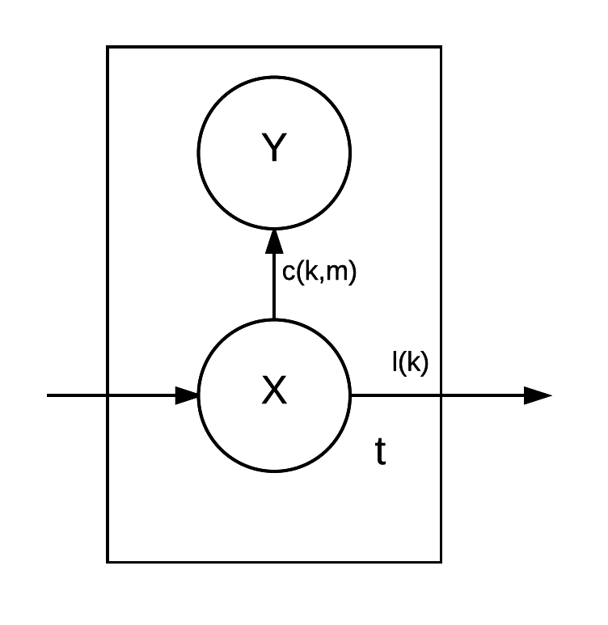

Examples
========================================================
id: hmm_example
- [Bayesian Knowledge Tracing Model](#/bkt)
- [Zone of Proximal Development](#/zpd)

The Effort Decision(1)
========================================================
id: ed
**Assumption 9**: Effort is a binary choice.

**Assumption 10**: Effort choice is independent, conditioning on the latent mastery and the item

$$
P(E_t=1|X_t=k,A(t)=j) = \gamma_j^k
$$

- The learner does not learn about the cost of effort

The Effort Decision(2)
========================================================
**Assumption 11**: No pain no gain.

$P(X_t=k+1|X_{t-1}=k, A(t)=j, E_t=0) = 0$

**Assumption 12**: No educated guess

$P(Y_t=0|E_t=0,A(t)=j) = 1$

[to Chapter 4](#/chp4)

The Stop Decision
========================================================
id: sd
- Stop: $H_t=1$

- The hazard rate
$$
h_t^k=P(H_t=1|H_{t-1}=0,X_t=k)
$$

- The hazard rate is duration dependent
- The hazard rate varies with the latent state
  + Not depend on response [Error due to ignorance and error due to carelessness differs]
  + A plausible story: boredom V.s. Frustration

The General Model
========================================================
id: hmm2

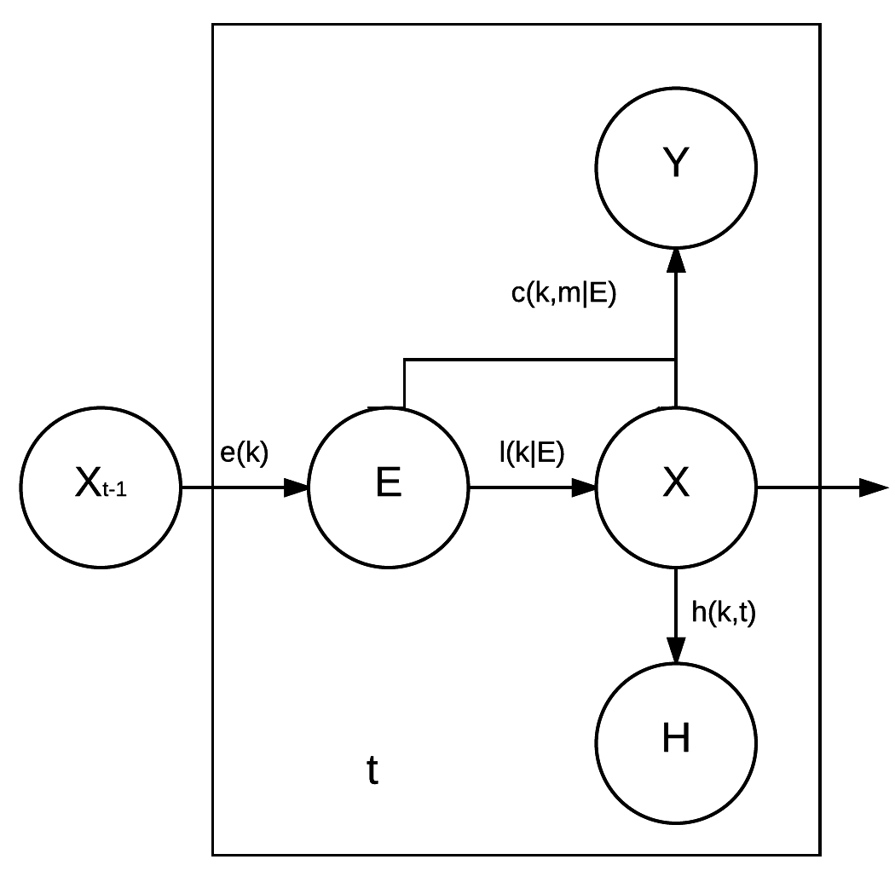

Chapter II: Identification and Estimation
========================================================
id: chp2
type: section

Notation
========================================================
+ $i$: the the learner id
+ $N$： the number of learners
+ $T_i$:the sequence length of learner $i$.
+ $\mathbf{X}_{1,T_i}^i$: The latent state sequence. $(X^i_1,\dots,X^i_{T_i})$
+ $\mathbf{Y}_{1,T_i}^i$: The answer sequence. $(Y^i_1,\dots,Y^i_{T_i})$
+ $\mathbf{A}_{1,T_i}^i$: The item sequence.   $(A^i(1),\dots,A^i(T_i))$
+ $\mathbf{E}_{1,T_i}^i$: The effort sequence. $(E^i_1,\dots,E^i_{T_i})$
+ $\mathbf{H}_{1,T_i}^i$: The stop sequence.   $(H^i_1,\dots,H^i_{T_i})$

Notation(2)
========================================================

- Let $\mathbf{y}_{1,T_i}^i$ denote a realized sequence $(Y_1=y_1,\dots,Y_{T_i}=y_{T_i})$
  + Same for $\mathbf{a}_{1,T_i}^i$,$\mathbf{e}_{1,T_i}^i$,$\mathbf{h}_{1,T_i}^i$

- For simplicity, omit the lower index when refering to the full sequence
  + e.g. $\mathbf{Y}^i = \mathbf{Y}_{1,T_i}^i$

- Let assignment function $A(t)$ to be exogeneously determined, thus independent of all other parameters

The Augmented Likelihood(1)
========================================================

- Consider observing the data $\mathbf{y}, \mathbf{a}, \mathbf{e}, \mathbf{h}$ of length $T$ for an individual
  + suppress $i$

- Augment the data by $\mathbf{X}$ and then marginalize over it.

$$
P(\mathbf{Y}=\mathbf{y},  \mathbf{E}=\mathbf{e}, \mathbf{H}=\mathbf{h}, \mathbf{a}) \propto \sum_{X_1}\dots\sum_{X_{T}}P(\mathbf{Y}=\mathbf{y},  \mathbf{E}=\mathbf{e}, \mathbf{H}=\mathbf{h}, \mathbf{X}|\mathbf{a})
$$

- For a particular state augmentation $\mathbf{x}$, factor the likelihood according to the model

$$
\begin{aligned}
P(\mathbf{Y}=\mathbf{y},  \mathbf{E}=\mathbf{e}, \mathbf{H}=\mathbf{h}, \mathbf{X}=\mathbf{x}|\mathbf{a})
&= P(\mathbf{Y}=\mathbf{y}|\mathbf{X}=\mathbf{x},\mathbf{a},\mathbf{E}=\mathbf{e})P(\mathbf{H}=\mathbf{h}|\mathbf{X}=\mathbf{x})P(\mathbf{E}=\mathbf{e},\mathbf{X}=\mathbf{x}|\mathbf{a})
\end{aligned}
$$

The Augmented Likelihood(2)
========================================================
$$
\begin{aligned}
P(\mathbf{Y}=\mathbf{y}|\mathbf{X}=\mathbf{x},\mathbf{E}=\mathbf{e},\mathbf{a}) &= \prod_{t=1}^{T} \prod_{k=1}^{M_x}\prod_{j=1}^J[ (c_j^{0,k})^{1(A(t)=j,y_t=0,x_t=k,e_t=1)}1^{1(A(t)=j,y_t=0,x_t=k,e_t=0}\\
&\prod_{m=1}^{M_y-1} (c_j^{m,k})^{1(A(t)=j,y_t=m,x_t=k,e_t=1)}0^{1(A(t)=j,y_t=m,x_t=k,e_t=0}]
\end{aligned}
$$

The Augmented Likelihood(3)
========================================================
$$
\begin{aligned}
P(\mathbf{H}=\mathbf{h}|\mathbf{X}=\mathbf{x}) &= \prod_{t=1}^{T}\prod_{k=1}^{M_x}h(t,k)^{1(h_t=1,x_t=k)}(1-h(t,k))^{1(h_t=0,x_t=k)}\\
&= \prod_{t=1}^{T}\prod_{k=1}^{M_x}[\lambda_ke^{\beta_kt}]^{1(h_t=1,x_t=k)}(1-\lambda_ke^{\beta_kt})^{1(h_t=0,x_t=k)}
\end{aligned}
$$

The Augmented Likelihood(4)
========================================================
$$
\begin{aligned}
&P(\mathbf{X}=\mathbf{x},\mathbf{E}=\mathbf{e}|\mathbf{a})\\
&= P(X_1=x_1)P(E_1=e_1|X_1=x_1)\prod_{t=2}^{T}P(E_t|X_{t-1}=x_{t-1})P(X_t=x_t|X_{t-1}=x_{t-1},E_t=e_t)\\
&= \prod_{k=1}^{M_x}(\pi^k)^{1(x_1=k)}\prod_{j=1}^J(\gamma_j^k)^{1(A(t)=j,x_1=k,E_1=1)}(1-\gamma_j^k)^{1(A(t)=j,X_1=k,E_1=0)}\\
& \prod_{t=2}^{T}\prod_{j=1}^J\{[(\gamma_j^k)^{1(A(t)=j,x_{t-1}=k,e_t=1)}(1-\gamma_j^k)^{1(A(t)=j,x_{t-1}=k,e_t=0)}]\\
&[1^{1(x_{t-1}=M_x,x_t=M_x)}\prod_{k=1}^{M_x-1}(\ell^k_j)^{1(A(t)=j,x_{t-1}=k,x_t=k+1,e_t=1)}(1-\ell^k_j)^{1(A(t)=j,x_{t-1}=k,x_t=k,e_t=1)}\\
&1^{1(A(t)=j,x_{t-1}=k,x_t=k,e_t=0)}\\
&0^{1-1(A(t)=j,x_{t-1}=k,x_t=k+1,e_t=1)-1(A(t)=j,x_{t-1}=k,x_t=k,e_t=1)-1(A(t)=j,x_{t-1}=k,x_t=k,e_t=0)}]\}
\end{aligned}
$$

Identification (1)
========================================================
- Are all parameters identified?

- MLE: Unique point mass in the measure of the parameter space
  + **What I mean identification here**

- MCMC: As long as the posterior parameter distribution is proper
  + Multimodality makes it difficult to traverse the whole parameter space
  + Multimodality makes MAP estimator meaningless

General Identification Assumption
========================================================

- Learner homogeneity:
  + **Identifcation Assumption 1**: Learner's initial mastery is generated i.i.d. from the multinomial distribution $\{\pi^k\}$

- Need to prevent label switching
  + E.g.: Flip mastery status from 1 to 0; Flip unmastery status from 0 to 1.
  + **Identifcation Assumption 2(a)**: $X_t,Y_t$ binary, $c_j^{0,1} < c_j^{1,1}$
  + **Identifcation Assumption 2(b)**: $X_t,Y_t$ tetiary, $c^{0,1}_j < (c^{1,1}_j+c^{1,2}_j)$, $c^{1,2}_j < c^{2,2}_j$

Identification (2)
========================================================

- Similar to method of moments:
  + The number of parameters is smaller than the number of moment conditions

- Sufficient statistics are the optimal moment conditions

Case Study : Identification of BKT model(1)
========================================================
id: bkt_identify
- $T=2$, not uniquely identified
  + Four equalities but they add up to 1. Thus only three moment conditions

$$
\begin{aligned}
P(Y_1=1,Y_2=1) &= (1-\pi)(1-\ell)c_0c_0+(1-\pi)\ell c_0c_1+\pi c_1c_1\\
P(Y_1=0,Y_2=1) &= (1-\pi)(1-\ell)(1-c_0)c_0+(1-\pi)\ell (1-c_0)c_1+\pi (1-c_1)c_1 \\
P(Y_1=1,Y_2=0) &= (1-\pi)(1-\ell)c_0(1-c_0)+(1-\pi)\ell c_0(1-c_1)+\pi c_1(1-c_1)\\
P(Y_1=0,Y_2=0) &= (1-\pi)(1-\ell)(1-c_0)(1-c_0)+(1-\pi)\ell (1-c_0)(1-c_1)+\pi (1-c_1)(1-c_1)\\
\end{aligned}
$$
Case Study : Identification of BKT model(2)
========================================================

- $T=3$, uniquely identified
  + Nine equalities with eight moments

$$
\begin{aligned}
P(Y_1=1,Y_2=1,Y_3=0) &=(1-\pi)(1-\ell)c_0^2(1-c_0)+(1-\pi)(1-\ell)\ell c_0^2(1-c_1) + (1-\pi)\ell c_0c_1(1-c_1)+\pi c_1^2(1-c_1) \\
P(Y_1=1,Y_2=0,Y_3=1) &=(1-\pi)(1-\ell)c_0^2(1-c_0)+(1-\pi)(1-\ell)\ell c_0(1-c_0)c_1 + (1-\pi)\ell c_0(1-c_1)c_1+\pi c_1^2(1-c_1) \\
P(Y_1=0,Y_2=1,Y_3=1) &=(1-\pi)(1-\ell)c_0^2(1-c_0)+(1-\pi)(1-\ell)\ell (1-c_0)c_0c_1 + (1-\pi)\ell (1-c_0)c_1^2+\pi c_1^2(1-c_1) \\
P(Y_1=0,Y_2=0,Y_3=1) &=(1-\pi)(1-\ell)c_0(1-c_0)^2+(1-\pi)(1-\ell)\ell (1-c_0)^2c_1 + (1-\pi)\ell (1-c_0)^2c_1+\pi c_1(1-c_1)^2 \\
P(Y_1=0,Y_2=1,Y_3=0) &=(1-\pi)(1-\ell)c_0(1-c_0)^2+(1-\pi)(1-\ell)\ell (1-c_0)c_0(1-c_1) + (1-\pi)\ell c0(1-c_0)(1-c_1)+\pi c_1(1-c_1)^2\\
\end{aligned}
$$
[proof](#\bkt_proof)

The Sufficient Statistics
========================================================

Let $G(\mathbf{Y},\mathbf{A}, \mathbf{E},\mathbf{H})$ maps the observed variable to a set $\Omega$ with size $Z$.

Let $G^{-1}(z)$ denote the $z^{th}$ element of mapping set.

$$
L = \prod_{i=1}^N P(\mathbf{Y}^i,\mathbf{A}^i,\mathbf{E}^i,\mathbf{H}^i) = \prod_{z=1}^ZP(G^{-1}(z))^{\sum_{i=1}^N1(G(\mathbf{Y}^i,\mathbf{A}^i,\mathbf{E}^i,\mathbf{H}^i)=z)}
$$

- Let $n_z=\sum_{i=1}^N1(G(\mathbf{Y}^i,\mathbf{A}^i,\mathbf{E}^i,\mathbf{H}^i)=z)$

The Sufficient Statistics (Cont)
========================================================
- Example:
  + Response only, binary $Y_t$, $t$=2, $j=1$
  + $\Omega=\{(1,1),(0,1),(1,0),(0,0)\}$
  + $G((1,0))=3$, $G^{-1}(3) = (1,0)$

Identification
========================================================
- By law of large numbers $\lim_{N\rightarrow \infty}\frac{\sum_i^N1(G(\mathbf{y},\mathbf{a},\mathbf{h},\mathbf{e})=z)}{N} \rightarrow p_z$
- Sufficient statistics $\{p_1,\dots,p_Z\}$. It implies Z-1 moment conditions.
- Let the size of the parameter set $\Theta$ to be W.

- Necessary condition: $Z\geq W$
- Sufficient condition: Only possible to prove local unique identification result

Estimation
========================================================
id: mcmc
- Why not EM:
  + Lack of Unique Identification
  + Hard to incorporate the hazard model
  + [Future] Hard to incorporate user heterogeneity

- General Stategy of MCMC
  + Given parameters, augment the latent states
  + Given latent states, update the parameters with Gibbs Sampling

- [Future] Hamiltonian Markov Chain Monte Carlo for better mixture in high dimensional parameter space

Data Augmentation(1): Brute Force
========================================================
- Calculate the initial density and conditional probability explicitly
  + $P(X_t=n,\mathbf{Y},\mathbf{E},\mathbf{H},\mathbf{A})=\sum_{(X_t=n\in\mathbf{X})}P(\mathbf{X},\mathbf{Y},\mathbf{E},\mathbf{H},\mathbf{A})$
  + $P(X_{t-1}=m,X_t=n,\mathbf{Y},\mathbf{E},\mathbf{H},\mathbf{A})=\sum_{((X_{t-1}=m,X_t=n)\in\mathbf{X})}P(\mathbf{X},\mathbf{Y},\mathbf{E},\mathbf{H},\mathbf{A})$
  + $P(X_t=n|\mathbf{Y},\mathbf{E},\mathbf{H},\mathbf{A})=  \frac{P(X_t=n|\mathbf{Y},\mathbf{E},\mathbf{H},\mathbf{A})}{\sum_{k=1}^{M_x}P(X_t=k|\mathbf{Y},\mathbf{E},\mathbf{H},\mathbf{A})}$
  + $P(X_{t-1}=m|X_t=n,\mathbf{Y},\mathbf{E},\mathbf{H},\mathbf{A})=\frac{P(X_{t-1}=m,X_t=n,\mathbf{Y},\mathbf{E},\mathbf{H},\mathbf{A})}{P(X_t=n,\mathbf{Y},\mathbf{E},\mathbf{H},\mathbf{A})}$

- Sampling Scheme
  + Draw the last state by $P(X_{T}|\mathbf{Y},\mathbf{E},\mathbf{H},\mathbf{A})$
  + Draw backward by $P(X_{t-1}|X_t=k)$ conditional on the last draw $X_t=k$

Data Augmentation(2): FRBS
========================================================

- Forward recursion, backward sampling[Scott, 2002]
  + $\tilde{\pi}^k_t=P(X_t=k|\mathbf{Y}_{1,t},\mathbf{E}_{1,t},\mathbf{A}_{1,t} ,H_t, \Theta)$
  + $P_{t}(m,n) = P(X_t=m,X_{t+1}=n|\mathbf{Y}_{1,t+1},\mathbf{E}_{1,t+1},\mathbf{A}_{1,t+1},H_{t+1},\Theta)$

- Recursion

  1. Initialize the marginal state density by

  $$
  \tilde{\pi}^k_1 = \frac{P(X_1=k)P(E_1|X_1=k)P(H_1|X_1=k)P(Y_1|X_1=k,E_1)}{\sum_{n=1}^K P(X_1=n)P(E_1|X_1=n)P(H_1|X_1=n)P(Y_1|X_1=n,E_1)}
  $$

  2. Calculate $P_t(n,k)=\tilde{\pi}_{t-1}^n P(X_t=k|X_{t-1}=n,E_{t-1})P(Y_t|X_t,E_t)P(E_t|X_t)\prod_{k=1}^T(1-h_k^{X_k})$

  3. Calculate $\tilde{\pi}_t^k=\sum_{n}P_t(n,k)$

Data Augmentation: FRBS sampling
========================================================
- Why backward sampling legit

  + By the assumption of first-order Markov chain $X_t\perp\!\!\!\perp \mathbf{Y}_{t+2,T},\mathbf{E}_{t+2,T},\mathbf{H}_{t+2,T}|X_{t+1}$
  + $P(X_t|X_{t+1}=j,\mathbf{Y},\mathbf{E},H_T,\Theta) = P(X_t|X_{t+1},\mathbf{Y}_{1,t+1},\mathbf{E}_{1,t+1},\mathbf{H}_{1,t+1},\Theta)$, which is $\frac{P(i,j)}{\sum_i P(i,j)}$

- Scheme
 + Sample by $\tilde{\pi}^k_T$
 + Backward sample by $\frac{P(k,j)}{\sum_i P(i,j)}$ given $X_{t+1}=j$

Gibbs Sampling: Conjugate Posterior
========================================================

- Except for the hazard model, all parameters are either binomial or multinomial
  + The conjugate prior is either Beta(1,1) or Dirchelet(1,$\dots$,1)
  + The posterior is Beta(1+$n_0$,1+$n_1$)  or Dirchelet(1+$n_1$, $\dots$, 1+$n_N$)

- Prior effectively assigns zero probability mass to parameter being 0 or 1, which satisfied **identification assumption 3**

- To satisfy  **identification assumption 2**, draw new set of parameters until the inequality is met

Gibbs Sampling: Non-conjugate Posterior
========================================================
- The parameters of the hazard model can still be drew by full conditional distribution
- No conjugate prior -> draw new parameter is expensive
- Adaptive Rejection Sampler uses the log concavity to speed up
  + Key is to reduce the number of the expensive evaluations of the target likelihood function
  + Use upper hull and lower hull to sandwich the target likelihood function by splines
  + draw from the area between the upper hull and lower hull
- The conditional distribution of $\lambda$ and $\beta$ are log concave
  + $\lambda e^{\beta T}<1$ contrains the initial sampling point

Chapter III: Selection Bias of the Exit Decision
========================================================
id: chp3
type: section

- [Motivation](#/chp3mot)

- [Characterize the Bias](#/chp3theory)

- [Case Study](#/chp3case)

Motivation
=======================================================
id: chp3mot

- Dynamic Selection Bias
  + If the learner is allowed to drop out
  + Low mastery students drop out first
  + Higher success rate reflect both learning and survival bias

Characterize the Bias
=======================================================
id: chp3theory

$$
E(\hat{\ell^k}) = \ell\times \frac{\sum_{t=1}^TP(H_t=0|X_t=k+1,X_{t-1}=k|\mathbf{Y},\mathbf{E})P(X_{t-1}=k|\mathbf{Y},\mathbf{E})}{\sum_{t=1}^TP(H_t=0|X_{t-1}=k,\mathbf{Y},\mathbf{E})P(X_{t-1}=k|\mathbf{Y},\mathbf{E})}
$$
- Unbiased if and only if $P(H_t|X_t=k+1,X_{t-1}=k)=P(H_t|X_{t-1}=k)$, which means the stop decision is independent of latent state

- If $h_t^1 < h_t^0$, Then $P(H_t=0|X_t=1,X_{t-1}=0) > P(H_t=0|X_{t-1}=0)$, and the pedagogical efficacy is **biased upwards**

- Notice that if the hazard rate only depends on response but not state, the pedagogical efficacy is unbiased

Case Study
=======================================================
id: chp3case

- [The Learning Environment] (#/chp3env)

- [The Learning Task] (#/chp3task)

- [Result] (#/chp3res)

The Learning Environment(1)
=======================================================
id: chp3env

The Learning Environment(2)
=======================================================
- Mechanically built in selection bias
  + Correct, damage the enenmy
  + Incorrect, damaged by the enemy
  + Maximum take 3 hits
  + Longest streak is 10. Data collected at the first 5.
- Basic algorithmatic training
  + identical unidimensional latent skill
  + Quasi-homogeneous items

The Learning Task
=======================================================
id: chp3task

- Sequential Order: Grade 1
  + 1,4,2. What is the 2nd largest number?

- Vertical Division: Grade 2

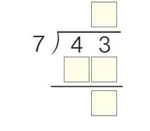

Observed Learning Curve
=======================================================
id: chp3res

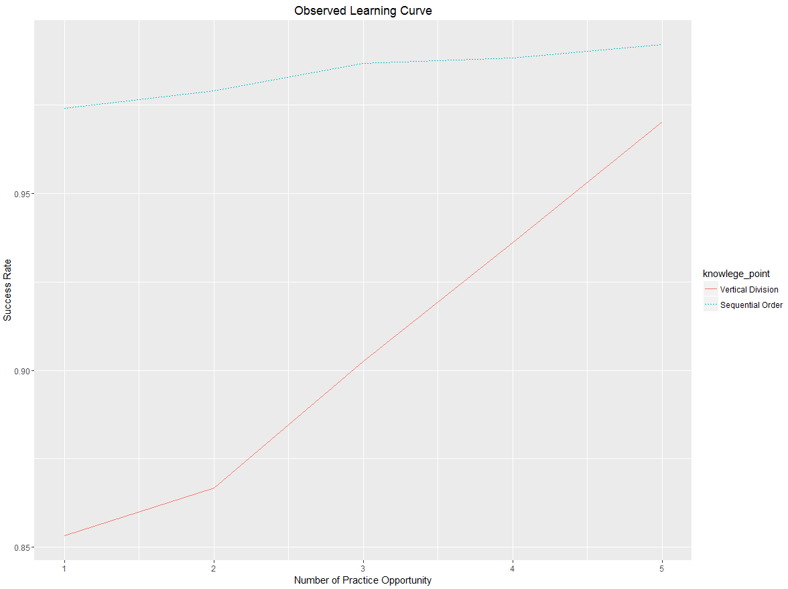

Differential Attrition
=======================================================
id: chp3res

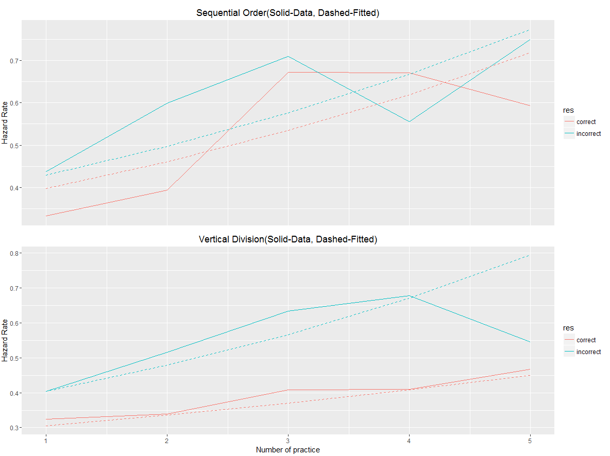

Estimated Pedagogical Efficacy
=======================================================
- Baseline(BKT):

  + $E_t=1$
  + $X_t$,$Y_t$ binary
  + $j=1$
  + $H_t=0$

- General model:
  + Allow $H_t$

***

|Knowledge Point | BKT | BKT+Hazard|
|----------------|-----|-------|
|Sequential Order| 0.213|0.097 |
|Vertical Division|0.077 |0.004 |

Estimated Pedagogical Efficacy
=======================================================

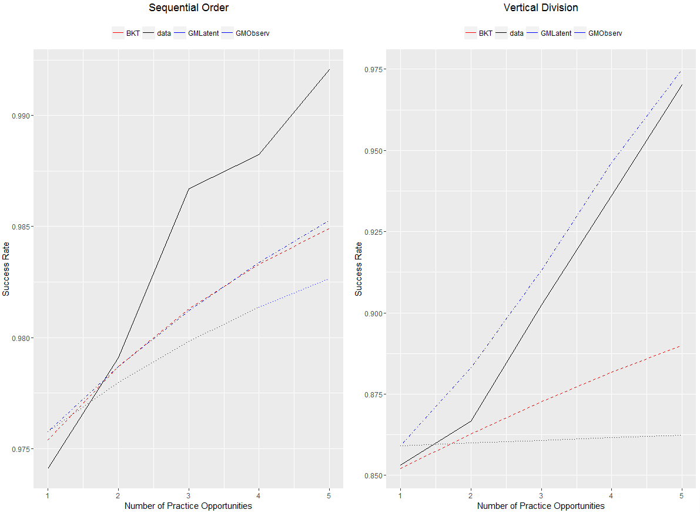

Chapter IV: Effort Induced Measurement Error
========================================================
id: chp4
type: section

- [Motivation](#/chp4mot)

- [Characterize the Bias](#/chp4theory)

- [Case Study](#/chp4case)

Motivation
=======================================================
id: chp4mot

- Consider an RCT that compares pedagogical efficacies of two items
    + Random assignment of the items
    + Balanced random attrition
    + standard DID design

$$
Y_{i,T} = \beta_d D_i + \beta_t T + \gamma D_i T + \epsilon_{i,T}
$$

- If items induce differential efforts and the effort influences the performance
    + The observed performance has non-zero mean measurement error
    + The DID estimator may not even have the right sign

Task Engagement (or Lack Thereof)
=======================================================
- The lack of effort is a salient feature in the low stake learning environment
    + Baker et al(2004) and Wixon et al(2012) report the lack of student engagement in digital learning
    + Pardos et al(2013) documents the lack of student engagement in classroom learning

- Effort is largely absent from other literature because it is hard to monitor

Characterize the Bias(1)
=======================================================
id: chp4theory

- To show the intuition, assume a very simple structure
    + $M_x=M_y=2$, $j=1$
    + $c^{11}=1$, $c^{01}=0$. No slip and no guess
    + $e^1=1$. Mastered student always exerts effort
    + $0< e^0 <1$. Unmastered student slacks some of the time

- It can be proved that the estimated pedagogical efficacy is biased downwards

$$
E(\hat{\ell}- \ell)  =  \ell(e^0-1) <0
$$

Characterize the Bias(2)
=======================================================
- In the motivating RCT example, the ATE is

$$
E(\hat{\gamma}) = \ell_1e^0_1-\ell_0e^0_0
$$
- For the sign to be correct: $(\ell_1-\ell_0)(\frac{l_1}{l_0}-\frac{e_0}{e_1})>0$

    + It implies more pedagogical effective item also induces more effort
    + Not true in general

Case Study
=======================================================
id: chp4case

- [The Learning Environment] (#/chp4env)

- [The Experiment Design] (#/chp4design)

- [The Identification of Effort] (#/effortident)

- [Result] (#/chp4res)

"Gamified" Learning
=======================================================
id: chp4env

Practice Interface
=======================================================

Low Stake Incentive
=======================================================

The Experiment Design (1)
=======================================================
id: chp4design

- The learning task / pre-test
- Calculate the circumference and area of the large rectangle
- Student fills in the blanks

***

The Experiment Design (2)
=======================================================

- Post-test

The Experiment Design (3)
=======================================================

- Same Training Question

***

- Different Delivery Methods
    + No Scaffolding
    + Vocabulary Scaffolding
        * What is the new length and width
        * What is the circumference
        * What is the area
    + Video Scaffolding [not compulsory] that reveals the post-test question
    [(link)](http://my.polyv.net/front/video/preview?vid=36488cc9164c53d6616869d83fbfd1b3_3)

The Experiment Design (4)
=======================================================
- Group Status
    + Group 1: pre-test + no-scaffolding + post-test
    + Group 2: no-scaffolding + post-test
    + Group 3: pre-test + vocabulary-scaffolding + post-test
    + Group 4: vocabulary-scaffolding + post-test
    + Group 5: pre-test + video-scaffolding + post-test

- Group Assignment
    + Assign learners to the group based on the remainder of their user id divided by 5

Summary Statistics(1)
=======================================================
- Total learners recruited: 13939
- Average retention rate is 84%. Pre-test hurts retention.

***

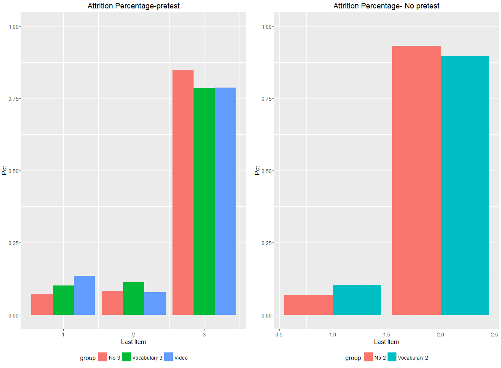

Summary Statistics(2)
=======================================================
- The no scaffolding and video scaffolding group has almost no difference
- The vocabulary scaffolding has worse efficacy than the no scaffolding

***

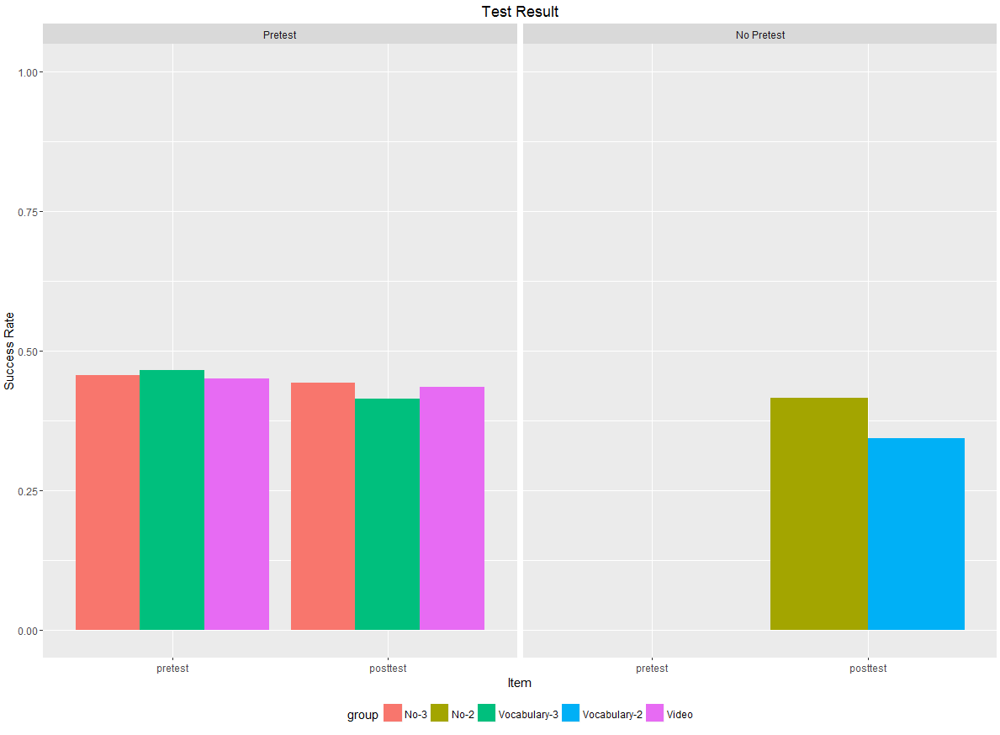

The Identification of Effort: Identification
=======================================================
id: effortident

- [effort classification](#/ans_class)
  + Slack/Give up: blank answer, non-blank wrong answer
  + Valid Effort: Slip, partial right and all right

Validity(1)
=======================================================
- The learner spent significantly less time to submit a blank answer in repeated exercises
  + Compare no scaffolding with and without pre-test
- [Not Shown] Submitting a blank answer is highly serial correlated

***

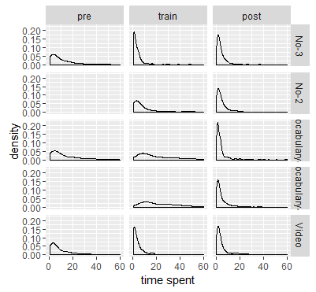

Validity(2)
=======================================================
- Non-blank answer is also likely to be slacking:
  + In repeated exercises, skewed toward left, similar to the blank answer
  + Has lower mean compare to the other two

- Valid Error and Correct has no position shift and similar distribution

***

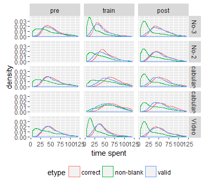

Pattern(1)
=======================================================
- Increase by sequence
- Higher for the vocabulary scaffolding

***

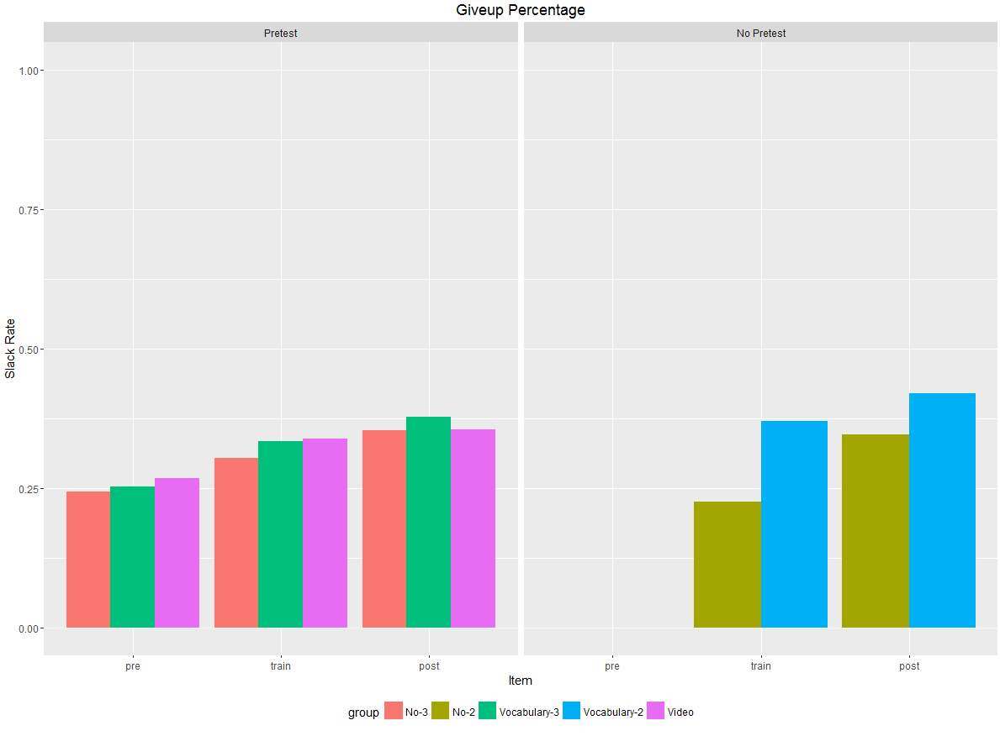

Pattern(2)
=======================================================
- Highly serial correlated
- [Left panel] All-giveup has higher probability mass than a binomal model would predict.

***

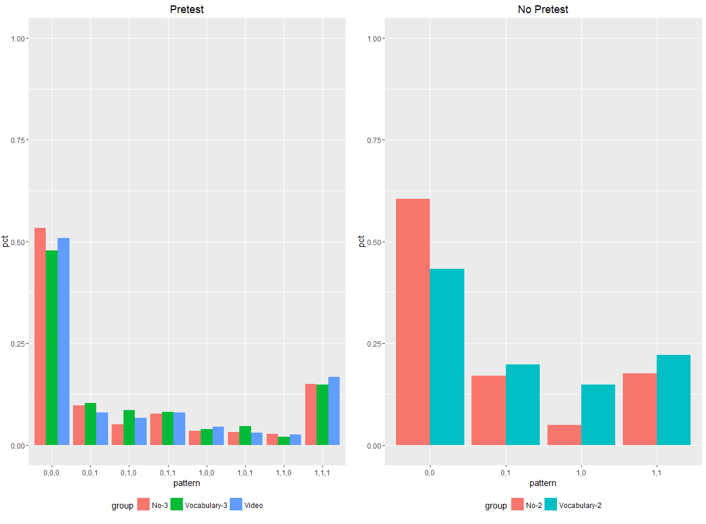

The Result
=======================================================
id: chp4res

- The model is estimated with MCMC algorithm
  + The learning parameter has a beta prior B(1,1)
  + Chain length 1000. First 30% is burn-in sample.
  + Sample every 10 iterations
- Only groups with both pre-test and post-test are included in the sample
- Two-state model, binary grade; Three-state model, partial grade

The Result (Two-state model)
=======================================================
- Position shifts (correct for downward bias)
- Weakly separate out video scaffolding

***

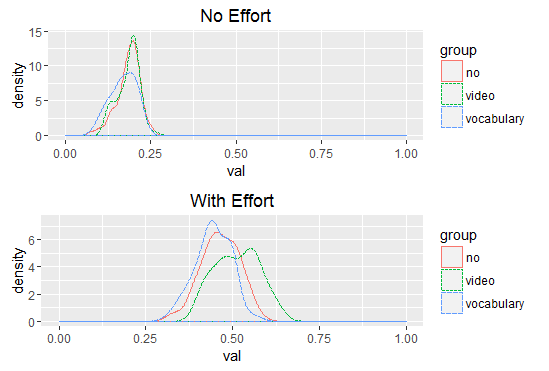

The Result (Three-state model: 0->1)
=======================================================
- The pedagogical efficacy with effort is not well estimated
  + Because low effort rate and low initial density, too few observations

***

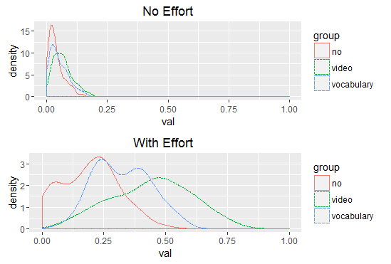

The Result (Three-state model: 1->2)
=======================================================

- More robust to effort decision
- Clear separation of item characteristic

***

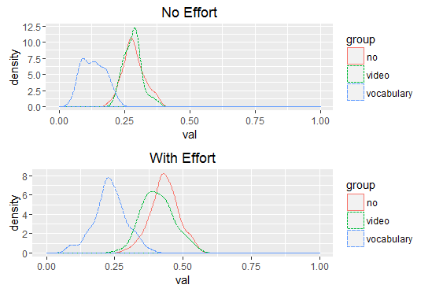

Q&A
=======================================================
type: section

Not IRT model
=======================================================
id: irt

- Learning from doing is bad for assessment
  + Local indepdence: Conditional on user score, items are independent of each other
  + user score is assumed to be invariant

- Cannot model pedagogical efficacy

[return](#/intro_mot)

Proof of Unique Identification
=======================================================
id:bkt_proof
- $c_1=\frac{p_{101}-p_{011}}{p_{10}-p_{01}}$
- $\frac{p_{110}-p_{101}}{p_{001}-p_{010}} =\frac{c_0}{1-c_0} \rightarrow c_0=\frac{p_{110}-p_{101}}{p_{110}-p_{101}+p_{001}-p_{010}}$
- $\pi$ and $\ell$ can be expressed as a function of $c_0$ and $c_1$
  + $p_{1}=\pi c_1+(1-\pi)c_0$
  + $p_{01}-p_{10} = (1-\pi)\ell(c_1-c_0)$

[return](#\bkt_identify)

Special Case 1: Bayesian Knowledge Tracing Model
=======================================================
id: bkt

- Developed by Corbert and Anderson(1996)
- The equivalent of Rasch model in the literature of the learning analytics
- $M_x=2$, $M_y=2$, $j=1$
- The guess rate is $c^{0,1}$, The slip rate is $c^{1,0}$.

[return](#/hmm_example)

Special Case 2: Zone of Proximal Development
=======================================================
id: zpd

- Developed by Vygosky(1976)
    + Development lags task requirement and fail the task no matter what
    + Development lags task requirement but may succeed in the task with guidance or collaboration [**The zone**]
    + Development leads task requirement and succeed on their own

Special Case 2: Zone of Proximal Development (Cont)
=======================================================
- $M_x=3$, $M_y=3$, $j=1$
    + $X=0$ is the unprepared. $X=1$ is the zone. $X=2$ is the mastered
    + $Y=0$ is failure. $Y=1$ is partial success. $Y=2$ is complete success

- Allow for **learning reinforcement** where positive performance leads to better performance

[return](#/hmm_example)

Answer Classification (1)
=======================================================
id: ans_class
The answers are initially classified into six categories:

(1) Blank answer: The learner submits nothing on the circumference and the area

(2) Non-blank wrong answer: Neither circumference nor area is correctly calculated and not includes in the slip or the wrong shape category

(3) Slip: The answer is correctly calculated but the learner inputs in a wrong way

Answer Classification (2)
=======================================================

(4) Wrong Shape: The learner calculates correctly either the circumference or the area of the small rectangle

(5) right circumference: The learner correctly calculates the circumference of the large rectangle

(6) right area: The learner correctly calculates the area of the large rectangle

(7) Correct Answer: Both circumference and area of the large rectangle are correctly calculated

Answer Classification (3)
=======================================================

|    Group     | Task  | Blank Ans(%) | Non Blank Wrong Ans (%) | Slip(%) |
|:------------:|:-----:|:------------:|:-----------------------:|:-------:|
|     No-3     |  pre  |     10.8     |           14            |  1.09   |
| Vocabulary-3 |  pre  |     10.4     |           15            |  0.82   |
|    Video     |  pre  |     11.4     |           15            |  0.73   |
|     No-3     | train |     14.6     |           16            |  0.32   |
|     No-2     | train |     9.8      |           13            |  0.48   |
| Vocabulary-3 | train |     18.2     |           15            |  0.27   |
| Vocabulary-2 | train |     13.1     |           24            |  0.32   |
|    Video     | train |     16.3     |           18            |  0.37   |
|     No-3     | post  |     18.4     |           17            |  0.81   |
|     No-2     | post  |     16.7     |           18            |  0.52   |
| Vocabulary-3 | post  |     21.4     |           16            |  0.73   |
| Vocabulary-2 | post  |     24.2     |           18            |  0.61   |
|    Video     | post  |     18.2     |           17            |  0.69   |

Answer Classification (4)
=======================================================

|    Group     | Task  | Wrong Shape(%) | Right Circ(%) | Right Area(%) | Correct(%) |
|:------------:|:-----:|:--------------:|:-------------:|:-------------:|:----------:|
|     No-3     |  pre  |      8.8       |      8.8      |     11.2      |     46     |
| Vocabulary-3 |  pre  |      7.4       |      8.0      |     11.9      |     47     |
|    Video     |  pre  |      7.7       |      8.9      |     11.0      |     45     |
|     No-3     | train |      5.1       |      5.3      |     12.2      |     47     |
|     No-2     | train |      10.2      |      8.3      |     14.8      |     44     |
| Vocabulary-3 | train |      10.6      |      9.7      |     17.7      |     28     |
| Vocabulary-2 | train |      20.7      |      6.3      |     18.4      |     17     |
|    Video     | train |      3.5       |      4.9      |     12.5      |     45     |
|     No-3     | post  |      1.9       |     10.0      |      7.6      |     44     |
|     No-2     | post  |      3.5       |     11.8      |      8.0      |     42     |
| Vocabulary-3 | post  |      2.5       |     10.5      |      7.0      |     41     |
| Vocabulary-2 | post  |      5.3       |     11.7      |      6.1      |     34     |
|    Video     | post  |      1.6       |     10.1      |      8.6      |     43     |

[Back](#\effortident)
