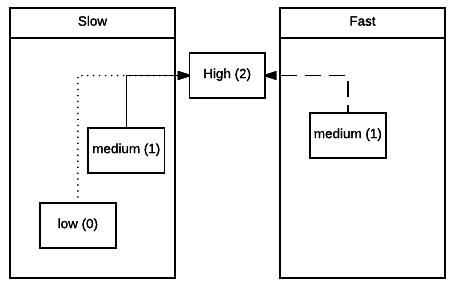
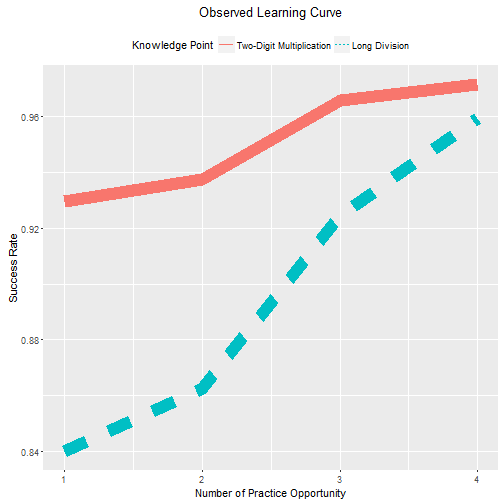
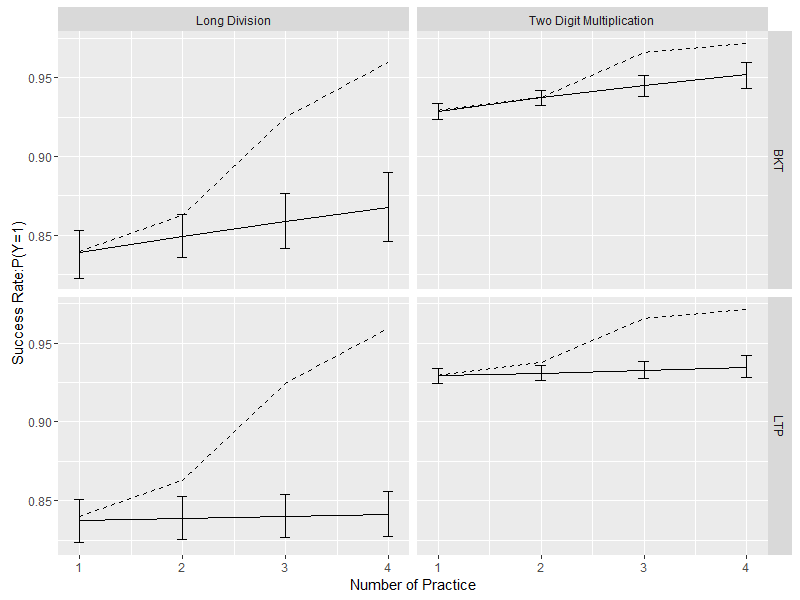
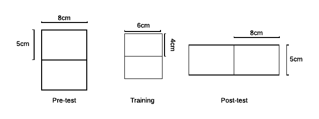

Learning Through Practices
========================================================
author: Junhen Feng
autosize: true

Main Result
========================================================
type: section

- A model of Learning Through Practice (LTP)
    - define the efficacy of practice in relation to a dynamic learning process
    - incorporate learner engagement, including stop decision and effort decision
    - Identification and Estimation of the LTP model

- Empirical Application
    - Stop Decision:  A majority of the observed learning gain is dynamic selection bias due to sample attrition
    - Effort Decision:  Correct Rank Order Inference in a RCT that DID gets it wrong

Motivation
========================================================

- Human teacher collaborates with an ITS is the future of education

- Dual roles of Practice
    - assessment 
    - instruction
    
- When the question bank is given
    - selection
    - sequencing
    

Computerized Adaptive Testing (CAT) is not Sufficient
========================================================

- CAT aims to measure the latent ability with certain precision by as few questions as possible

- A good exam question can be a bad practice question
    
- Item Response Theory (IRT) implicitly assumes no learning
    - Understand growth/gain is the key

Understanding Learner Heterogeneity is Essential
========================================================
id:hetero

- Efficacy of practice = Learning Gain [(formal def)](#/def)

- Heterogeneity of Efficacy:
    - Different level of current mastery
    - Different gain conditional on mastery level
    

The Data Structure
========================================================
- $j$: The item id
- $t$: The sequence id. [*Not clock time*]

- Latent
    + $X_t$: The state of knowledge mastery
    + $Z$: Learner type (Not time varying)

***

- Observed
    + Practice Result
        - $Y_t$: The observed response
        - $A_t$: The item sequence order
    + Learner Engagement
        - $E_t$: The observed effort
        - $H_t$: The stop decision

Bayesian Knowledge Tracing Model
========================================================

- One type ($Z$)
- Two state ($X_t$)
- One item type
- Observed response ($Y_t$) is a noisy signal of the latent mastery
- Non-regressive state transition (Never forgets)

- In terms of Hidden Markov Process

$$
\begin{aligned}
\begin{bmatrix}
P(Y_T=0)\\
P(Y_T=1)
\end{bmatrix}
&=
\begin{bmatrix}
P(Y_T=0|X_T=0) & P(Y_T=0|X_T=1)\\
P(Y_T=1|X_T=0) & P(Y_T=1|X_T=1)
\end{bmatrix}
\begin{bmatrix}
P(X_T=0)\\
P(X_T=1)
\end{bmatrix}\\
\begin{bmatrix}
P(X_T=0)\\
P(X_T=1)
\end{bmatrix}
&=
\prod_{t=2}^T
\begin{bmatrix}
P(X_t=0|X_{t-1}=0) & 0\\
P(X_t=1|X_{t-1}=0) & P(X_t=1|X_{t-1}=1)
\end{bmatrix}
\begin{bmatrix}
P(X_1=0)\\
P(X_1=1)
\end{bmatrix}\\
\end{aligned}
$$

Bayesian Knowledge Tracing Model
========================================================

- Notation:
    + $\pi \equiv P(X_1=1)$
    + $\ell \equiv P(X_t=1|X_{t-1}=0)$
    + $c^{r,k} \equiv P(Y_t=r|X_t=k)$

- The HMM process

$$
\begin{aligned}
\begin{bmatrix}
P(Y_T=0)\\
P(Y_T=1)
\end{bmatrix}
&=
\begin{bmatrix}
c^{0,0} & c^{0,1}\\
c^{0,1} & c^{1,1}
\end{bmatrix}
\prod_{t=2}^T
\begin{bmatrix}
1-\ell & 0\\
\ell & 1
\end{bmatrix}
\begin{bmatrix}
1-\pi\\
\pi
\end{bmatrix}
\end{aligned}
$$

Generalized Learning Through Practice
========================================================
id: ltp_efficacy
- Extend the number of item types (j)
- Extend the number of states

$$
\begin{aligned}
\begin{bmatrix}
\ell_j^{0,0} & 0 & 0\\
\ell_j^{0,1} & \ell_j^{1,1} & 0\\
\ell_j^{0,2} & \ell_j^{1,2} & 1
\end{bmatrix}
\end{aligned}
$$

- Extend the number of learner type

$$
\begin{aligned}
\sum_{z=1}^Z
\begin{bmatrix}
\ell_j^{z;0,0} & 0 & 0\\
\ell_j^{z;0,1} & \ell_j^{z;1,1} & 0\\
\ell_j^{z;0,2} & \ell_j^{z;1,2} & 1
\end{bmatrix}
\end{aligned}
$$

***

- Working definition of efficacy [(Assumption)](#efficacy_assumption)

$\ell^{z;m,n}_j$

Learner Engagement 
========================================================
id: ltp_le

- Effort Decision [(Assumption)](#/ed)
    + $e \equiv P(E_t=1|X_t=0)$
- No pain no gain: 
    + $P(X_t=1|X_{t-1}=0,E_t=0)=0$

$$
(
\begin{bmatrix}
1-\ell & 0\\
\ell e & 1
\end{bmatrix}
+
\begin{bmatrix}
\ell(1-e)  & 0\\
0 & 0
\end{bmatrix}
)
\begin{bmatrix}
1-\pi\\
\pi
\end{bmatrix}
$$

Learner Engagement 
========================================================

- Stop Decision [(Assumption)](#/sd)
    + $h^k \equiv P(H_t=1|H_t=0,X_t=k)$

- Selective sample attrition
    + $h^1 \neq h^0 \rightarrow P(X_t|H_t) \neq P(X_t)$
    
    

$$
\begin{bmatrix}
1-\ell & 0\\
\ell  & 1
\end{bmatrix}
\begin{bmatrix}
P(X_{t-1}=0|H_{t-1}=0)\\
P(X_{t-1}=1|H_{t-1}=0)
\end{bmatrix}
$$

Navigation
========================================================

- [Chapter 2](#/chp2): The Learning Through Practice Model
- [Chapter 3](#/chp3): Identification
- [Chapter 4](#/chp4): Estimation
- [Chapter 5](#/chp5): Dynamic Selection Bias
- [Chapter 6](#/chp6)：Effectiveness V.S.Efficacy

Chapter 2: A Model of Learning Through Practice
========================================================
id: chp2
type: section

- [The Learning Process](#/lp)

- [The Effort Decision] (#/ed)

- [The Stop Decision](#/sd)

Event Sequence
========================================================
id: lp

1. A learner is presented with a practice item

2. The learner produces a response based on her state of latent mastery

3. The learner receives feedback on the observed response.

4. The learner learns (elevates her latent mastery) probabilistically.

Assumptions on Latent Mastery
========================================================

**Assumption 1**:  Latent mastery ($X_t$) is a unidimenstional ordered discrete variable with $M_x$ number of states.

+ Avoid factorial state representation (mapping of knowledge points to items)

+ As flexible as a continuous latent mastery if the number of states is allowed to vary

Assumptions on Efficacy (1)
========================================================
id:efficacy_assumption
- A general definition of efficacy:

The probability of practice item $j$ moving the state of mastery of a learner of type $z$ from $m$ to $n$ ($m\leq n$) at sequence position $t$, after exposing to feedback ($Y_t$) on the current item $j$ and feedback ($\mathbf{Y}_{1,t-1}$) on the preceding items ($\mathbf{A}_{1,t-1}$)

**Assumption 2**: Pedagogical efficacy does not dependent on responses conditional on the previous latent mastery.

**Assumption 3**: There is no complementarity or substitution effect in the item composition.

**Assumption 4**: The pedagogical efficacy is independent of the sequence position.

- The working definition of efficacy:

The probability of practice item $j$ moving the state of mastery of a learner of type $z$ from $m$ to $n$

$\ell^{z;m,n}_{j} \equiv P(X_t=n|X_{t-1}=m;Z=z;A_t=j)$

Assumptions on Efficacy (2)
========================================================

**Assumption 5**: The latent mastery never regresses.

$$
\ell^{z;m,n}_{j} = 0 \quad \forall t,z,j \quad\text{where} \quad m < n
$$
[return](#\ltp_efficacy)

Assumptions on Observed Response
========================================================
id:lp2

**Assumption 6**: The distribution of observed response ($Y_t$) conditional the latent mastery is the same for all learner types.

$P(Y_{t}=r|X_t=k,A_t=j)  \equiv c^{r,k}_j$

[Example 1: Bayesian Knowledge Tracing Model](#/bkt)

Learning Through Practice With Learner Engagement
========================================================

- The duration and the intensity of learner engagement are imperfect in a low stake learning environment
    + Duration: the stop decision
    + Intensity: the effort decision

- New Event Sequence

1. A learner is presented with a practice question.

2. The learner exerts a level of effort based on her state of latent mastery

3. The learner produces a response based on the effort level and her state of latent mastery.

4. The learner receives feedback on the observed response.

5. If the learner has exerted effort, she learns probabilistically. Otherwise, she does not learn.

6. The learner can choose or be forced to exit. If the learner continues, repeat from (1); else data collection stops.

The Effort Decision (1)
========================================================
id: ed
**Assumption 6**: Effort is a binary choice with value 0 and 1.

**Assumption 7**: Conditioning on the latent mastery and the item, the effort choice is independent

$$
P(E_t=1|Z=z,X_t=k,A_t=j) = \gamma_j^{z;k}
$$

- Grit is a characteristic of the state of mastery, not the learner

The Effort Decision (2)
========================================================
**Assumption 8** (No pain no gain): If a learner does not exert effort, she does not learn

$P(X_t=n|X_{t-1}=m, Z=z, A_t=j, E_t=0) = 0 \quad \forall z,t,j, \text{and }m > n$

**Assumption 9** (No Educated Guess): If a learner does not exert effort, she makes a wrong response for sure

$P(Y_t=0|E_t=0,A_t=j) = 1  \quad \forall j,t$

[return](#/ltp_le)

[to Chapter 5](#/chp5)

The Stop Decision
========================================================
id: sd

- Depdence Structure
    + Stop-by-rule: Learners are forced to exit based on responses
        - X-strike rule: Three mistakes and out (Old Duolingo)

    + Stop-by-choice: Learners are forced to exit based on latent mastery
        - Boredom V.S. Frustration

- Functional Form ($h_t^k \equiv P(H_t=1|H_{t-1}=0,S_t=k)$):
    + Proportional Hazard: $h_t^k= \lambda_k e^{\beta_k t}$
    + Non-parametric: $h_{t}^k$

**Assumption 10**: Stop decision is independent of item characteristics

[return](#/ltp_le)

[to Chapter 6](#/chp6)

Express Learning Theories with the LTP model
========================================================
id: ltp_example
- [Zone of Proximal Development](#/zpd)

- [Reinforcement Learning](#/rl)

Chapter 3: Model Identification
========================================================
id: chp3
type: section

Identification of the BKT Model (1)
========================================================

- The BKT is considered as the BKT model by the learning analytics literature

    + The following model specification has the same learning curve

|     model     |  pi  |  l  |  g   |  s   |
|:-------------:|:----:|:---:|:----:|:----:|
|   Knowledge   | 0.56 | 0.1 | 0.00 | 0.05 |
|     Guess     | 0.36 | 0.1 | 0.30 | 0.05 |
| Reading Tutor | 0.01 | 0.1 | 0.53 | 0.05 |

***

Identification of the BKT Model (2)
========================================================

- These models have different distribution of joint responses
    + They are sufficient statistics
    + It implies different likelihood and model identification

***

Identification of the BKT Model (3)
========================================================
id: bkt_id
- In Bayesian analysis, identification (in the frequestist sense) implies:
    + The posterior distribution of parameters with a non-informative prior is single modality
    + The mean of such posterior distributions converges to the "true" parameter in large sample

[formal proof](#/bkt_proof)

***

Necessary Identification Conditions
=======================================================
id: ltp_id

- The data generating system described by the LTP model has sufficient statistics

- The sufficient statistics are moment conditions for identification

- Identification Conditions:
    + More moment conditions than parameters
    + Jacobian matrix at the local optimal solution has full column matrix

[formal proof](#/ltp_proof)

Label Switching and Rank Order Condition
=======================================================

- Label Switching
    + In latent state model, the label of states is arbitrary.
    + Arbitrary labels in MCMC algorithm results in poor mixture

- Rank Order Condition:
    + States: A learner with higher state of mastery has higher probability of correct response

    $$P(Y_t=1|X_t=m) < P(Y_t=1|X_t=n) \forall m < n$$

    + Type: A learner with higher type has higher probability of  initial mastery

    $$P(X_1=1|Z=w) < P(X_1=1|Z=v) \forall w < v$$

Chapter 4: Model Estimation
========================================================
id: chp4
type: section

An Overview of Monte Carlo Markov Chain Algorithm
========================================================

- General Strategy:
    + First augment the observed data with latent states given parameters
    + Update parameters with Gibbs sampler given the augmented data

Priors
========================================================

- Parameters that follow a multinomial distribution is the non-informative Dirichelet distribution $Dir(1,\dots,1)$
    + Initial mastery probability ($\pi_0,\dots,\pi_{M_X-1}$)
    + Type Density ($\alpha_1,\dots,\alpha_{M_Z}$)
    + Pedagogical efficacy conditional on latent mastery $k$ ($\ell^{z;k,k+1}_j,\dots,\ell^{z;k,M_X-1}_j$)
    + Response Probability conditional on latent mastery $k$ ($c_j^{0,k},\dots,c_j^{M_Y-1,k}$)
    + Nonparametric hazard rate condition on state $k$ and position $t$ ($h^t_k$)

- Proportional hazard model ($\gamma_j^{z,k},\beta_j^{z,k}$) follows uniform distrubtion

Notation
========================================================
+ $i$: the the learner id
+ $N$： the number of learners
+ $T_i$:the sequence length of learner $i$.
+ $\mathbf{X}_{1,T_i}^i$: The latent state sequence. $(X^i_1,\dots,X^i_{T_i})$
+ $\mathbf{Y}_{1,T_i}^i$: The answer sequence. $(Y^i_1,\dots,Y^i_{T_i})$
+ $\mathbf{A}_{1,T_i}^i$: The item sequence.   $(A^i_1,\dots,A^i_{T_i})$
+ $\mathbf{E}_{1,T_i}^i$: The effort sequence. $(E^i_1,\dots,E^i_{T_i})$
+ $\mathbf{H}_{1,T_i}^i$: The stop sequence.   $(H^i_1,\dots,H^i_{T_i})$

Likelihood (1)
========================================================

- Likelihood of observed data

$$
P(\mathbf{Y},  \mathbf{E}, \mathbf{H}|\mathbf{A},\Theta) \propto \sum_{Z=1}^{M_Z}(P(Z) \sum_{X_1}\dots\sum_{X_{T}}P(\mathbf{Y}, \mathbf{E}, \mathbf{H}, \mathbf{X}|Z，\mathbf{A},\Theta))
$$

- Conditional on Learner Type $z$

$$
P(\mathbf{Y},  \mathbf{E}, \mathbf{H}, \mathbf{X}|Z,\mathbf{A},\Theta)
= P(\mathbf{H}|Z,\mathbf{X},\mathbf{Y},\Theta)P(\mathbf{Y}|Z,\mathbf{X},\mathbf{A},\mathbf{E},\Theta)P(\mathbf{E},\mathbf{X}|Z,\mathbf{A},\Theta)
$$

- Conditional likelihood of Observed Response

$$
P(\mathbf{Y}|Z,\mathbf{X},\mathbf{E},\mathbf{A},\Theta) = \prod_{t=1}^{T} \prod_{k=0}^{M_X-1}\prod_{j=1}^J[ \prod_{r=0}^{M_Y-1} (c_j^{r,k})^{I(A_t=j,Y_t=r,X_t=k,E_t=1)}\prod_{r=1}^{M_Y-1}0^{I(A_t=j,Y_t=r,X_t=k,E_t=0)}]
$$

- Conditional likelihood of Hazard Rate

$$
\begin{aligned}
P(\mathbf{H}|Z,\mathbf{X},\Theta) &=  \prod_{t=1}^{T}\prod_{k=0}^{M_X-1}(\lambda_{z;k}e^{\beta_{z;k}t})^{I(H_t=1,X_t=k,Z=z)}(1-\lambda_{z;k}e^{\beta_{z;k}t})^{I(H_t=0,X_t=k,Z=z)}\\
P(\mathbf{H}|Z,\mathbf{S},\Theta) &=  \prod_{t=1}^{T}\prod_{k=0}^{M_S-1}(h_t^{z;k})^{I(H_t=1,S_t=k,Z=z)}(1-h_t^{z;k})^{I(H_t=0,Z=z,S_t=k)}
\end{aligned}
$$

Likelihood (2)
========================================================

- Conditional likelihood of the Effort and the Latent State

$$
\begin{aligned}
P(\mathbf{X},\mathbf{E}|\mathbf{A},\Theta,Z) &= P(X_1|Z)P(E_1|X_1,Z)\prod_{t=2}^{T}P(X_t|X_{t-1},Z,E_{t-1})P(E_t|X_t,Z)\\
P(X_1|Z) &= \prod_{k=0}^{M_X-1}(\pi^{z;k})^{I(X_1=k,Z=z)}\\
P(E_t|X_t,Z,\mathbf{A}) &=\prod_{j=1}^J(\gamma_j^{z;k})^{I(A_t=j,Z=z,X_t=k,E_t=1)}(1-\gamma_j^{z;k})^{I(A_t=j,Z=z,X_t=k,E_t=0)}\\
P(X_t|X_{t-1},E_{t-1},Z,\mathbf{A})&=\prod_{j=1}^J\{[\prod_{k=1}^{M_X-2} (1-\sum_{n=k+1}^{M_X-1} \ell^{z;k,n}_j)1^{I(A_{t-1}=j,X_{t-1}=k,X_t=n,Z=z,E_t=1)}]\\
&[\prod_{m=1}^{M_X-2}\prod_{n=k+1}^{M_X-1}(\ell^{z;m,n}_j)^{I(A_{t-1}=j,X_{t-1}=m,X_t=n,Z=z,E_t=1)}]\}
\end{aligned}
$$

Augment State (Brute Force)
========================================================

- The latent states can be generated by rule. Given the latent states, calculate the likelihood marginalizing out nuisance states.

$$
\begin{aligned}
P(X_t=n,\mathbf{Y},\mathbf{E},\mathbf{H},\mathbf{A},Z,\Theta)&=\sum_{X_1}\dots\sum_{X_{t-1}}\sum_{X_{t+1}}\dots\sum_{X_T} P(\mathbf{X},\mathbf{Y},\mathbf{E},\mathbf{H},\mathbf{A},Z,\Theta)\\
P(X_{t-1}=m,X_t=n,\mathbf{Y},\mathbf{E},\mathbf{H},\mathbf{A},Z,\Theta)&=\sum_{X_1}\dots\sum_{X_{t-2}}\sum_{X_{t+1}}\dots\sum_{X_T} P(\mathbf{X},\mathbf{Y},\mathbf{E},\mathbf{H},\mathbf{A},Z,\Theta)
\end{aligned}
$$

- The backward sampling scheme is
    + Sample the latest latent state $X_T$ by  $P(X_T=n|\mathbf{Y},\mathbf{E},\mathbf{H},\mathbf{A},Z,\Theta)$
    + Given the sampled $X_{t+1}$, sample the last latent state $X_t$ by $P(X_{t-1}=m|,X_t=n,\mathbf{Y},\mathbf{E},\mathbf{H},\mathbf{A},Z,\Theta)$

$$
\begin{aligned}
P(X_T=n|\mathbf{Y},\mathbf{E},\mathbf{H},\mathbf{A},Z,\Theta)&=  \frac{P(X_T=n,\mathbf{Y},\mathbf{E},\mathbf{H},\mathbf{A},Z,\Theta)}{\sum_{k=0}^{M_X-1}P(X_T=k,\mathbf{Y},\mathbf{E},\mathbf{H},\mathbf{A},Z,\Theta)}\\
P(X_{t-1}=m|,X_t=n,\mathbf{Y},\mathbf{E},\mathbf{H},\mathbf{A},Z,\Theta) &= \frac{P(X_{t-1}=m,X_t=n,\mathbf{Y},\mathbf{E},\mathbf{H},\mathbf{A},Z,\Theta)}{P(X_t=n,\mathbf{Y},\mathbf{E},\mathbf{H},\mathbf{A},Z,\Theta)}
\end{aligned}
$$

Augment State (Forward Recusion and Backward Sampling)
========================================================
id: augdata_frbs

- The FRBS algorithm is essentially the brute force algorithm

- The computation cost is reduced by leveraging the conditional independence of the First Order Markov Chain

[details](#/frbs)

Augment Learner Type
========================================================

$$
P(Z=z|\mathbf{Y},\mathbf{E},\mathbf{H},\mathbf{A},\Theta) = \frac{\alpha_zP(\mathbf{Y},\mathbf{E},\mathbf{H}|\mathbf{A}Z=z,\Theta)}{\sum_{w=1}^{M_Z}(\alpha_wP(\mathbf{Y},\mathbf{E},\mathbf{H}|\mathbf{A},Z=w,\Theta))}
$$

Gibbs Sampling: Conjugate Posterior
========================================================

- The mixture density

$Dir(a_{Z_1},\dots,a_{Z_{M_Z}})$ where $a_{Z_k} = 1+\sum_{i=1}^N I(Z^i_1=k)$.

- The initial state density of learner type $z$

$Dir(a_{X_0;z},\dots,a_{X_{M_X-1};z})$ where $a_{X_k;z} = 1+\sum_{i=1}^N I(X^i_1=k,Z^i=z)$.

- The effort rates conditional on the latent state mastery ($X=k$) of learner type $z$

$Beta(a_{E_0;z},a_{E_1;z})$ where $a_{E_e;z} = 1+\sum_{t=1}^T\sum_{i=1}^N I(E_t=e, X^i_t=k,Z^i=z)$.

- The response rates conditional on the latent state mastery ($X=k$)

$Dir(a_{Y_0},\dots,a_{Y_{M_Y-1}})$ where $a_{Y_r} = 1+\sum_{t=1}^T\sum_{i=1}^N I(Y^i_t=r,X^i_t=k,E_t=1)$.

- (Nonparametric) The hazard rate conditional on the latent mastery $k$ of learner type $z$

$Beta(a_{H^{z;k}_{t,0}},a_{H^{z;k}_{t,1}})$ where $a_{H^{z;k}_{t,h}} = 1+\sum_{i=1}^N I(X^i_t=k,Z^i=z,H_t=h)$

Gibbs Sampling: Non-conjugate Posterior
========================================================
id: gibs_ars
- The parameters of the hazard model can still be drew by full conditional distribution
- No conjugate prior -> draw new parameter is expensive
- Adaptive Rejection Sampler uses the log concavity to speed up
  + Key is to reduce the number of the expensive evaluations of the target likelihood function
  + Use upper hull and lower hull to sandwich the target likelihood function by splines
  + draw from the area between the upper hull and lower hull
- The conditional distribution of $\lambda$ and $\beta$ are log concave
  + $\lambda e^{\beta T}<1$ contrains the initial sampling point

[details](#/ars)

Chapter 5: Dynamic Selection Bias of Sample Attrition
========================================================
type:section
id:chp5

Motivation
=======================================================

- Which practice has better efficacy?
    + Conventional wisdom says long division 
    + The learning curve rises more sharply

***

Dynamic Selection Bias
=======================================================
id: dynamicbias
- Assume the change in composition of latent types are from efficacy while it is partially from attrition
    + Let the true efficacy be zero
    + Let learners without mastery be more likely to dropout
        - The proportion of learners without mastery descreases overtime
    + The learning curve
        - The true curve is flat
        - The observed curve has positive slope

- Differential attrition is a necessary, but not sufficient, condition for bias
    + The dependence structure of the stop decision matters [(details)](#/stop)

Stop-by-rule
=======================================================

- The exit from practice is determined by (a function of) observed responses
- E.g. In (old) Duolingo, a learner can make three errors before being forced to stop

***

Stop-by-choice
=======================================================

- The exit from practice due to learner's own initiative
    + usually the consequence of learner's non-cognitive skill
- Link (different) non-cognitive skills to states of latent mastery
    + Without mastery: resiliance against frustration
    + With mastery: resiliance against boredom

A Revisit of the Motivation Example
=======================================================
id:stop_case

- [The learning environment](#/babel)

- Formally stop-by-rule
    + 2-3 errors or 3-4 hits

- empirically also stop-by-choice
    + Hazard rate is not zero in the first period

- Selective attrition more obvious for Long division 

- [Hazard rate fit](#/hrfit)

***

Bounds of Estimated Efficacy
=======================================================

|     Knowledge Point      | Dependence | Estimates | 95% CI(L) | 95% CI(H) |
|:------------------------:|:----------:|:---------:|:---------:|:---------:|
|      Long Division       |    BKT     |   0.06    |   0.02    |   0.11    |
|      Long Division       |    LTP     |   0.01    |   0.00    |   0.03    |
| Two-Digit Multiplication |    BKT     |   0.13    |   0.08    |   0.18    |
| Two-Digit Multiplication |    LTP     |   0.03    |   0.00    |   0.06    |

Spurious Learning Gain 
=======================================================

- The counterfactual learning curve without attrition

***

- The predicted learning curve with attrition

Chapter 6: Effort Choice and Efficacy Ranking
========================================================
id: chp6
type: section

Effectiveness V.S. Efficacy
========================================================

- Imperfect implmentation (for a given population)
    + Medical: Patient does not follow doctor's prescription
    + Education: Learners does not engage with the instruction 

- If a program does not have effectiveness:
    + No pedagogical efficacy
    + Has pedagogical efficacy but also low effort appeal

- Valuable for developer to know which hypothesis is true

Difference in Difference in Low Stake RCT
========================================================

- Randomized Control Trial design does not preclude the problem of effort

- What DID should estimate

$$
Y_{i,t} = \beta_0 + \beta_d D_i + \beta_t t + \gamma D_i t + \epsilon_{i,t}
$$

- What DID actually estimates

$$
\begin{aligned}
O_{i,t} &= Y_{i,t}E_{i,t}\\
O_{i,t} &= \tilde{\beta}_0 + \tilde{\beta}_d D_i + \tilde{\beta}_t t + \tilde{\gamma} D_i t + \epsilon_{i,t}
\end{aligned}
$$

- Can DID correctly estimates the **rank order** in the presence of effort choice?
    + Does $\gamma$ and $\tilde{\gamma}$ has the same sign

Rank Order Inference Bias
========================================================
id: did
- Yes: When the control group has a null efficacy
    + Essentially a power problem

- No: Otherwise
    + E.g. Same Efficacy but can generate different sign of relative effectiveness with different effort specification
    + The problem does not go away in large sample

[formal proof](#/did_proof)

Case Study
========================================================
id:rct
- [The learning environment](#/afenti)
    + a low stake learning environment
    + learners are known to exert low effort

***

- The experiment
    + Goal: compare the efficacy of practice question with or without video [instruction](#/instruction)

Effort Identification
========================================================

- No Effort
    + Blank Answer
    + Nonsensical answer (E.g. Emoji)

- Valid Effort:
    + An honest error
        - Mis-identified the length or width of the large rectangle
        - Either circumference or the area is correctly calculated
    + Correct answer

Robustness of the Effort Identification
========================================================

- Distribution of Time Spent on Item without Effort

***

Distribution of Time Spent on Item With Effort

Summary Statistics
========================================================
id:rct_res

- Positive growth but no treatment effect

***

- More [evidence](#/dif_effort) on differential effort choice

Result for Aggregate Score
========================================================

| Model | Est. Rel  Effectivness | Est. Rel  Efficacy | 95% CI(L) | 95% CI(H) | Treatment Better? |
|:-----:|:----------------------:|:------------------:|:---------:|:---------:|:-----------------:|
|  DID  |          0.01          |         NA         |   -0.03   |   0.05    |         N         |
|  LTP  |           NA           |        0.12        |   0.01    |   0.23    |         Y         |

Result for Component Score
========================================================

| Knowledge Component | Model | Est. Rel  Effectiveness | Est. Rel  Efficacy | 95% CI(L) | 95% CI(H) | Treatment Better? |
|:-------------------:|:-----:|:-----------------------:|:------------------:|:---------:|:---------:|:-----------------:|
|        Area         |  LTP  |           NA            |        0.03        |   -0.12   |   0.19    |         N         |
|        Area         |  DID  |          0.02           |         NA         |   -0.02   |   0.06    |         N         |
|    Circumference    |  LTP  |           NA            |        0.23        |   0.09    |   0.40    |         Y         |
|    Circumference    |  DID  |          0.01           |         NA         |   -0.03   |   0.05    |         N         |
|        Shape        |  LTP  |           NA            |        0.02        |   -0.11   |   0.15    |         N         |
|        Shape        |  DID  |          0.01           |         NA         |   -0.02   |   0.05    |         N         |

Thank You
=======================================================
type: section

 Q&A 

Mastery, Learning, Practice and Efficacy
========================================================
id:def
- Mastery:

The capability to solve a  problem or perform a task in a particular domain

- Learning:

A process in which a learner becomes capable of solving a problem that she is unable to previously

- Practice:

Solving a sequence of problems

- Efficacy:

The probability of moving a learner from a lower mastery state to a higher one

[return](#/hetero)

Example 1: Bayesian Knowledge Tracing Model
=======================================================
id: bkt

- Developed by Corbert and Anderson (1996)
- The model is defined by four parameters:
    + Initial probability of mastery $\pi = P(X_1=1)$
    + Learning rate $\ell = P(X_t=1|X_{t-1}=0) \equiv \ell^{1;0,1}_1$
    + Guess rate: $g = P(Y_t=1|X_t=0) \equiv c^{1,0}_1$
    + Slip rate: $s = P(Y_t=0|X_t=1) \equiv 1-c^{1,1}_1$

[return](#/lp2)

Example 2: Zone of Proximal Development
=======================================================
id: zpd

- Developed by Vygosky(1976)
    + Development lags task requirement and fail the task no matter what
    + Development lags task requirement but may succeed in the task with guidance or collaboration [**The zone**]
    + Development leads task requirement and succeed on their own

- LTP representation: $M_X=3, M_Y=2,M_Z=1$ with effort decision.

$$
\begin{aligned}
P(Y_t=0|X_t=0) &\approx 1\\
P(E_t=0|X_t=0) &\approx 1\\
P(X_t=2|X_{t-1}=0) &\approx 0\\
P(Y_t=0|X_t=2) &\approx 0
\end{aligned}
$$
[return](#/ltp_example)

Example 3: Reinforcement Learning
=======================================================
id: rl

- Reinforcement learning
    + People repeat actions that reward them with pleasure and avoid actions that punish them with pain
    + The more successes a learner get, the more engaged she is; the more failures a learner gets, the less engaged she is

- LTP representation:
    + The stop decision depends on the latent mastery and the hazard rate is negatively correlated with the latent mastery
    + The effort rate is positively correlated with the latent mastery

[return](#/ltp_example)

BKT Identification :
=======================================================
id: bkt_proof

- Theorem 1:
The Bayesian Knowledge Tracing model is identified on practice sequences with length three if $\pi\neq 1$, $0 \leq \ell<1$ and $c^{1,0} \neq c^{1,1}$.

- Proof:

Let $p_{ijk} = P(Y_1=i,Y_2=j,Y_3=k)$, $p_{i,j}=P(Y_1=i,Y_2=j)$, and $p_i=P(Y_1=i)$. Let $c_1=c^{1,1}$, $c_0=c^{1,0}$. Excluding $p_{0,0,0}$, the rest seven moment conditions are:

$$
\begin{aligned}
p_{111} &=(1-\pi)(1-\ell)c_0^3+(1-\pi)(1-\ell)\ell c_0^2c_1 + (1-\pi)\ell c_0c_1^2+\pi c_1^3 \\
p_{110} &=(1-\pi)(1-\ell)c_0^2(1-c_0)+(1-\pi)(1-\ell)\ell c_0^2(1-c_1) + (1-\pi)\ell c_0c_1(1-c_1)+\pi c_1^2(1-c_1)\\
p_{101} &=(1-\pi)(1-\ell)c_0^2(1-c_0)+(1-\pi)(1-\ell)\ell c_0(1-c_0)c_1 + (1-\pi)\ell c_0(1-c_1)c_1+\pi c_1^2(1-c_1)\\
p_{011} &=(1-\pi)(1-\ell)c_0^2(1-c_0)+(1-\pi)(1-\ell)\ell (1-c_0)c_0c_1 + (1-\pi)\ell (1-c_0)c_1^2+\pi c_1^2(1-c_1)\\
p_{100} &=(1-\pi)(1-\ell)c_0(1-c_0)^2+(1-\pi)(1-\ell)\ell c_0(1-c_0)(1-c_1) + (1-\pi)\ell c_0(1-c_1)^2+\pi c_1(1-c_1)^2\\
p_{010} &=(1-\pi)(1-\ell)c_0(1-c_0)^2+(1-\pi)(1-\ell)\ell (1-c_0)c_0(1-c_1) + (1-\pi)\ell (1-c_0)(1-c_1)c_1+\pi c_1(1-c_1)^2\\
p_{001} &=(1-\pi)(1-\ell)c_0(1-c_0)^2+(1-\pi)(1-\ell)\ell (1-c_0)^2c_1 + (1-\pi)\ell (1-c_0)(1-c_1)c_1+\pi c_1(1-c_1)^2
\end{aligned}
$$

BKT Identification (1) :
=======================================================

From these base moments, derive the following moments by marginalizing over nuisance periods. For example $p_{11} = p_{111}+p_{110}$.

$$
\begin{aligned}
p_{11} &= (1-\pi)(1-\ell)c_0^2+(1-\pi)\ell c_0c_1+\pi c_1^2\\
p_{01} &= (1-\pi)(1-\ell)(1-c_0)c_0+(1-\pi)\ell (1-c_0)c_1+\pi (1-c_1)c_1\\
p_{10} &= (1-\pi)(1-\ell)c_0(1-c_0)+(1-\pi)\ell c_0(1-c_1)+\pi c_1(1-c_1)\\
p_1 &= (1-\pi)c_0+\pi c_1
\end{aligned}
$$

With some algebra, it is easy to show that if $\pi \neq 1$, $0 \leq \ell<1$ and $c_1 \neq c_0$,
$$
\begin{aligned}
c_1 = \frac{p_{101}-p_{011}}{p_{01} - p_{10}}\\
c_0=\frac{p_{110}-p_{101}}{p_{110}-p_{101}+p_{001}-p_{010}}
\end{aligned}
$$

Plug $c_1$ and $c_0$ into $p_1$ to solve for $\pi$

$$
\pi = \frac{p_{10}+p_{01}-\frac{p_{110}-p_{101}}{p_{110}-p_{101}+p_{001}-p_{010}}}{\frac{p_{101}-p_{011}}{p_{01} - p_{10}} - \frac{p_{110}-p_{101}}{p_{110}-p_{101}+p_{001}-p_{010}}}
$$

Plug $c_1$, $c_0$ and $\pi$ into any of the equations above to solve for $\ell$. This proof chooses $p_{01}-p_{10}$.
$$
\ell = \frac{p_{01}-p_{10}}{(1-\pi)(c_1-c_0)} = \frac{p_{01}-p_{10}}{\frac{p_{101}-p_{011}}{p_{01} - p_{10}}-(p_{11}+p_{10})}
$$

BKT Identification (2) :
=======================================================

Now that one solution to the system is found, it is necessary to prove that it is the only solution. $c_1$ and $c_0$ are both solutions to a linear equation with one unknown, therefore they are unique. $\pi$ is also the unique solution to a linear equation with one unknown when $c_1$ and $c_0$ are plugged in. When $c_1$, $c_0$ and $\pi$ are solved, $\ell$ is the unique solution to a linear equation in any equations. In sum, the solution is unique although the representation of the solution is not.

BKT Identification (3) :
=======================================================

Now consider the special cases wheen the model is not identified.

If $\pi=1$ but $0<\ell<1$, $\ell$ and $c_0$ are not identified because they are never observed.

If $\ell=1$ but $0<\pi<1$, $\pi$ and $c_0$ are not identified because $p_1$ is a linear equation with two unknowns.

If $c_1=c_0$, $\pi$ and $\ell$ are not uniquely identified because the latent variable collapses to one state.

BKT Identification (4) :
=======================================================

- Theorem 2:

The Bayesian Knowledge Tracing model is identified if at least three periods of response are observed, $\pi\neq 1$, $0 \leq \ell<1$ and $c^{1,0} \neq c^{1,1}$.

BKT Identification (5) :
=======================================================

- Proof:

The equivalent representation of Theorem 3.4 is that the BKT model is identified if the three-response sequence BKT model is identified.

Assume the BKT model based on sequences of length three is identified, but the model on sequences of length $T$ is not identified. Let m ($m\geq2$) be the size of the observation equivalent parameter sets. The parameters sets are denoted as $\Theta_1, \dots, \Theta_m$. Because that the parameter space is the same for the BKT model on sequences with length three and that with length $T$, $\Theta_1, \dots, \Theta_m$ also generates the observation for the BKT model on sequences with length three. However, it is uniquely identified, therefore $\Theta_1=\dots=\Theta_m=\Theta$, and the BKT model on sequences with length $T$ is identified.

BKT Identification (6) :
=======================================================

- The practice identification is influence by the magnitude of $\pi$.

- The read tutor has $\pi$ close to 0 and requires longer practice sequence to identify

[return](#/bkt_id)

***

LTP Identification
=======================================================
id: ltp_proof

- $\mathbf{Y}$ is the joint responses. $\mathbf{H}$ is the joint stop decisions. $\mathbf{E}$ is the joint effort decisions. $\mathbf{a},\mathbf{y},\mathbf{h},\mathbf{e}$ are the realized value.
- Define a mapping function $G(\mathbf{y},\mathbf{a},\mathbf{e},\mathbf{h})=\omega$ that projects each distinct combinations of $\mathbf{Y},\mathbf{A}, \mathbf{E},\mathbf{H}$ to a distinct $\omega$. Define a new random variable $\Omega$ that follows a multinomial distribution whose probability mass function is

$$
P(\Omega=\omega) = P(\mathbf{Y}=\mathbf{y},\mathbf{A}=\mathbf{a}, \mathbf{E}=\mathbf{e},\mathbf{H}=\mathbf{h})
$$

- Let $N_{\Omega}$ be the cardinality of the sample space of $\Omega$. Define $n_\omega=\sum_{i=1}^N I(G(\mathbf{y}^i,\mathbf{a}^i,\mathbf{e}^i,\mathbf{h}^i)=\omega)$ where $i$ is the learner id and $N$ is the number of learners.

LTP Identification (1)
=======================================================

- Theorem :$\{ n_1,\dots\,n_{N_{\Omega}}\}$ are sufficient statistics of the joint distribution $(\mathbf{Y},\mathbf{A}, \mathbf{E},\mathbf{H})$

- proof:The total likelihood function is

$$
\begin{aligned}
L &= \prod_{i=1}^NP(\mathbf{Y}=\mathbf{y}^i,\mathbf{A}=\mathbf{a}^i, \mathbf{E}=\mathbf{e}^i,\mathbf{H}=\mathbf{h}^i)\\
&= \prod_{i=1}^NP(\Omega=G(\mathbf{y}^i,\mathbf{a}^i,\mathbf{e}^i,\mathbf{h}^i))= \prod_{\omega=1}^{N_{\Omega}} P(\Omega=\omega)^{\sum_{i=1}^N I(G(\mathbf{y}^i,\mathbf{a}^i,\mathbf{e}^i,\mathbf{h}^i)=\omega)} \\
&= \prod_{\omega=1}^{N_{\Omega}} P(\Omega=\omega)^{N_{\omega}}
\end{aligned}
$$

LTP Identification (2)
=======================================================

- Theorem
The parameters are locally identified only if the number of parameters is smaller than or equal to $N_{\Omega}-1$ and the Jacobian matrix of the moment conditions evaluated at the local optimal solution has full column rank.

- Proof
    + If the number of parameters is larger than $N_{\Omega}-1$, there are more variables than equations. The system has no unique solution.
    + If Jacobian matrix evaluated at the optimal solution does not full column rank, it means that for at least one such $\theta^*_j$ that $\frac{\partial P(\Omega=\omega,\theta^*)}{\partial \theta_j^*} =0 \quad \forall \omega$. Therefore, $\theta_j$ has multiple roots and the solution is not unique.

[return](#/ltp_id)

Forward Recursion Back Sampling Algorithm
=======================================================
id:frbs

[return](#/augdata_frbs)

- Start with the conditional marginal density($\tilde{\pi}^{z;k}_t$) and the conditional joint density of two adjacent latent states ($\tilde{p}^{z;m,n}_{t+1}$)

$$
\begin{aligned}
\tilde{\pi}^{z;k}_t & =P(X_t=k|\mathbf{Y}_{1,t},\mathbf{E}_{1,t},\mathbf{A}_{1,t} ,\mathbf{H}_{1,t}, Z,\Theta)\\
\tilde{p}^{z;m,n}_{t+1}&=P(X_t=m,X_{t+1}=n|\mathbf{Y}_{1,t+1},\mathbf{E}_{1,t+1},\mathbf{A}_{1,t+1} ,\mathbf{H}_{1,t+1}, Z,\Theta)
\end{aligned}
$$

- The recursive algorithm is:
    + Given $\tilde{\pi}^m_t$, calculate the conditional joint density ($\tilde{p}^{z;m,n}_{t+1}$)
    + Given $\tilde{p}^{z;m,n}_{t+1,Z}$, calculate partial conditional marginal density ($\tilde{\pi}_{t+1}^{z;n}$)

$$
\begin{aligned}
\tilde{p}^{z;m,n}_{t+1} &= \tilde{\pi}_t^{z;m} P(X_{t+1}=n|X_t=m,E_{t-1},Z)\quad P(Y_{t+1}|X_{t+1},E_{t+1})P(E_{t+1}|X_{t+1}=m,Z)P(H_{t+1}|X_{t+1}=m,Z,H_t=0)\\

\tilde{\pi}_{t+1}^{z;n}&=\sum_{m=0}^{M_X-1}\tilde{p}^{z;m,n}_{t+1}
\end{aligned}
$$

- Once the conditional marginal density and conditional joint density are all calculated, sample backward
    + Sample $X_T$ by $\tilde{\pi}_{T}^{z;n}$
    + Given $X_{t+1}=n$, Sample $X_{t}$ by $\tilde{p}^{z;m,n}_{t}$

Adaptive Rejection Sampling Algorithm
=======================================================
id:ars

[return](#/gibs_ars)

(1) Choose a few values $x_j$ from the domain. Construct the upper hull and the lower hull of the target distribution function $f(x)$ by piecewise linear functions of

$$
\begin{aligned}
u(x) &= f(x_j)+f'(x_j)(x-x_j)\\
l(x) &= \frac{(x_{j+1}-x)f(x_j)+(x-x_j)f(x_{j+1})}{x_{j+1}-x_j}
\end{aligned}
$$

defined over intervals $x\in(z_{j-1},z_j)$ where

$$
z_j = \frac{f(x_j)-f(x_{j+1})-x_{j+1}f'(x_{j+1})+x_jf'(x_j)}{f'(x_j)-f'(x_{j+1})}
$$

(2) Sample new value of $x^*$ by the probability of $s(x)$ where

$$
s(x) =\frac{exp(u(x))}{\int_{D_x} exp(u(x)) dx}
$$

(3) Sample $w$ independently from uniform(0,1). Accept the new value$x^*$ if

$$
w \leq e^{l(x^*)-u(x^*)}
$$
Otherwise, accept the new value$x^*$ if
$$
w \leq e^{f(x^*)-u(x^*)}
$$
Otherwise reject $x^*$ and draw again.

(4) If $x^*$ is accepted, add to the list of $x_j$ for the next draw.

Dependence Structure and Dynamic Selection Bias
=======================================================
id: stop

- If the stop decision is stop-by-rule
    + Both BKT and LTP consistently estimate parameters of the learning process

- If the stop decision is stop-by-choice
    + Only LTP consistently estiamte parameters of the learning process

- Key Intuition:
    + The parameter learning in BKT is already conditioning on responses.
    + In stop-by-rule, stop decision as a function of responses has no information value

- [Formal proof](#stop_proof)

Parameter Consistency Under Stop Decision (1)
=======================================================
id:stop_proof

**Theorem:**

The pedagogical efficacy is consistently estimated by the Bayesian Knowledge Tracing Model only if

$$
P(\mathbf{X_{t_1,t_2}}|\mathbf{Y},H_{t-1}=0) = P(\mathbf{X_{t_1,t_2}}|\mathbf{Y}) \quad \forall \quad 1 < t_1 < t_2 \leq T
$$

*proof:*

If the true parameter set $\Theta$ is stationary in the iterative estimation procedure of the BKT model, the BKT model converges to the true parameter. For pedagogical efficacy in iteration $s+1$:

$$
\begin{aligned}
\hat{\ell}_{BKT}^{mn} &= \frac{\sum_{t=2}^T\sum_{i=1}^NI(X^i_t=n,X^i_{t-1}=m|\Theta_s,\mathbf{Y}^i)}{\sum_{t=2}^T\sum_{i=1}^NI(X^i_{t-1}=m|\Theta_s,\mathbf{Y}^i)}\\
&= \frac{\sum_{t=2}^{T}\frac{\sum_{i=1}^NI(X^i_t=n,X^i_{t-1}=m|\Theta_s,\mathbf{Y}^i)}{N}}{\sum_{t=2}^{T}\frac{\sum_{i=1}^NI(X^i_{t-1}=m|\Theta_s,\mathbf{Y}^i)}{N}}
\end{aligned}
$$

By law of large number,

$$
\begin{aligned}
\lim_{N\rightarrow \infty}\frac{\sum_{i=1}^NI(X^i_t=n,X^i_{t-1}=m|\Theta_s,\mathbf{Y}^i)}{N}&\rightarrow P(X_t=n,X_{t-1}=m|\mathbf{Y})\\
\lim_{N\rightarrow \infty} \frac{\sum_{i=1}^NI(X^i_{t-1}=m|\Theta_s,\mathbf{Y}^i)}{N} &\rightarrow P(X_{t-1}=m|\Theta_s,\mathbf{Y})\\
\lim_{N\rightarrow\infty}\hat{\ell}_{s+1}^{mn} &\rightarrow \frac{\sum_{t=2}^TP(X_t=n,X_{t-1}=m|\mathbf{Y})}{\sum_{t=2}^TP(X_{t-1}=m|\Theta_s,\mathbf{Y})}\\
&=\frac{\sum_{t=2}^T \ell^{mn} P(X_{t-1}=m|\Theta_s,\mathbf{Y})}{ \sum_{t=2}^TP(X_{t-1}=m|\Theta_s,\mathbf{Y})}\\
&=\ell^{mn}
\end{aligned}
$$

Parameter Consistency Under Stop Decision (2)
=======================================================

**Lemma 1**:

If the stop decision depends only on the observed response, $P(H_t=1)=f(Y_1,\dots,Y_t)$, the Bayesian Knowledge Tracing model consistently estimates the pedagogical efficacy.

*proof:*

$$
\begin{aligned}
P(\mathbf{X_{t_1,t_2}}|\mathbf{Y},H_{t-1}=0) &=\frac{P(\mathbf{X_{t_1,t_2}},\mathbf{Y},H_{t-1}=0)}{P(\mathbf{Y},H_{t-1}=0)} \\
&= \frac{P(H_{t-1}=0|\mathbf{Y})P(\mathbf{Y}|\mathbf{X_{t_1,t_2}})P(\mathbf{X_{t_1,t_2}})}{\sum_{X_{t1}}\dots \sum_{X_{t_2}}P(H_{t-1}=0|\mathbf{Y})P(\mathbf{Y}|\mathbf{X_{t_1,t_2}})P(\mathbf{X_{t_1,t_2}})} \\
&= \frac{P(\mathbf{Y}|\mathbf{X_{t_1,t_2}})P(\mathbf{X_{t_1,t_2}})}{\sum_{X_{t1}}\dots \sum_{X_{t_2}}P(\mathbf{Y}|\mathbf{X_{t_1,t_2}})P(\mathbf{X_{t_1,t_2}})} \\
&= P(\mathbf{X_{t_1,t_2}}|\mathbf{Y})
\end{aligned}
$$

The results follow by theorem 5.1.

Parameter Consistency Under Stop Decision (3)
=======================================================

[return](#/stop)

**Lemma 2:**

If the stop decision depends on the latent mastery, $P(H_t=1)=f(Y_1,\dots,Y_t,X_1,\dots,X_t)$, the Bayesian Knowledge Tracing model consistently estimates the pedagogical efficacy only if $f(Y_1,\dots,Y_t,X_1=x_1^1,\dots,X_t=x_t^1)=f(Y_1,\dots,Y_t,X_1=x_1^2,\dots,X_t=x_t^2) \quad \forall x_1^1,x_1^2,\dots,x_t^1,x_t^2$.

*proof:*

Start with the posterior distribution of the marginal distribution

$$
\begin{aligned}
P(X_t=m|\mathbf{Y},H_{t-1}=0) &= \frac{\sum_{k=1}^{m}P(X_t=m|X_{t-1}=k)P(H_{t-1}=0|X_{t-1}=k)P(X_{t-1}=k|\mathbf{Y})}{\sum_{n=1}^{M_x}[\sum_{l=1}^{n}P(X_t=n|X_{t-1}=l)P(H_{t-1}=0|X_{t-1}=l)P(X_{t-1}=k|\mathbf{Y})]}\\
P(X_t=m|\mathbf{Y}) &= \frac{\sum_{k=1}^{m}P(X_t=m|X_{t-1}=k)P(X_{t-1}=k|\mathbf{Y})}{\sum_{n=1}^{M_x}[\sum_{l=1}^{n}P(X_t=n|X_{t-1}=l)P(X_{t-1}=l|\mathbf{Y})]}\\
\end{aligned}
$$
Let $P(X_t=m|X_{t-1}=n)$ be $\ell^{nm}$,$P(X_{t-1}=k|\mathbf{Y})=\pi_k$, $P(H_{t-1}=0|X_{t-1}=k)=h^k$.

$$
P(X_t=m|\mathbf{Y},H_{t-1}=0) = P(X_t=m|\mathbf{Y}) \rightarrow \sum_{n=1}^{M_x}\sum_{l=1}^{n}\sum_{k=1}^{m} \ell^{km}\ell^{ln}\pi_k\pi_l(h_l-h_k) = 0
$$

If $h_l=h_k \quad \forall{\ell,k}$, it is obvious that the equality stands. If the equality stands, but $h_l\neq h_k\quad \text{for some }l,k$, then it must be true that $\ell^{km}\ell^{ln} = \ell^{lm}\ell^{kn}$. Since no conditions are imposed on the pedagogical efficacy, it must not be the case. Therefore, the sufficient and necessary condition is that the conditional hazard rates are equal across states.

Description of Babel
=======================================================
id: babel

-  Formal Stop Rule
    + Each turn, the learner is challenged with a practice problem.
        - If she answers correctly, the health point of the AI avatar is randomly reduced.
        - If she answers incorrectly, the health point of the learner avatar is randomly reduced.
    + If the health point of either avatar drops to zero, the practice session stops. In expectation:
        - The learner fails the level if he accumulates two or three errors
        - The learner clears the level if he scores three or four hits.

- Questions are almost perfect substitute
    + "5:8=x:32" or "3:7=9:x"

[return](#stop_case)

Rank Order Consistency of the DID Estimator (1)
=======================================================
id:did_proof

- Rank Order Conditions

Let $\delta$ be the estimated relative effectiveness and $\Delta \ell$ be relative efficacy.

For the estimated effectiveness to have the same rank order as the efficacy, $\delta$ and $\Delta \ell$ need to satisfy the following properties.

(1) If $\Delta \ell=0$, $\delta=0$.

(2) If $\Delta \ell\neq0$, $\delta\Delta \ell>0$.

Rank Order Consistency of the DID Estimator (2)
=======================================================

- Without Effort Choice

**Theorem 1**

The DID estimator correctly ranks pedagogical efficacies if there are learners without mastery before the experiment ($\pi<1$), the pre-test item does not convert all learners without mastery to having mastery ($\ell_0<1$), and the post-test item discriminates between two latent states($c_1^1 > c_1^0$).

Rank Order Consistency of the DID Estimator (2)
=======================================================

*proof:*

When there is no effort choice, the first difference within each group is
$$
\begin{aligned}
\delta_D&=P(Y_1=1,Y_0=1|D)-P(Y_1=1,Y_0=1|D) \\
&= (1-\pi)(1-\ell_0)(1-\ell_D)(c_1^0-c_0^{1,0})+((1-\pi)[(1-\ell_0)\ell_D+\ell_0])(c_1^1-c_0^{1,0})+(1-\pi)(c_1^1-c_0^{1,1})
\end{aligned}
$$

The second difference is
$$
\delta =\delta_T-\delta_C = \Delta \ell(1-\pi)(1-\ell_0)(c_1^1-c_1^0)
$$

If $\ell_0<1$, $\pi<1$, and $c_1^1>c_1^0$, it is easy to verify that rank order properties are satisfied.

Rank Order Consistency of the DID Estimator (3)
=======================================================

- With Effort Choice

**Theorem 2**

the DID estimator correctly ranks pedagogical efficacies if $\pi<1$ and $\ell_0<1$, $c_1^1e_1^1-c_1^0e_1^0$ and $e_T^0=e_C^0$

Rank Order Consistency of the DID Estimator (4)
=======================================================

*proof:*

The first difference is
$$
\begin{aligned}
\tilde{\delta}_D&=P(O_0=0,O_1=1|D)-P(O_0=1,O_1=0|D) \\
&=P(E_0=0,E_1=1,Y_1=1|D)+P(E_0=1,E_1=1,Y_0=0,Y_1=1|D)\\
&\quad-P(E_0=1,E_1=0,Y_0=1|D)-P(E_0=1,E_1=1,Y_0=1,Y_1=0|D)\\
&= (1-\pi)(1-\ell_0e^0_0)(1-\ell_De_D)(c_1^0e^0_1-c_0^{1,0}e^0_0)+((1-\pi)[(1-\ell_0e^0_0)\ell_De^0_D+\ell_0e^0_0])(c_1^1e^1_1-c_0^{1,0}e^0_0)+(1-\pi)(c_1^1e^1_1-c_0^{1,1}e^0_0)
\end{aligned}
$$

The second difference is
$$
\tilde{\delta} = \tilde{\delta}_T-\tilde{\delta}_C = (\ell_Te^0_T-\ell_Ce^0_C)(1-\pi)(1-\ell_0e^0_0)(c_1^1e_1^1-c_1^0e_1^0)
$$

When $\Delta \ell=0$, $\tilde{\delta}=0$ only when $e^0_T=e^0_C$.

If $e^0_T=e^0_C$, when $\Delta \ell\neq0$, $\tilde{\delta} \Delta \ell>0$ requires $c_1^1e_1^1-c_1^0e_1^0>0$.

[return](#/did)

Hazard Rates are Reasonably Estimated
=======================================================
id:hr_fit

[return](#/stop_case)

Description of Afenti
=======================================================
id: afenti

- A role-playing game where a learner clears a level to claim some reward by succeeding in practice questions
- A small monetary incentive for good performance and no direct punishment for poor performance
- Each correct answer is worth the same regardless of its difficulty

Instruction
=======================================================
id:instruction
- Calculate the circumference and the area of the small rectangle
- To get the circumference of the large rectangle, multiply the circumference of the small rectangle by two and subtract two times of the length of the joined side
- To get the area of the large rectangle,  multiply the area of the small rectangle by two

[return](#/rct)

Differential Effort Level Choice
========================================================
id:dif_effort
- Fill-in-the-blanks has close to zero guess rate

- Learners who answer the pre-test item correctly must have mastery
    + The effort gap rate is 2% in the training question

- Learners who answer the pre-test item incorrectly either has no mastery or exert no effort
    + The effort gap rate for learners without mastery is at least 4% in the training question

- A non-zero effort gap at the pre-test
    + The RCT is not perfectly executed

| Period |   Group   | Mean Effort Rate(Y=0) | S.E(Y=0) | Mean Effort Rate(Y=1) | S.E(Y=1) |
|:------:|:---------:|:---------------------:|:--------:|:---------------------:|:--------:|
|  pre   |  Control  |         0.54          |   0.01   |         1.00          |    0     |
|  pre   | Treatment |         0.51          |   0.01   |         1.00          |    0     |
| train  |  Control  |         0.48          |   0.01   |         0.94          |    0     |
| train  | Treatment |         0.44          |   0.01   |         0.92          |    0     |
|  post  |  Control  |         0.43          |   0.01   |         0.90          |    0     |
|  post  | Treatment |         0.43          |   0.01   |         0.90          |    0     |

[return](#/rct_res)
