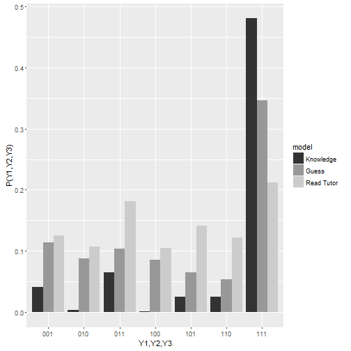

Pedagogical Research with High Resolution Data
========================================================
author: Junhen Feng
autosize: true

Navigation
========================================================

- Chapter 1: Introduction
- [Chapter 2](#/chp2): Practice Performance and Practice Persistencelc
- [Chapter 3](#/chp3): Evaluate Pedagogical Efficacy in Low Stake Test
- [Chapter 4](#/chp4)：Continuous Improvement with Multi-armed Bandit Algorithm

Chapter I: Big Data and Pedagogical Research
========================================================
type: section

Education Technology is not Working
========================================================
- The majority experimental finds are Null Effect
- Few strongly positive or negative result
- Mixed at best(Taylor, 2015)

But...
========================================================
- More education data than ever
    + Quantity explodes
    + Quality improves

- Better Algorithm than ever
    + Collaborative filtering
    + Parallel computing

- More money than ever
    + More than 3 billions dollars in VC funding in 2015
    + 500% Growth since 2010

Why...
========================================================
type: prompt
incremental: true
- Why can't we just build an Amazon or Netflix for Learning

- An Allegory: Teach a teenage "*Twilight*" fan "*Romeo and Juliet*"

- A Few Educated Guesses
    + Engagement and Grit
    + Change Preference rather than Exploit it
    + *Teacher Human Capital Deficit
    + *Organizational Struture misfit
    + Slow iteration and dissemination

What is High Solution Data and How it Helps?
========================================================
- Resolutions of education data
    + Aggregate Performance statistics
    + Response Log
    + Behavioral Data

- Understand the Engagement

- Understand the Learning Process

Chapter II: Practice Performance and Practice Persistence
========================================================
id: chp2
type: section

Routine Task
========================================================
- Routine Task:
    + Muscle Memeory **Over** Knowledge Transfer
    + Wide Application
        * Sports
        * Mathematics
        * Language Learning

- Known recipe for success: Practice Makes Perfect

- Most suitable for digital learning

The Dilemma
========================================================
- Routine task:
    + boring if easy
    + frustrating if hard

- practice makes perfect, but the learner stops before reaching perfect!

Key Insight
========================================================
type: prompt
- Differential attrition leads to dynamic selection bias
- Correct the bias by modeling the survival process

Bayesian Knowledge Tracing
========================================================
- Latent Knowledge Mastery State: $X_t\in{0,1}$
- Dynamics of the Latent State
    + Initial Mastery: $\pi = P(X_1=1)$
    + Learning rate: $\ell = P(X_t=1|X_{t-1}=0)$
    + No forgetting: $P(X_t=1|X_{t-1}=0)$
- Observed Response: $O_t \in {0,1}$
- Emission of the Observed Response
    + Slip: $s=P(O_t=0|X_t=1)$
    + Guess: $g=P(O_t=1|X_t=0)$

The Learning Curve
========================================================
- $P(O_t=1) = f(t)$

***

BKT-Survival Hybrid Model
========================================================
id: hybrid
- Learner observes the response status and decide if stops $E_t=1$
- The hazard rate can be expressed as $h_{t,O_t} = P(E_t=1|O_t)$
    + First Order Markov Chain: No X strike rule
    + Capture duration dependence
    + Does not explicitly depend on the latent state ($X_t$) for agility in extention
- [Full Likelihood](#/hybridllk)

Revisit the Learning Curve
========================================================

Dynamic Selection Bias
========================================================
- $P(X_t = 1| E_{t-1} = 0, X_{t-1}) \neq P(X_t=1|X_{t-1})$
- The Paradox is
    + Learning Curve rises higher
    + The learning rate is biased downward
        * A feature of the EM algorithm

MCMC Algorithm
========================================================
- Overall Scheme:
    + Data Augmentation(Forward Recursion Backward Sampling)
        1. The forward state transition $p_{t,i,j} = P(X_t=j|X_{t-1}=i,O_1,\dots,O_{t},\theta) \propto \pi_{t-1}(i)P(X_t=j|X_{t-1}=i)P(O_t|X_t)$
        2. Draw the last state $X_t$ from $P(X_T|O_1,\dots,O_T|\theta)$
        3. Permuate the sate by $P(X_t|X_{t+1},O_1,\dots,O_{t+1}|\theta)$
    + Gibbs Sampler: Given full data $X,O.E$, the Beta-Bernoulli has closed form posterior

Simulation Data : Parameter Learning
========================================================

Simulation Data : The Learning Curve
========================================================

Real Data : The Learning Curve
========================================================

Future Work
========================================================
- Study the discrepancy between learning curve fitness and AUC fitness
- Restrict the range of slip and guess between 0 and 0.5 (New Prior)
- Allow for X-strike Rule
- Allow for user heterogeneity

Chapter III: Evaluate Pedagogical Efficacy in Low Stake Environment
========================================================
id: chp3
type: section

Comprehension Task
========================================================
- Knowledge Transfer **OVER** Muscle Memory
- Repetition is not enough
- Improving pedagogical efficacy is the key

Pedagogical Efficacy
========================================================
- A narrow definition
- Learning Gain: before-after design
    + Assume equal measurement error before and after
- Relative Learning Gain: DID design
    + Assume equal trend in measurement error
- benchmark against naive repetition (routine task training)

Two Methodological Problems
========================================================
type: prompt
- Attrition Rate
    + require **TWO** observations to make an inference
    + Online service suffers from a large natural attrition
    + The differential attrition is observational equivalent to the random attrition
- Measurement Error
    + Student does not exert full effort in low stake learning environment
    + Effort induced measurement error is equivalent to selection bias
    + The sign of the bias is unknown

Assessment
========================================================
- Original

***

- Routine Assessment

***

- Transfer Assessment
    + Small rectangle is a square
    + Difference in total circumference is X

Pedagogical Interventions
========================================================

- Control

***

- Treatment
    + Scaffolding
        * New length and width
        * New Circumference
        * New Area
    + Delivery
        * Vocabulary instruction as sub-question
        * 50 second animation

Missing At Random
========================================================

|Group|Attrition Rate(%)|
|:-------------| -------------------:|
|Control|22.33|
|Vocabulary Treatment|29.22|
|Video Treatment|27.61|

***

Measurement Error Identification
========================================================
id:mei

- The knowledge of text response and response time helps to identify the measurement error
- [The Identification Stategy](#/giveupdef)

Identification Strategy
========================================================
- The DID design when all response in the first period is failure ($\mu_0=0$)

- Alternative configuration to compare the relative gain between two treatments

- Binary result: Correctly compute both circumference and area

Baseline Result
========================================================

<table style="text-align:center"><tr><td colspan="5" style="border-bottom: 1px solid black"></td></tr><tr><td style="text-align:left"></td><td colspan="4"><em>Dependent variable:</em></td></tr>
<tr><td></td><td colspan="4" style="border-bottom: 1px solid black"></td></tr>
<tr><td style="text-align:left"></td><td colspan="4">Response</td></tr>
<tr><td style="text-align:left"></td><td>Routine</td><td>Transfer</td><td>Routine</td><td>Transfer</td></tr>
<tr><td style="text-align:left"></td><td>(1)</td><td>(2)</td><td>(3)</td><td>(4)</td></tr>
<tr><td colspan="5" style="border-bottom: 1px solid black"></td></tr><tr><td style="text-align:left">vocabulary</td><td>0.006</td><td>-0.010</td><td></td><td></td></tr>
<tr><td style="text-align:left"></td><td>(0.013)</td><td>(0.008)</td><td></td><td></td></tr>
<tr><td style="text-align:left"></td><td></td><td></td><td></td><td></td></tr>
<tr><td style="text-align:left">video</td><td>0.009</td><td>-0.00000</td><td></td><td></td></tr>
<tr><td style="text-align:left"></td><td>(0.013)</td><td>(0.008)</td><td></td><td></td></tr>
<tr><td style="text-align:left"></td><td></td><td></td><td></td><td></td></tr>
<tr><td style="text-align:left">level</td><td></td><td></td><td>0.006</td><td>-0.010</td></tr>
<tr><td style="text-align:left"></td><td></td><td></td><td>(0.013)</td><td>(0.008)</td></tr>
<tr><td style="text-align:left"></td><td></td><td></td><td></td><td></td></tr>
<tr><td style="text-align:left">difference</td><td></td><td></td><td>0.002</td><td>0.010</td></tr>
<tr><td style="text-align:left"></td><td></td><td></td><td>(0.013)</td><td>(0.009)</td></tr>
<tr><td style="text-align:left"></td><td></td><td></td><td></td><td></td></tr>
<tr><td colspan="5" style="border-bottom: 1px solid black"></td></tr><tr><td style="text-align:left">Observations</td><td>6,638</td><td>6,638</td><td>6,638</td><td>6,638</td></tr>
<tr><td style="text-align:left">Adjusted R2</td><td>0.141</td><td>0.044</td><td>0.141</td><td>0.044</td></tr>
<tr><td colspan="5" style="border-bottom: 1px solid black"></td></tr><tr><td style="text-align:left"><em>Note:</em></td><td colspan="4" style="text-align:right">*p<0.1; **p<0.05; ***p<0.01</td></tr>
</table>
          
Differential Measurement Error in Placebo Group
========================================================

<table style="text-align:center"><tr><td colspan="5" style="border-bottom: 1px solid black"></td></tr><tr><td style="text-align:left"></td><td colspan="4"><em>Dependent variable:</em></td></tr>
<tr><td></td><td colspan="4" style="border-bottom: 1px solid black"></td></tr>
<tr><td style="text-align:left"></td><td>Response</td><td>Giveup</td><td>Response</td><td>Giveup</td></tr>
<tr><td style="text-align:left"></td><td>Routine</td><td>Routine</td><td>Transfer</td><td>Transfer</td></tr>
<tr><td style="text-align:left"></td><td>(1)</td><td>(2)</td><td>(3)</td><td>(4)</td></tr>
<tr><td colspan="5" style="border-bottom: 1px solid black"></td></tr><tr><td style="text-align:left">vocabulary</td><td>-0.079***</td><td>0.050***</td><td>-0.011</td><td>0.028*</td></tr>
<tr><td style="text-align:left"></td><td>(0.015)</td><td>(0.009)</td><td>(0.014)</td><td>(0.016)</td></tr>
<tr><td style="text-align:left"></td><td></td><td></td><td></td><td></td></tr>
<tr><td style="text-align:left">video</td><td>-0.011</td><td>0.004</td><td>0.012</td><td>-0.001</td></tr>
<tr><td style="text-align:left"></td><td>(0.015)</td><td>(0.009)</td><td>(0.014)</td><td>(0.016)</td></tr>
<tr><td style="text-align:left"></td><td></td><td></td><td></td><td></td></tr>
<tr><td colspan="5" style="border-bottom: 1px solid black"></td></tr><tr><td style="text-align:left">Observations</td><td>5,862</td><td>5,862</td><td>5,862</td><td>5,862</td></tr>
<tr><td style="text-align:left">Adjusted R2</td><td>0.201</td><td>0.056</td><td>0.582</td><td>0.371</td></tr>
<tr><td colspan="5" style="border-bottom: 1px solid black"></td></tr><tr><td style="text-align:left"><em>Note:</em></td><td colspan="4" style="text-align:right">*p<0.1; **p<0.05; ***p<0.01</td></tr>
</table>

Effective Exposure to Treatment
========================================================

<table style="text-align:center"><tr><td colspan="5" style="border-bottom: 1px solid black"></td></tr><tr><td style="text-align:left"></td><td colspan="4"><em>Dependent variable:</em></td></tr>
<tr><td></td><td colspan="4" style="border-bottom: 1px solid black"></td></tr>
<tr><td style="text-align:left"></td><td colspan="4">Response</td></tr>
<tr><td style="text-align:left"></td><td>Routine</td><td>Transfer</td><td>Routine</td><td>Transfer</td></tr>
<tr><td style="text-align:left"></td><td>(1)</td><td>(2)</td><td>(3)</td><td>(4)</td></tr>
<tr><td colspan="5" style="border-bottom: 1px solid black"></td></tr><tr><td style="text-align:left">vocabulary</td><td>0.020</td><td>-0.005</td><td></td><td></td></tr>
<tr><td style="text-align:left"></td><td>(0.022)</td><td>(0.015)</td><td></td><td></td></tr>
<tr><td style="text-align:left"></td><td></td><td></td><td></td><td></td></tr>
<tr><td style="text-align:left">video</td><td>0.061***</td><td>0.033**</td><td></td><td></td></tr>
<tr><td style="text-align:left"></td><td>(0.022)</td><td>(0.015)</td><td></td><td></td></tr>
<tr><td style="text-align:left"></td><td></td><td></td><td></td><td></td></tr>
<tr><td style="text-align:left">level</td><td></td><td></td><td>0.020</td><td>-0.005</td></tr>
<tr><td style="text-align:left"></td><td></td><td></td><td>(0.022)</td><td>(0.015)</td></tr>
<tr><td style="text-align:left"></td><td></td><td></td><td></td><td></td></tr>
<tr><td style="text-align:left">difference</td><td></td><td></td><td>0.041*</td><td>0.038**</td></tr>
<tr><td style="text-align:left"></td><td></td><td></td><td>(0.023)</td><td>(0.016)</td></tr>
<tr><td style="text-align:left"></td><td></td><td></td><td></td><td></td></tr>
<tr><td colspan="5" style="border-bottom: 1px solid black"></td></tr><tr><td style="text-align:left">Observations</td><td>3,018</td><td>3,018</td><td>3,018</td><td>3,018</td></tr>
<tr><td style="text-align:left">Adjusted R2</td><td>0.278</td><td>0.074</td><td>0.278</td><td>0.074</td></tr>
<tr><td colspan="5" style="border-bottom: 1px solid black"></td></tr><tr><td style="text-align:left"><em>Note:</em></td><td colspan="4" style="text-align:right">*p<0.1; **p<0.05; ***p<0.01</td></tr>
</table>

Robust Check
========================================================
- Alternative measurement error identification
    + 10 second rule
    + Blank response
- Alternative performance measurement
    + Allow for partial grade
    
- The pattern holds:
    + Differential measurement error
    + the magnitude of point estimation jumps after conditions on effective exposure

- The significance goes away

Future Work
========================================================
- Understand the mechanism
    + Check if error persists
    + Check how the response in the vocabulary scaffolding affects the response in routine assessment
- *Try Adaptive instructional material as vocabulary scaffolding
- *Better data for measurement error identifcation 

Chapter IV: Continuous Improvement with Multi-armed Bandit Algorithm
========================================================
id: chp4
type: section

Continuous Improvement
=======================================================
- Tech startup has the philosophy of rapid product iteration
    - fail quickly
    - A/B Test everything
- Very successful in online service sector
    - Google
    - Amazon
    - Duolingo/Khan Academy

Fixed Balanace Sample T-test may not be a Good Idea 
=======================================================
- Sample arrive sequentially
    + allow early termination
- If there is a difference, balance sample is not the optimal design
    + the option with higher mean shall have more sample to minimize total sample
    + the option with higher mean shall have more sample to maximize the experiment return

The Relative Cost of Type I and Type II error
=======================================================
type:prompt
- The opportunity cost of wait outweighs the opportunity cost of action
    - If the null hypothesis of null effect is true, there is no cost to service receiver, although there maybe cost to service provider
    - If the null hypothesis of null effect is false, cumulative loss to service receiver overtime is considerable
    
- Prefer high power to low significance level

Multi-arm Bandit Problem
=======================================================
- $n$ experimental options (arm), each with a constant but unknown return parameter $\mu^i$
- A policy describes the choice of the option over time
- Regret is defined as the cumulative expected difference between the policy and the true optimal arm $\sum_t m^*-m^{i_t}$
- The goal is to minimize the regret

Thompson Sampling
=======================================================
- Stratified sampling proportion to estimated return
$$
w_{at} = Pr(\mu_a = max\{\mu_1, \dots, \mu_n\}|y_1,\dots,y_t)
$$
- A good heuristic that balances between exploration and exploitation
    - With uninformative prior, the initial stage is dominated by exploration
    - As evidence strongly favors a subset of options, exploration takes over

- Complete learning: best arm wins for sure as time goes by
    - Optimal arm plays exponentially more times than inferior alternatives

Potential Value Remaining Stop Condition
=======================================================
- There is no need to make a decision if the thompson sampling algorithm can run forever
- Practically it is used as a substitude to statistical test therefore needs a decision rule
- Potential Value Remaining

$$
VR(m) = \frac{\theta^*(m)}{\theta_{i^*}(m)} - 1 
$$

- Stop if $\Pr(VR > 1+\epsilon) < \delta$

Imbalanced Sample
=======================================================
type:prompt

- the more sample assigned to the option
    + the faster variance of the posterior distribution shrinks
        * $VR$ can have high kurtosis
    + the higher the return generated by the experiment if chosen the right arm

Simulation Setup
=======================================================
- Base Rate

|Type | Values|
|--- | ---|
|Low | 0.05,0.09|
|medium| 0.15, 0.25|
|high| 0.4, 0.5|

- Effect size: 10%, 20%, 50%, 100%

- Null Hypothesis
    + $H_0: \quad p_0 \geq p_1$
    + maximum sample size is calculated by 5% significance level and 95% power

Modified Sequential Likelihood Ratio Test
=======================================================
- Separate early termination from imbalance sample design
    - sequential likelihood ratio test uses pair sample from the control and the treatment
- Define Reject time as $T = \inf\{n:n \geq m_0, W(t)\geq \alpha\}$
- Reject the null hypothesis if $T \leq m$ or $T>m, mH(\frac{\sum_{j}Y_j}{m}) \geq d$

Power
=======================================================

Significance Level
=======================================================
- If using balanced sample and potential value remaining stop condition, on average, the type I error rate decreases to 40%

Regret: Simulation
=======================================================
- regret for the fixed sample t-test is a fixed number $r_{welch} = N*p*\triangle$
- Measure the saving in regret by 
$$
R_x(T) = \frac{E(r_x|t\leq T)}{r_{welch}}
$$
- Result

Regret: Simulated Experiment
=======================================================

Assessment | treamtnet   | Full Data            | Filtered Data (Automatic) | Filtered Data (Manual) |
---        | ---         | ---                          | ---                                         | ---                                         |
Routine    | Vocabulary  | -12.3%  | 0.2%          | -4.7%         |
Routine    | Video       | 13.2%  | 3.3%          | 6.8%         |
Transfer   | Vocabulary  | 52.8%  | 6.2%          | -1.4%         |
Transfer   | Video       | 22.6%  | 1.5%          | 5.8%         |

Sample Saving: Simulation
=======================================================

Sample Saving: Simulated Experiment
=======================================================

Assessment | treamtnet   | Full Data            | Filtered Data (Automatic) | Filtered Data (Manual) |
---        | ---         | ---                          | ---                                         | ---                                         |
Routine    | Vocabulary  | 87%  | 1%          | 80%         |
Routine    | Video       | 92%  | 43%          | 80%         |
Transfer   | Vocabulary  | 41%  | 0%          | 0%         |
Transfer   | Video       | 44%  | 0%          | 45%         |

Future Work
=======================================================
- Stop Conditions
    + Explore the properties of potential value remaining condition
    + Explore other stop conditions that is robust to measurement error
- Performance in multiple comparison

Appendix I.2 Derivation of the Gibbs Sampling Scheme
=======================================================
id: hybridllk

[return](#/hybrid)

Appendix II.2 Identifcation of Give-up
=======================================================
id: giveupdef

1. Add or omit trailing zeros. 
    - If the right answer is 120, both 12, 120 and 1200 are admitted as valid attempts.

2. Add when shall multiply or vice versa. 
    - When calculating area with length 6 and width 4, 10 is admitted as a valid attempt.

3. Apply the wrong formula. 
    - When calculating the circumferences of the rectangle with length 6 and width 4, 10(forget to double) or 24(formula of the area) are admitted as valid attempts. 

4. Calculation mistakes. 
    - 13*4 = 42

5. Fail to understand the question. 
    - Calculate the circumference and the area of the small rectangle

6. Typo
    - 36 as 35
    
[return](#/mei)
